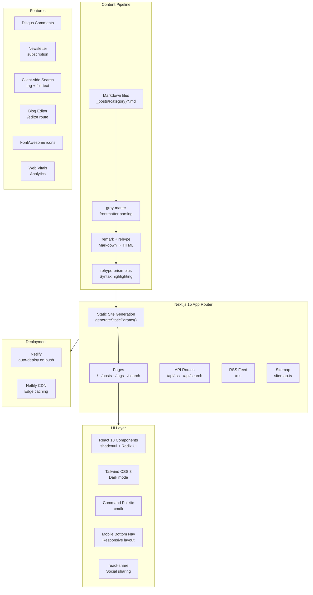
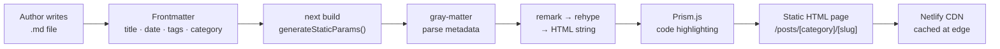

# Jell Blog

> 개발자 기술 블로그 — Next.js 15 기반 Markdown 정적 블로그
> Personal developer blog built with Next.js 15, Markdown-driven with full SSG

[](https://github.com/jellive/jell_gatsby_blog/actions/workflows/ci.yml)
[](https://nextjs.org)
[](https://react.dev)
[](https://www.typescriptlang.org)
[](https://blog.jell.kr)
[](LICENSE)

**Live site**: [https://blog.jell.kr](https://blog.jell.kr)

---

## Architecture



### Content Flow



---

## Tech Stack


| Category         | Technology                 | Notes                   |
| ---------------- | -------------------------- | ----------------------- |
| Framework        | Next.js 15 (App Router)    | SSG + ISR               |
| React            | React 18                   | Server Components       |
| Language         | TypeScript 5               | Strict mode             |
| Styling          | Tailwind CSS 3 + shadcn/ui | Radix UI primitives     |
| Markdown         | remark + rehype            | Full pipeline           |
| Frontmatter      | gray-matter                | YAML metadata           |
| Syntax highlight | rehype-prism-plus          | 200+ languages          |
| Search           | cmdk + client-side         | Command palette         |
| Comments         | Disqus                     | Per-post threads        |
| Icons            | FontAwesome 6              | Brand + solid + regular |
| Social           | react-share                | Multi-platform sharing  |
| RSS              | Custom route               | `/rss` endpoint         |
| Sitemap          | Next.js `sitemap.ts`       | Auto-generated          |
| Testing (E2E)    | Playwright                 | Cross-browser           |
| Testing (Unit)   | Jest + Testing Library     | Component tests         |
| Deploy           | Netlify                    | Auto-deploy from main   |
| Analytics        | web-vitals                 | Core Web Vitals         |

---

## Post Categories

Posts live in `_posts/{category}/` as Markdown files:

| Category           | Description                   |
| ------------------ | ----------------------------- |
| `dev/`             | Development articles          |
| `dev/algorithm`    | Algorithm & data structures   |
| `dev/architecture` | System design & architecture  |
| `dev/blog`         | Meta — blog development notes |
| `dev/docker`       | Docker & containerization     |
| `dev/ios`          | iOS development               |
| `dev/js`           | JavaScript & TypeScript       |
| `dev/linux`        | Linux & DevOps                |
| `dev/network`      | Networking fundamentals       |
| `bicycle/`         | Cycling                       |
| `chat/`            | General thoughts              |
| `game/`            | Gaming                        |
| `notice/`          | Announcements                 |

### Post Frontmatter Format

```yaml
---
title: 'Post Title'
date: '2025-01-15'
tags: ['nextjs', 'typescript', 'tutorial']
category: 'dev/js'
description: 'Brief description for SEO and post list'
---
```

---

## Project Structure

```text
jell_gatsby_blog/
├── _posts/                      # Markdown content
│   ├── dev/
│   │   ├── algorithm/
│   │   ├── architecture/
│   │   ├── docker/
│   │   ├── js/
│   │   └── ...
│   ├── bicycle/
│   ├── chat/
│   └── notice/
├── src/
│   ├── app/                     # Next.js App Router
│   │   ├── posts/               # Post pages (SSG)
│   │   ├── tags/                # Tag listing
│   │   ├── search/              # Search page
│   │   ├── editor/              # Blog editor UI
│   │   ├── rss/                 # RSS feed
│   │   ├── api/                 # API routes
│   │   ├── layout.tsx           # Root layout
│   │   └── page.tsx             # Home page
│   ├── components/
│   │   ├── Header/              # Site header + nav
│   │   ├── Footer.tsx           # Site footer
│   │   ├── PostContent/         # Markdown renderer
│   │   ├── PostInteraction/     # Like, share, comments
│   │   ├── Comments/            # Disqus integration
│   │   ├── CommandPalette/      # cmdk search UI
│   │   ├── MobileBottomNav/     # Mobile navigation
│   │   ├── Newsletter/          # Email subscription
│   │   ├── OptimizedImage/      # next/image wrapper
│   │   ├── Bio/                 # Author bio card
│   │   └── Analytics/           # Web Vitals tracker
│   ├── lib/                     # Utilities
│   │   └── posts.ts             # Markdown loading + parsing
│   ├── hooks/                   # Custom hooks
│   └── types/                   # TypeScript types
├── public/                      # Static assets
├── scripts/
│   ├── blog/                    # Blog tooling scripts
│   │   ├── scaffold.js          # New post scaffolding
│   │   ├── quality/validate.js  # Post quality checks
│   │   └── generate/generator.js # Content generation
│   └── copy-images.js           # Pre-build image copy
├── netlify/                     # Netlify functions
├── netlify.toml                 # Netlify config
├── next.config.js
├── tailwind.config.js
└── package.json
```

---

## Getting Started

### Prerequisites

- **Node.js** 20+
- **npm** 9+

### Install

```bash
git clone https://github.com/jellive/jell_gatsby_blog.git
cd jell_gatsby_blog
npm install
```

### Development

```bash
npm run dev
# Open http://localhost:9000
```

### Production Build

```bash
npm run build
npm run start
```

### Writing a New Post

```bash
# Scaffold a new post with frontmatter template
npm run blog:new

# Validate existing posts for quality issues
npm run blog:validate

# Analyze writing style consistency
npm run blog:analyze-style
```

---

## Scripts Reference

| Script                       | Description              |
| ---------------------------- | ------------------------ |
| `npm run dev`                | Dev server on port 9000  |
| `npm run build`              | Production build (SSG)   |
| `npm run start`              | Start production server  |
| `npm run lint`               | Next.js ESLint           |
| `npm run type-check`         | TypeScript check         |
| `npm run test:unit`          | Jest unit tests          |
| `npm run test:unit:coverage` | Unit tests with coverage |
| `npm run test:e2e`           | Playwright E2E tests     |
| `npm run analyze`            | Bundle analyzer          |
| `npm run blog:new`           | Scaffold new post        |
| `npm run blog:validate`      | Validate post quality    |
| `npm run format`             | Prettier format          |

---

## Testing

### Unit Tests (Jest)

```bash
npm run test:unit
npm run test:unit:watch
npm run test:unit:coverage
```

### E2E Tests (Playwright)

```bash
npm run test:e2e
npm run test:e2e:ui
npm run test:e2e:debug
```

---

## Deployment

The blog deploys automatically to **Netlify** on push to `main`:

1. Netlify detects push
2. Runs `npm run build` (Next.js SSG)
3. Deploys `out/` to Netlify CDN
4. Live at [https://blog.jell.kr](https://blog.jell.kr)

### netlify.toml

```toml
[build]
  command = "npm run build"
  publish = "out"
```

---

## Performance

- **SSG**: All post pages pre-rendered at build time
- **Image optimization**: `next/image` with Sharp
- **Font**: System font stack — zero font load time
- **Code splitting**: Per-page JS chunks
- **RSS**: Fully generated at `/rss`
- **Sitemap**: Auto-generated via `sitemap.ts`

---

## Roadmap

- [ ] Dark/light mode toggle persistence
- [ ] Reading progress indicator
- [ ] Related posts recommendation
- [ ] Post view count tracking
- [ ] Series / multi-part post support
- [ ] Algolia search integration

---

## License

MIT
