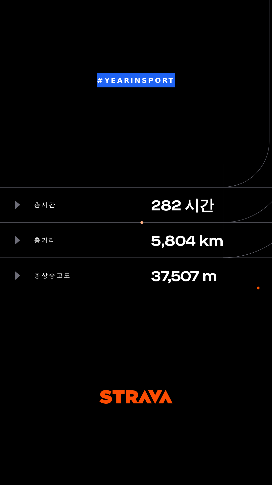

  

Strava에서는 매년 결산을 통해 선수가 얼마나 달렸는지를 보여줍니다.  
기존에는 동영상으로 보여줬는데, 올해는 사이트로 보여주네요.  
2019년에 자전거(및 약간의 걷기, 하이킹) 총 합이 5800km였네요.  

뒤돌아보면 정말 많은 일이 있었다고 생각합니다.  
난생 처음 200km도 해보고.. 자전거 대회도 나가보고.. 에버랜드 스피드웨이도 달려보고..  
2019년에는 4월부터 제대로 했으니, 올해는 그거보다는 더 달리리라 생각하며 6000km를 도전해보겠습니다!