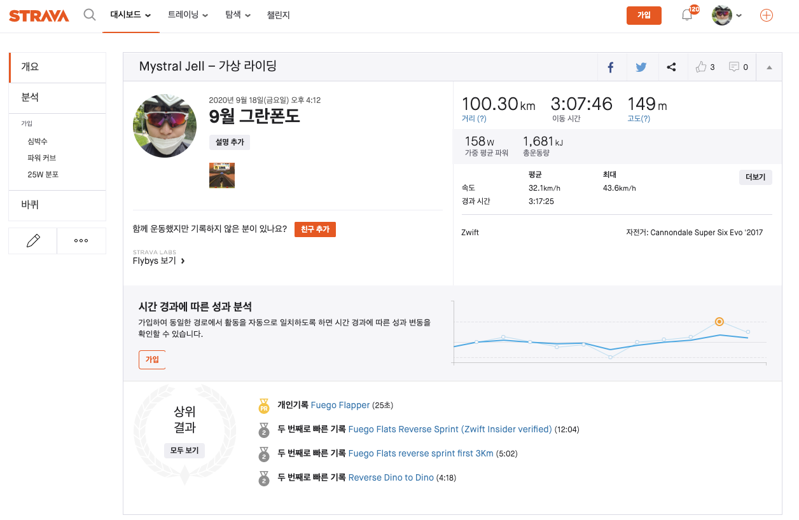

[toc]

## 그란폰도란

위키피디아에 있는 그란폰도(Granfondo)의 뜻은 다음과 같습니다.

```kr
그란폰도(granfondo)는 이탈리아어로
'long distance or great endurance'라는 뜻으로
자전거를 이용한 비경쟁 방식의 동호인 대회를 의미한다.
```

(출처: [위키피디아](https://ko.wikipedia.org/wiki/%EA%B7%B8%EB%9E%80%ED%8F%B0%EB%8F%84))

그리고 그란폰도와 비슷한, 우리나라에서는 더 널리(?) 알려진 랜도너스(randonneurs)의 뜻은 다음과 같습니다.

```kr
란도너는 200km 에서 1200km 사이
혹은 그 이상의 장거리를
외부 도움 없이 순전히 자신의 힘만으로 달리는 사이클리스트를 뜻합니다.
란도너링(또는 브레베)은 레이싱 또는 경쟁시합이 아닙니다.
```

(출처: [한국 란도너스 공식 홈페이지](http://www.korearandonneurs.kr/))

얼핏 보면 비슷비슷해 보이지만 조금 더 자세히 보면 그란폰도는 어쨌든 하루에 끝나며, 산악(힐클라임) 위주의 레이스인 반면,  
랜도너스는 길면 3박 4일 (1200km 기준 완주 시간이 96시간이어야 합니다.)이 된다는 차이가 있습니다.

## 게시물 이름이 그란폰도인 이유?

제가 여기서 그란폰도라는 이름을 쓴 데에는 큰 이유는 없고, 단순히 운동 보조 어플리케이션인 Strava의
챌린지 이름이 9월 그란폰도(Semtember Gran fondo)이기 떄문입니다.  
네, 그렇습니다. 그냥 한번 붙여보고 싶었어요..

## 100KM 자전거 라이딩?

할 때마다 느끼는 건데, 100km는 결코 쉬운 라이딩이 아닙니다.  
하지만 어느정도 올라가게 되면 마실나가는 듯한? 느낌이 드는 분들도 많고, 실제로 저도 200km 랜도너스를 완주하면서 100km는 그냥 천천히.. 해보자?  
하는 느낌입니다.  
앞으로 매월 그란폰도는 시도할 예정입니다.  
다이어트를 위해서!
