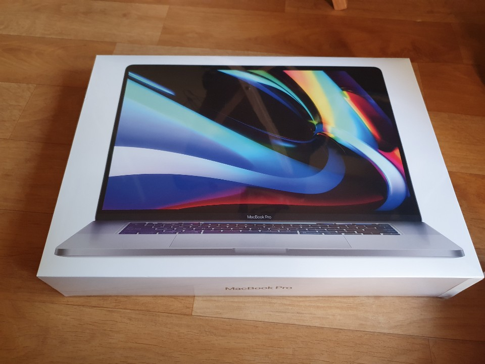
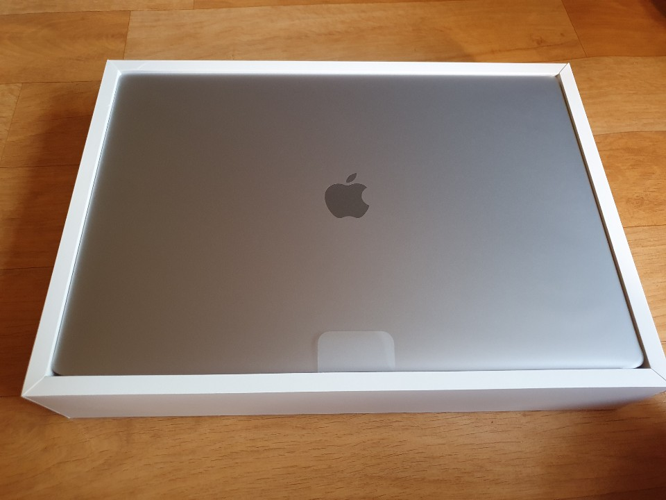

저는 맥북 유저입니다.  
이번에 16인치 신형이 나오면 지르려고 했는데, 한국시각으로 23일 wwdc 2020이 열렸습니다.  
ARM 아키텍쳐를 사용한 맥이 발표되었는데요.  
어차피 인텔 맥을 성능 상으로 바로 이기기는 쉽지 않아보이기도 하고, PowerPC가 지원이 끊겼던 것처럼 인텔 맥이 지원이 끊기고 나면 새로운 맥을 구매할 듯 싶기도 하고, 그냥 윈도우 머신으로 돌려도 문제 없기에 큰 맘 먹고 구매했습니다.  
슬슬 iOS 어플도 만들어봐야겠네요.

아! 물론 JS, TS 공부도 열심히 하고 있습니다.  
조만간 글 올려둘께요!
