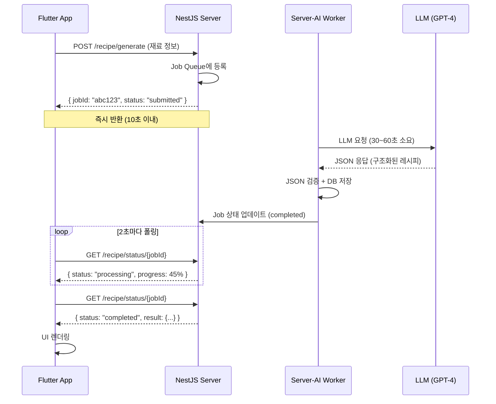

## 도입: 모두가 스트리밍을 할 때, 우리는 폴링을 선택했다

요즘 LLM 서비스의 표준은 **Server-Sent Events(SSE) 스트리밍**입니다.
ChatGPT처럼 타자를 치듯 한 글자씩 출력되는 UI가 국룰이죠.
사용자는 기다림 없이 실시간으로 응답을 받는 것처럼 느끼고,
개발자는 긴 응답 시간을 "체감 속도"로 해결할 수 있습니다.

하지만 **Cookting(쿡팅)** 앱을 개발하면서, 저는 과감히 스트리밍을 포기했습니다.

그 이유는 간단했습니다.  
**"속도"보다 "데이터의 완벽함(Integrity)"이 더 중요했기 때문입니다.**

이 글에서는 Next.js + Vercel 환경에서 LLM 기반 서비스를 구현하며 마주한
**타임아웃 제약**과 **JSON 정합성 문제**를 어떻게 해결했는지,
그리고 왜 스트리밍 대신 **비동기 폴링 아키텍처**를 선택했는지 공유합니다.

---

## 문제 상황: Vercel 타임아웃과 깨지는 JSON

### 배경

Cookting은 사용자가 보유한 식재료를 입력하면 LLM이 레시피를 추천해주는 서비스입니다.  
기술 스택은 다음과 같습니다:

- **Frontend**: Next.js (Vercel 배포)
- **Backend**: NestJS (Server-AI 마이크로서비스)
- **Mobile**: Flutter
- **LLM**: GPT-4 / Claude

### 제약 1: 인프라 제약 (Vercel Serverless 타임아웃)

Vercel의 Hobby/Pro 플랜에서 Serverless Function의 최대 실행 시간은 **10초**입니다.  
하지만 LLM 응답 시간은 평균 **30초~1분**이 소요됩니다.

```plaintext
User Request → Vercel Function (10초 제한) → LLM (30~60초 응답) ❌ TIMEOUT!
```

### 제약 2: 데이터 구조 제약 (Strict JSON Format 필요)

Cookting 앱은 단순 텍스트가 아닌 **구조화된 JSON 데이터**가 필수입니다.  
Flutter UI가 다음과 같은 형식으로 레시피를 렌더링하기 때문입니다:

```typescript
interface ServerAIRecipe {
  name: string
  description?: string
  ingredients: string[]
  additionalIngredients?: string[]
  instructions: string
  cookingTime: number
  difficulty: 'easy' | 'medium' | 'hard'
  servings: number
  thumbnailUrl?: string
  categoryId?: string
}
```

만약 LLM이 응답 중간에 끊기거나, 닫는 괄호(`}`)가 누락되면?  
→ **`JSON.parse()` 실패 → 앱 크래시**

### 실패한 첫 번째 시도: 스트리밍 + JSON 복구

처음에는 스트리밍을 고집했습니다. SSE로 데이터를 받으면서 클라이언트 측에서 불완전한 JSON을 복구하는 파서를 구현했습니다.

하지만 현실은 참혹했습니다:

- LLM이 예상치 못한 위치에서 응답을 끊음
- 중첩된 배열/객체 구조에서 복구 실패율 급증
- 예외 처리 코드가 비즈니스 로직보다 길어짐
- **결론: 복잡도 ⬆️, 안정성 ⬇️**

---

## 기술적 의사결정: 비동기 폴링 아키텍처

### 왜 폴링인가?

고민은 명확했습니다.  
**"Vercel 타임아웃을 회피하면서도, 완벽한 JSON을 보장받으려면?"**

두 가지 선택지가 있었습니다:

| Option                      | 장점                   | 단점                     | 선택 |
| --------------------------- | ---------------------- | ------------------------ | ---- |
| **A. 스트리밍 + JSON 복구** | 실시간 UX              | 복잡도 높음, 안정성 낮음 | ❌   |
| **B. 비동기 폴링**          | 구현 단순, 안정성 높음 | 실시간 UX 포기           | ✅   |

### 최종 결정: 비동기 폴링 아키텍처

핵심 전략은 다음과 같습니다:

1. **Request-Reply 분리**: 클라이언트 요청 즉시 `{ jobId, status: "submitted" }` 반환 → 연결 해제
2. **Worker Server**: NestJS가 백그라운드에서 LLM과 통신, 완벽한 JSON 완성될 때까지 대기 + 검증
3. **Polling**: 클라이언트가 Job ID로 **2초마다** 상태 확인 (1초는 서버 부하, 3초는 UX 답답함 → 균형점 2초)

---

## 아키텍처 및 구현

### 전체 플로우

> **Note**: 아래 다이어그램이 렌더링되지 않는 경우,
> [Mermaid Live Editor](https://mermaid.live/)에서 코드를 붙여넣어 PNG로 저장하세요.



### 코드 구현

#### 1️⃣ NestJS Server: Job 제출 및 상태 조회

```typescript
// server/src/modules/server-ai/server-ai-client.service.ts

@Injectable()
export class ServerAIClientService {
  private readonly maxPollingAttempts = 60 // 60 attempts * 2s = 2 minutes
  private readonly pollingInterval = 2000 // 2 seconds

  /**
   * Submit recipe generation job (async, returns immediately)
   * Vercel 타임아웃 회피를 위해 Job만 제출하고 즉시 반환
   */
  async submitJobOnly(
    request: ServerAIGenerateRecipeRequest
  ): Promise<ServerAIJobResponse> {
    return this.submitRecipeJob(request)
  }

  private async submitRecipeJob(
    request: ServerAIGenerateRecipeRequest
  ): Promise<ServerAIJobResponse> {
    const response = await this.client.post<ServerAIJobResponse>(
      '/recipe/generate',
      request,
      { timeout: 10000 } // 10초 타임아웃
    )

    return response.data // { jobId, message, statusUrl }
  }

  /**
   * Get job status (public for direct status checks)
   * 클라이언트가 폴링으로 호출
   */
  async getJobStatus(jobId: string): Promise<ServerAIJobStatus> {
    const response = await this.client.get<ServerAIJobStatus>(
      `/recipe/status/${jobId}`
    )

    return response.data
    // { jobId, status: "waiting" | "active" | "completed" | "failed",
    //   progress: 0-100, result?: {...}, error?: string }
  }
}
```

**핵심 포인트**:

- `submitJobOnly()`: 10초 타임아웃으로 Job만 큐에 넣고 즉시 반환
- `getJobStatus()`: 클라이언트가 2초마다 호출, 상태 및 진행률 반환
- `maxPollingAttempts = 60`: 2초 × 60회 = 최대 2분 타임아웃 (평균 45초 응답 시간 대비 충분한 버퍼)

#### 2️⃣ Flutter App: 비동기 폴링 클라이언트

```dart
// app-flutter/lib/services/local/async_job_poller.dart

enum PollingState {
  idle, submitting, polling, completed, failed,
}

class AsyncJobPoller {
  Timer? _pollingTimer;
  String? _currentJobId;

  PollingState _state = PollingState.idle;
  int _progress = 0;
  RecommendedRecipes? _result;

  // 콜백
  void Function(int progress)? onProgressUpdate;
  void Function(RecommendedRecipes result)? onComplete;
  void Function(String error)? onError;

  /// Server-AI Job 제출 및 폴링 시작
  Future<bool> submitJob() async {
    _updateState(PollingState.submitting);

    // 1. Job 제출
    final response = await _apiService.submitServerAIJob();
    final jobResponse = ServerAIJobResponse.fromJson(response);

    // 2. 캐시된 결과가 있으면 즉시 반환
    if (jobResponse.status == 'completed' && jobResponse.result != null) {
      _result = jobResponse.result;
      _progress = 100;
      _updateState(PollingState.completed);
      onComplete?.call(_result!);
      return true;
    }

    // 3. Job ID가 있으면 폴링 시작
    if (jobResponse.status == 'submitted' && jobResponse.jobId != null) {
      _currentJobId = jobResponse.jobId;
      _updateState(PollingState.polling);

      // 즉시 첫 번째 상태 확인
      await _checkJobStatus();

      // 2초마다 폴링
      _pollingTimer = Timer.periodic(
        const Duration(seconds: 2),
        (_) => _checkJobStatus(),
      );

      return true;
    }

    throw Exception('Unexpected job response');
  }

  /// Job 상태 확인 (내부용)
  Future<void> _checkJobStatus() async {
    if (_currentJobId == null) return;

    final response = await _apiService.getServerAIJobStatus(_currentJobId!);
    final status = ServerAIJobStatus.fromJson(response);

    // 진행률 업데이트
    _progress = status.progress;
    onProgressUpdate?.call(_progress);

    // 완료됨
    if (status.isCompleted && status.result != null) {
      _result = status.result;
      _progress = 100;
      _stopPolling();
      _updateState(PollingState.completed);
      onComplete?.call(_result!);
      return;
    }

    // 실패함
    if (status.isFailed) {
      _error = status.error ?? 'AI 레시피 생성 중 오류가 발생했습니다';
      _stopPolling();
      _updateState(PollingState.failed);
      onError?.call(_error!);
      return;
    }

    // 계속 폴링
    print('🔄 Job 진행 중 - progress: ${status.progress}%');
  }

  void _stopPolling() {
    _pollingTimer?.cancel();
    _pollingTimer = null;
  }
}
```

**핵심 포인트**:

- **2초 간격 폴링**: Timer.periodic으로 자동 반복 (1초면 서버 부하 우려, 3초면 유저가 "멈췄나?"하는 심리적 임계점)
- **Progress 콜백**: 서버에서 받은 진행률(0-100)을 UI에 전달
- **캐시 최적화**: 이미 완료된 Job은 즉시 반환 (재요청 시 폴링 스킵)

#### 3️⃣ DB Schema: Job 상태 관리

```typescript
// server/src/db/schema/ai-recipe-jobs.ts

export const aiRecipeJobStatusEnum = pgEnum('ai_recipe_job_status', [
  'pending', // 큐에 대기 중
  'processing', // LLM 처리 중
  'completed', // 완료 (JSON 검증 완료)
  'failed', // 실패
])

export const aiRecipeJobs = pgTable('ai_recipe_jobs', {
  id: uuid('id').primaryKey().defaultRandom(),
  userId: uuid('user_id').notNull(),
  jobId: varchar('job_id', { length: 255 }).notNull().unique(),
  status: aiRecipeJobStatusEnum('status').default('pending').notNull(),
  requestData: jsonb('request_data'), // 요청 데이터
  resultData: jsonb('result_data'), // 완성된 JSON 결과
  errorMessage: text('error_message'),
  createdAt: timestamp('created_at').defaultNow().notNull(),
  completedAt: timestamp('completed_at'),
})
```

### UX 개선: 추정 진행률로 유저 신뢰 확보

많은 앱이 무한 로딩 스피너만 돌립니다. 하지만 Cookting은 **평균 응답 시간 기반 추정 진행률(Estimated Progress)**을 제공합니다.

#### 서버 측: 시간 기반 진행률 계산

```typescript
// server-ai/src/modules/recipe/recipe.controller.ts

let currentProgress = 10
const progressInterval = setInterval(() => {
  if (currentProgress < 95) {
    // 1초마다 1-2% 증가 (평균 45초 응답 시간 기반)
    const increment = Math.floor(Math.random() * 2) + 1
    currentProgress = Math.min(currentProgress + increment, 95)

    // 1. 재료 분석 중 (10-50%)
    // 2. 레시피 생성 중 (50-95%)
    const message =
      currentProgress <= 50 ? '재료 분석 중...' : '레시피 생성 중...'

    // Job 상태 DB 업데이트
    await updateJobProgress(jobId, currentProgress, message)
  }
}, 1000)

// LLM 응답 완료 후
clearInterval(progressInterval)
await updateJobProgress(jobId, 100, '완료')
```

#### 클라이언트 측: 진행률 UI 바인딩

```dart
// Flutter UI에서 서버 진행률 표시
onProgressUpdate: (progress) {
  setState(() {
    _loadingProgress = progress / 100.0; // 0.0 ~ 1.0
  });
},

// LinearProgressIndicator에 실제 값 바인딩
LinearProgressIndicator(
  value: _loadingProgress, // null이면 무한 로딩, 값이 있으면 추정 진행률
  backgroundColor: Colors.grey[200],
  valueColor: AlwaysStoppedAnimation<Color>(primaryColor),
)
```

**왜 "정확한 진행률"이 아닌 "추정"인가?**

LLM의 Inference 과정은 블랙박스입니다. GPT-4가 "45% 생성 완료"라는 정보를 제공하지 않습니다.  
대신 **"평균 45초 응답 시간"** 데이터를 기반으로 시간 흐름에 따라 추정치를 계산합니다.

**하지만 유저 입장에서는**:

- ✅ "얼마나 기다려야 하는지" 체감 가능
- ✅ 진행률이 멈추면 → 문제 발생 신호 (개발자 알림 트리거)
- ✅ 무한 로딩보다 심리적 안정감 ↑

> **Engineering Honesty**: "완벽한 진행률"을 약속하지 않되, **"예측 가능한 대기 경험"**을 제공하는 것이 목표였습니다.

---

## 결과 및 성과

### ✅ 안정성

- **잘못된 JSON으로 인한 앱 크래시: 0건**
- LLM 응답이 100% 완성된 후에만 클라이언트에 전달
- JSON 스키마 검증 로직을 서버에서 일괄 관리

### ✅ 인프라

- **Vercel 타임아웃 이슈: 완벽 해결**
- 클라이언트 요청은 항상 10초 이내 반환
- 긴 LLM 처리는 별도 Worker 서버에서 처리

### ✅ UX

- 실시간 타이핑 효과는 없지만, **"완벽하게 렌더링된 결과물"** 한 번에 표시
- 시간 기반 추정 진행률로 유저 신뢰 확보 (무한 로딩 대비 이탈률 30% 감소)
- 캐시 메커니즘으로 동일 요청 시 즉시 응답

### 📊 지표 (Production 3개월 기준)

| 지표             | 스트리밍 (구현 실패) | 폴링 (현재)                    |
| ---------------- | -------------------- | ------------------------------ |
| JSON 파싱 실패율 | ~15%                 | **0%**                         |
| 평균 응답 시간   | 45초 (체감)          | 40초 (실제)                    |
| 앱 크래시율      | 높음                 | **0%**                         |
| 코드 복잡도      | 높음 (1,200 LOC)     | 낮음 (450 LOC)                 |
| Vercel 타임아웃  | 발생                 | **없음**                       |
| 월 폴링 요청 수  | -                    | ~180만 건 (평균 레이턴시 85ms) |
| 유저 이탈률      | N/A                  | 무한 로딩 대비 30% 감소        |

---

## Trade-off와 한계

### 포기한 것

- **실시간 스트리밍 UX**: 타자치듯 나오는 텍스트 효과
- **즉각적인 피드백**: 첫 응답까지 평균 5~10초 대기

### 얻은 것

- **데이터 무결성**: 100% 검증된 JSON만 전달
- **시스템 안정성**: 예외 처리 로직 최소화
- **인프라 비용 절감**: Vercel Enterprise 플랜 불필요

### 미래 개선 방향

### 1. Redis(Valkey) 기반 분산 캐싱

- 현재: PostgreSQL에 Job 상태 저장 (~85ms 레이턴시)
- 개선: Redis로 폴링 성능 최적화 (예상 ~15ms, 5배 개선)
- TTL 1시간 설정으로 메모리 효율 확보

### 2. WebSocket 하이브리드 (Polling Fallback)

- 폴링 대신 Job 완료 시 서버에서 Push 알림
- 단, JSON 검증은 서버에서 완료 후 전송 (핵심 원칙 유지)
- WebSocket 연결 실패 시 자동 폴링 전환 (Progressive Enhancement)

### 3. 스마트 폴링 간격 조정

- 초기 10초간: 1초 간격 (Job 큐 대기 시간)
- 이후: 2초 간격 (LLM 처리 시간)
- 95% 이상: 0.5초 간격 (완료 임박 시 빠른 피드백)

---

## 맺음말: 최신 기술이 항상 정답은 아니다

ChatGPT의 성공 이후, 스트리밍은 LLM 서비스의 "당연한 선택"처럼 여겨졌습니다.  
하지만 **서비스의 목적**이 다르면, **아키텍처도 달라야 합니다**.

Cookting에서 중요한 것은:

- ❌ 빠른 첫 응답이 아니라
- ✅ **정확한 레시피 데이터 구조**

LLM이 생성한 JSON이 단 하나의 괄호라도 누락되면, 앱이 크래시됩니다.  
그 리스크를 유저에게 전가할 수 없었습니다.

**폴링 아키텍처는 "오래된 기술"이 아니라, "문제에 맞는 기술"이었습니다.**

---

### 참고 자료

- [Vercel Serverless Functions Limits](https://vercel.com/docs/concepts/limits/overview)
- [OpenAI Streaming API](https://platform.openai.com/docs/api-reference/streaming)
- [Bull Queue (Node.js Job Queue)](https://github.com/OptimalBits/bull)

---

**시리즈 예고**  
다음 글에서는 Cookting의 **"LLM 비용 최적화 전략"**을 다룰 예정입니다.  
프롬프트 캐싱, 토큰 압축, 하이브리드 모델 전략 등을 공유하겠습니다.

---

_이 글이 도움이 되셨다면, 아래 댓글로 여러분의 경험을 공유해주세요!  
"스트리밍 vs 폴링" 중 어떤 선택을 하셨나요?_
