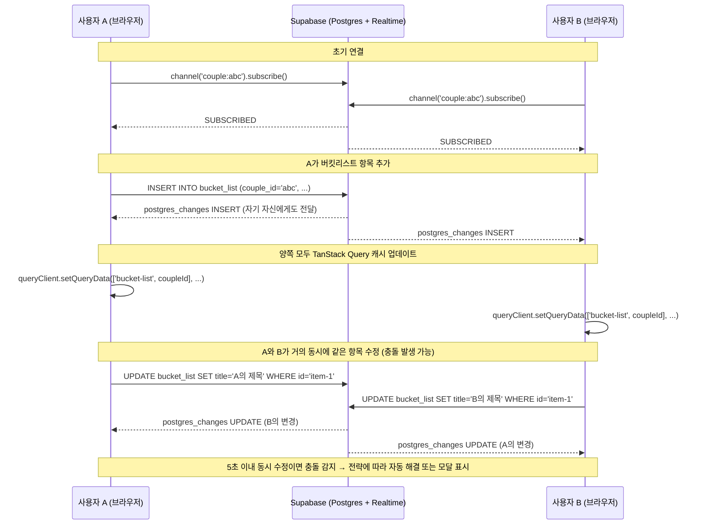

커플 앱을 만들면서 처음에는 단순하게 생각했다. "둘이 쓰는 앱인데, 그냥 새로고침하면 되지 않나?" 그런데 막상 구현하다 보니, 두 사람이 동시에 같은 데이터를 건드리는 순간이 생각보다 훨씬 많았다. 버킷리스트를 동시에 체크하거나, 달력 일정을 각자 다른 내용으로 수정하거나. 이 글은 그 문제를 어떻게 풀었는지, 그리고 충돌 해결까지 어떻게 연결했는지에 관한 기록이다.

---

## 1. 커플 앱에서 실시간 동기화가 필요한 이유

일반적인 웹앱과 달리 커플 앱은 **항상 2명의 액터(actor)가 동일한 데이터 공간을 공유**한다. 혼자 쓰는 메모 앱이라면 pull-to-refresh로도 충분하지만, 커플 앱에서는 이런 시나리오가 빈번하다.

- A가 오늘 저녁 일정을 추가하는 순간, B가 같은 날 다른 내용으로 일정을 추가한다
- A가 버킷리스트 항목을 완료 처리하는데, B가 동시에 같은 항목의 제목을 수정한다
- 한쪽이 지출 내역을 입력하면 상대방 화면에 즉시 반영되어야 한다

폴링(polling) 방식으로 5초마다 fetch를 돌리는 방법도 있지만, 커플 앱의 특성상 "내가 방금 입력한 게 상대방 화면에 나타났나?" 하는 실시간 감각이 UX 핵심이라고 판단했다. Supabase Realtime이 WebSocket 기반으로 Postgres 변경사항을 스트리밍해주는 걸 보고, 이걸 채택하기로 했다.

### 왜 이 기술을 선택했는가

**Supabase Realtime vs Firebase Realtime Database vs 자체 WebSocket 서버**

Firebase는 NoSQL 구조라 이미 Postgres 스키마로 설계한 데이터 모델과 맞지 않았다. 자체 WebSocket 서버는 운영 부담이 크다. Supabase Realtime을 선택한 이유는 세 가지다.

첫째, 이미 Supabase를 DB로 쓰고 있었다. `postgres_changes` 이벤트를 구독하면 DB 레벨에서 변경을 받을 수 있어 별도 인프라가 필요 없다.

둘째, `filter` 옵션이 강력하다. `couple_id=eq.${coupleId}` 형태로 필터링하면 해당 커플의 데이터만 받도록 서버 측에서 걸러준다.

셋째, Row Level Security(RLS)와 자연스럽게 통합된다. Realtime 구독도 RLS를 준수하므로 다른 커플의 데이터가 섞일 걱정이 없다.

---

## 2. Supabase Realtime 채널 설계: couple_id 기반 단일 채널

처음 설계할 때 테이블마다 채널을 하나씩 만들었다. `date_records` 채널, `bucket_list` 채널, `events` 채널... 그런데 이렇게 하면 WebSocket 연결이 테이블 수만큼 생기고, 각 채널의 구독 상태를 따로 관리해야 하는 복잡도가 생겼다.

결국 **커플 ID 기준으로 단일 채널을 만들고, 그 안에 모든 테이블 리스너를 등록**하는 방식으로 바꿨다.

```typescript
// src/contexts/RealtimeContext.tsx

// couple_id로 필터링하는 테이블 목록
const COUPLE_TABLES = [
  "date_records",
  "bucket_list",
  "recipes",
  "anniversaries",
  "expenses",
  "settlements",
] as const;

// user_id로 필터링하는 테이블 목록 (개인 데이터)
const USER_TABLES = ["events", "private_notes"] as const;

export function RealtimeProvider({ coupleId, userId, children }: RealtimeProviderProps) {
  const [isConnected, setIsConnected] = useState(false);
  const listenersRef = useRef<Map<string, Set<TableListener>>>(new Map());
  const channelRef = useRef<RealtimeChannel | null>(null);

  useEffect(() => {
    if (!coupleId) {
      setIsConnected(false);
      return;
    }

    const supabase = getSupabaseClient();
    // 커플 ID를 채널 이름으로 사용 — 하나의 WebSocket 연결
    const channel = supabase.channel(`couple:${coupleId}`);
    channelRef.current = channel;

    // couple_id 기반 테이블 구독
    COUPLE_TABLES.forEach((table) => {
      channel.on(
        "postgres_changes",
        {
          event: "*",
          schema: "public",
          table,
          filter: `couple_id=eq.${coupleId}`,
        },
        (payload) => {
          listenersRef.current.get(table)?.forEach((cb) => cb(payload));
        },
      );
    });

    // user_id 기반 테이블 구독 (이벤트, 개인 노트)
    if (userId) {
      USER_TABLES.forEach((table) => {
        channel.on(
          "postgres_changes",
          { event: "*", schema: "public", table, filter: `user_id=eq.${userId}` },
          (payload) => {
            listenersRef.current.get(table)?.forEach((cb) => cb(payload));
          },
        );
      });
    }

    channel.subscribe((status) => {
      setIsConnected(status === "SUBSCRIBED");
    });

    return () => {
      supabase.removeChannel(channel);
      channelRef.current = null;
      setIsConnected(false);
    };
  }, [coupleId, userId]);
```

`listenersRef`는 `Map<string, Set<TableListener>>` 구조다. 채널은 하나지만 각 테이블에 여러 컴포넌트가 리스너를 등록할 수 있다. `useRealtimeListener` 훅이 그 인터페이스를 제공한다.

```typescript
export function useRealtimeListener<T = Record<string, unknown>>(
  tableName: string,
  onEvent: (payload: RealtimePostgresChangesPayload<any>) => void
): void {
  const ctx = useContext(RealtimeContext)
  const callbackRef = useRef(onEvent)
  callbackRef.current = onEvent // 매 렌더마다 최신 콜백으로 갱신

  useEffect(() => {
    if (!ctx) return
    const remove = ctx.addListener(
      tableName,
      payload => callbackRef.current(payload) // ref를 통해 항상 최신 콜백 호출
    )
    return remove // 언마운트 시 자동 제거
  }, [ctx, tableName])
}
```

`callbackRef` 패턴이 중요하다. `useEffect` deps에 `onEvent`를 넣으면 부모가 렌더링될 때마다 새 함수 참조가 생기고, 리스너가 remove → add를 반복한다. ref에 저장해두면 채널 재구독 없이 항상 최신 클로저를 사용할 수 있다.

### RealtimeBridge: 의존성 분리

`RealtimeProvider`는 `coupleId`와 `userId`를 prop으로 받는 순수한 컴포넌트다. 인증 상태와 커플 상태를 직접 알지 않는다. `RealtimeBridge`가 그 연결 역할을 담당한다.

```typescript
// src/components/providers/realtime-bridge.tsx
export function RealtimeBridge({ children }: { children: ReactNode }) {
  const { user } = useAuth();
  const { coupleInfo } = useCoupleStatus();

  const coupleId = coupleInfo?.coupleId ?? null;
  const userId = user?.id ?? null;

  return (
    <RealtimeProvider coupleId={coupleId} userId={userId}>
      {children}
    </RealtimeProvider>
  );
}
```

`RealtimeProvider` 자체는 auth를 모르고, Bridge가 글루(glue) 역할만 한다. 덕분에 `RealtimeProvider`는 mock coupleId/userId를 주입해서 독립적으로 테스트할 수 있다.

---

## 3. 실시간 동기화 흐름

아래는 두 사용자 간 실시간 동기화와 충돌이 어떻게 흘러가는지를 나타낸 시퀀스 다이어그램이다.



Supabase Realtime은 insert/update를 수행한 당사자에게도 이벤트를 보낸다. 이 점을 이용해 내 변경도 Realtime 이벤트로 캐시를 업데이트하는 단일 경로로 처리할 수 있지만, 낙관적 업데이트와 결합하면 중복 처리가 발생한다 — 이 부분은 아래에서 자세히 다룬다.

---

## 4. 낙관적 업데이트 + TanStack Query invalidation 전략

Realtime 이벤트를 받았을 때 화면을 어떻게 갱신할지가 중요한 결정 포인트였다.

**`invalidateQueries` 방식**: 이벤트 수신 시 쿼리를 무효화해서 재fetch한다. 단순하지만 네트워크 왕복이 발생한다.

**`setQueryData` 방식**: Realtime 페이로드에서 직접 캐시를 업데이트한다. 네트워크 없이 즉시 반영된다.

`useEvents` 훅에서는 `setQueryData` 방식을 택했다. Realtime 페이로드 자체에 최신 row 데이터가 담겨 있으므로 재fetch가 불필요하다.

```typescript
// src/hooks/useEvents.ts

useRealtimeListener<EventRow>('events', payload => {
  if (!queryKey) return

  if (payload.eventType === 'INSERT' && payload.new) {
    const newEvent = mapRowToEvent(payload.new as EventRow)
    queryClient.setQueryData<CalendarEvent[]>(queryKey, (prev = []) => {
      // 낙관적 업데이트로 이미 추가된 항목 중복 방지
      if (prev.some(e => e.id === newEvent.id)) {
        return prev
      }
      return [...prev, newEvent].sort(
        (a, b) => a.startDate.getTime() - b.startDate.getTime()
      )
    })
  } else if (payload.eventType === 'UPDATE' && payload.new) {
    const updatedEvent = mapRowToEvent(payload.new as EventRow)
    queryClient.setQueryData<CalendarEvent[]>(queryKey, (prev = []) =>
      prev.map(e => (e.id === updatedEvent.id ? updatedEvent : e))
    )
  } else if (payload.eventType === 'DELETE' && payload.old) {
    const deletedId = (payload.old as EventRow).id
    queryClient.setQueryData<CalendarEvent[]>(queryKey, (prev = []) =>
      prev.filter(e => e.id !== deletedId)
    )
  }
})
```

INSERT 처리에서 `prev.some((e) => e.id === newEvent.id)` 체크가 핵심이다. 내가 이벤트를 생성하면 두 가지 경로로 데이터가 온다.

1. 뮤테이션 `onSuccess`에서 `invalidateQueries` → 서버에서 재fetch
2. Supabase Realtime → INSERT 이벤트 push

두 경로가 경쟁하면 같은 항목이 두 번 캐시에 들어간다. 중복 체크로 이를 방어한다.

### mutation의 invalidateQueries는 여전히 필요하다

뮤테이션 `onSuccess`에서는 여전히 `invalidateQueries`를 호출한다.

```typescript
const createMutation = useMutation({
  mutationFn: async (input: EventInput): Promise<CalendarEvent> => {
    // ... Supabase insert
  },
  onSuccess: () => {
    if (queryKey) {
      queryClient.invalidateQueries({ queryKey }) // 안전망
    }
  },
})
```

Realtime 이벤트가 항상 도착한다고 보장할 수 없다. 연결이 끊겼거나 이벤트가 유실된 경우에도 최종적으로 DB 상태와 동기화되도록 보장하는 안전망이다. `setQueryData`(빠른 경로) + `invalidateQueries`(보장 경로)가 함께 동작한다.

---

## 5. useCoupleSync: 동기화 이벤트 관찰자

UI에 "파트너가 버킷리스트를 업데이트했어요"라는 알림을 보여주고 싶었다. 각 훅에서 직접 토스트를 띄우는 대신, 모든 테이블의 변경을 한곳에서 관찰하는 `useCoupleSync` 훅을 만들었다.

```typescript
// src/hooks/useCoupleSync.ts

export const TABLE_DISPLAY_NAMES: Record<SyncTable, string> = {
  date_records: '데이트 기록',
  bucket_list: '버킷리스트',
  recipes: '레시피',
  events: '일정',
  anniversaries: '기념일',
  expenses: '지출',
  settlements: '정산',
}

export function useCoupleSync(): UseCoupleSync {
  const { isConnected } = useRealtimeStatus()
  const [events, setEvents] = useState<SyncEvent[]>([])
  const [latestEvent, setLatestEvent] = useState<SyncEvent | null>(null)
  const timerRef = useRef<ReturnType<typeof setTimeout>>(null)

  const handleChange = useCallback(
    (table: SyncTable) =>
      (payload: RealtimePostgresChangesPayload<Record<string, unknown>>) => {
        const newData =
          payload.eventType !== 'DELETE'
            ? (payload.new as Record<string, unknown>)
            : undefined
        const oldData =
          payload.eventType === 'DELETE'
            ? (payload.old as Record<string, unknown>)
            : undefined

        const event: SyncEvent = {
          id: `${table}-${Date.now()}-${Math.random().toString(36).substring(2, 11)}`,
          table,
          type: payload.eventType,
          data: newData || oldData || {},
          timestamp: new Date(),
          userId:
            (newData?.user_id as string) || (newData?.created_by as string),
        }

        setEvents(prev => [event, ...prev.slice(0, 49)]) // 최근 50개 유지
        setLatestEvent(event)

        // 5초 후 latestEvent 자동 클리어
        if (timerRef.current) clearTimeout(timerRef.current)
        timerRef.current = setTimeout(() => {
          setLatestEvent(current => (current?.id === event.id ? null : current))
        }, 5000)
      },
    []
  )

  // 모든 동기화 테이블에 리스너 등록
  useRealtimeListener('date_records', handleChange('date_records'))
  useRealtimeListener('bucket_list', handleChange('bucket_list'))
  useRealtimeListener('recipes', handleChange('recipes'))
  useRealtimeListener('events', handleChange('events'))
  useRealtimeListener('anniversaries', handleChange('anniversaries'))
  useRealtimeListener('expenses', handleChange('expenses'))
  useRealtimeListener('settlements', handleChange('settlements'))
  // ...
}
```

`latestEvent`는 5초 타이머로 자동 소거된다. 타이머가 겹치면 id 비교로 현재 이벤트인지 확인하고 소거한다. `SyncStatusIndicator` 컴포넌트가 연결 상태를 실시간으로 보여준다.

```typescript
// src/components/sync/SyncStatusIndicator.tsx (일부)
const { isConnected, isConnecting, lastSync, reconnect } = useCoupleSync()

const formatLastSync = (date: Date | null) => {
  if (!date) return '동기화 대기 중'
  const diff = Math.floor((now.getTime() - date.getTime()) / 1000)
  if (diff < 60) return '방금 전'
  if (diff < 3600) return `${Math.floor(diff / 60)}분 전`
  return `${Math.floor(diff / 3600)}시간 전`
}
```

compact 모드에서는 녹색 pulse 점, 전체 모드에서는 "실시간 연결 · 방금 전" 텍스트를 보여준다.

---

## 6. 충돌 감지 및 해결

### 충돌을 어떻게 정의하는가

충돌은 **두 사용자가 같은 레코드를 마지막 동기화 이후에 각자 수정했고, 그 수정이 5초 이내에 일어났을 때** 발생한다고 정의했다. 5초를 넘으면 순차적 편집으로 간주하고 Last-Write-Wins를 적용한다.

```typescript
// src/lib/conflictDetection.ts

const CONFLICT_THRESHOLD_MS = 5000 // 5초

export function detectConflict(
  recordId: string,
  table: string,
  localData: Record<string, unknown>,
  localUpdatedAt: Date,
  localUpdatedBy: string,
  remoteData: Record<string, unknown>,
  remoteUpdatedAt: Date,
  remoteUpdatedBy: string,
  lastSyncTime: Date
): SyncConflict | null {
  // 같은 사용자가 양쪽 모두 수정했으면 충돌 아님
  if (localUpdatedBy === remoteUpdatedBy) return null

  // 마지막 동기화 이후 양쪽 모두 변경됐어야 충돌
  const remoteChangedAfterSync = remoteUpdatedAt > lastSyncTime
  const localChangedAfterSync = localUpdatedAt > lastSyncTime
  if (!remoteChangedAfterSync || !localChangedAfterSync) return null

  // 5초 초과면 나중 변경이 자연스럽게 우선 — 충돌 없음
  const timeDiff = Math.abs(
    localUpdatedAt.getTime() - remoteUpdatedAt.getTime()
  )
  if (timeDiff > CONFLICT_THRESHOLD_MS) return null

  // 실제로 다른 필드가 있는지 확인
  const conflictedFields = findConflictingFields(localData, remoteData)
  if (conflictedFields.length === 0) return null

  return {
    id: `conflict-${recordId}-${Date.now()}`,
    recordId,
    table,
    localVersion: {
      data: localData,
      updatedAt: localUpdatedAt,
      updatedBy: localUpdatedBy,
    },
    remoteVersion: {
      data: remoteData,
      updatedAt: remoteUpdatedAt,
      updatedBy: remoteUpdatedBy,
    },
    conflictedFields,
    detectedAt: new Date(),
  }
}
```

`findConflictingFields`는 `id`, `created_at`, `couple_id` 같은 시스템 필드를 건너뛰고 실제 콘텐츠 필드만 비교한다. Date, Array, 중첩 객체를 모두 처리하는 `deepEqual`을 직접 구현했다.

```typescript
export function findConflictingFields(
  localData: Record<string, unknown>,
  remoteData: Record<string, unknown>
): string[] {
  const conflicting: string[] = []
  const allKeys = new Set([
    ...Object.keys(localData),
    ...Object.keys(remoteData),
  ])

  // 시스템 필드 제외
  const skipFields = [
    'id',
    'created_at',
    'updated_at',
    'createdAt',
    'updatedAt',
    'user_id',
    'userId',
    'couple_id',
    'coupleId',
  ]

  for (const key of allKeys) {
    if (skipFields.includes(key)) continue
    if (!deepEqual(localData[key], remoteData[key])) {
      conflicting.push(key)
    }
  }

  return conflicting
}
```

### 테이블별 충돌 전략

모든 충돌을 동일하게 처리하면 UX가 나빠진다. 버킷리스트 완료 여부가 바뀐 건 사용자가 굳이 선택할 필요 없지만, 데이트 기록의 내용이 충돌하면 사용자가 직접 선택해야 한다.

```typescript
export enum ConflictStrategy {
  LAST_WRITE_WINS = 'last_write_wins', // 최신 타임스탬프 우선
  FIRST_WRITE_WINS = 'first_write_wins', // 원본 데이터 보존
  ASK_USER = 'ask_user', // 사용자 선택
  AUTO_MERGE = 'auto_merge', // 필드 단위 자동 병합
}

export const TABLE_CONFLICT_STRATEGIES: Record<string, ConflictStrategy> = {
  date_records: ConflictStrategy.ASK_USER, // 중요한 데이터 — 직접 선택
  bucket_list: ConflictStrategy.LAST_WRITE_WINS, // 단순 데이터 — 자동 해결
  recipes: ConflictStrategy.ASK_USER, // 레시피 내용 — 직접 선택
  events: ConflictStrategy.LAST_WRITE_WINS, // 캘린더 이벤트 — 자동 해결
  anniversaries: ConflictStrategy.LAST_WRITE_WINS, // 단순 데이터
}
```

`autoResolve` 함수가 테이블 전략에 따라 자동으로 해결 방법을 결정한다.

```typescript
export function autoResolve(conflict: SyncConflict): ConflictResolution {
  const strategy =
    TABLE_CONFLICT_STRATEGIES[conflict.table] ||
    ConflictStrategy.LAST_WRITE_WINS

  switch (strategy) {
    case ConflictStrategy.LAST_WRITE_WINS:
      return conflict.localVersion.updatedAt > conflict.remoteVersion.updatedAt
        ? 'keep_local'
        : 'keep_remote'
    case ConflictStrategy.FIRST_WRITE_WINS:
      return conflict.localVersion.updatedAt < conflict.remoteVersion.updatedAt
        ? 'keep_local'
        : 'keep_remote'
    case ConflictStrategy.AUTO_MERGE:
      return 'merge'
    case ConflictStrategy.ASK_USER:
    default:
      return 'merge' // UI에서 처리해야 하므로 fallback
  }
}
```

### 병합(merge) 전략: 필드 단위 최신값

`merge` 해결 방법은 충돌하지 않은 필드는 있는 값을 그대로 쓰고, 충돌한 필드는 더 최근에 업데이트된 버전의 값을 사용한다.

```typescript
export function mergeData(conflict: SyncConflict): Record<string, unknown> {
  const merged: Record<string, unknown> = {}
  const { localVersion, remoteVersion } = conflict
  const allKeys = new Set([
    ...Object.keys(localVersion.data),
    ...Object.keys(remoteVersion.data),
  ])

  for (const key of allKeys) {
    if (!conflict.conflictedFields.includes(key)) {
      // 충돌 없는 필드: 있는 값 사용
      merged[key] = localVersion.data[key] ?? remoteVersion.data[key]
      continue
    }
    // 충돌 필드: 더 최근 버전 우선
    if (localVersion.updatedAt > remoteVersion.updatedAt) {
      merged[key] = localVersion.data[key]
    } else {
      merged[key] = remoteVersion.data[key]
    }
  }

  return merged
}
```

### useConflictResolution 훅

충돌 상태를 관리하는 훅이다. 같은 `recordId + table` 조합의 충돌이 다시 들어오면 업데이트(중복 방지)한다. `resolveAll`로 전략을 받아 한 번에 일괄 해결하는 것도 지원한다.

```typescript
// src/hooks/useConflictResolution.ts

export function useConflictResolution(): UseConflictResolutionReturn {
  const [conflicts, setConflicts] = useState<SyncConflict[]>([])

  const addConflict = useCallback((conflict: SyncConflict) => {
    setConflicts(prev => {
      const existing = prev.find(
        c => c.recordId === conflict.recordId && c.table === conflict.table
      )
      if (existing) {
        // 같은 레코드의 충돌이 새로 들어오면 업데이트
        return prev.map(c =>
          c.recordId === conflict.recordId && c.table === conflict.table
            ? conflict
            : c
        )
      }
      return [...prev, conflict]
    })
  }, [])

  const resolveAll = useCallback(
    (strategy: ConflictStrategy): Map<string, Record<string, unknown>> => {
      const results = new Map<string, Record<string, unknown>>()

      conflicts.forEach(conflict => {
        let resolution: ConflictResolution
        switch (strategy) {
          case ConflictStrategy.LAST_WRITE_WINS:
            resolution =
              conflict.localVersion.updatedAt > conflict.remoteVersion.updatedAt
                ? 'keep_local'
                : 'keep_remote'
            break
          case ConflictStrategy.AUTO_MERGE:
            resolution = 'merge'
            break
          default:
            resolution = autoResolve(conflict)
        }
        const resolvedData = resolveConflict(conflict, resolution)
        results.set(conflict.recordId, resolvedData)
      })

      setConflicts([])
      return results
    },
    [conflicts]
  )
  // ...
}
```

### ConflictResolutionModal: 사용자 직접 선택 UI

`ASK_USER` 전략의 테이블에서 충돌이 발생하면 모달을 띄운다. 각 충돌 필드별로 내 버전과 파트너 버전을 나란히 보여주고, 클릭해서 선택한다. 자동 병합 옵션도 제공한다.

```tsx
// src/components/sync/ConflictResolutionModal.tsx (핵심 부분)

{
  conflict.conflictedFields.map(field => (
    <div key={field} className="rounded-xl bg-gray-50 p-4 dark:bg-gray-900/50">
      <h3 className="mb-3 text-sm font-medium text-gray-500">
        {getFieldDisplayName(field)}{' '}
        {/* "content" → "내용", "location" → "장소" */}
      </h3>
      <div className="grid grid-cols-2 gap-4">
        {/* 내 버전 */}
        <div
          className={`cursor-pointer rounded-lg border-2 p-3 transition-all ${
            selectedResolution === 'keep_local'
              ? 'border-blue-500 bg-blue-50 dark:bg-blue-900/20'
              : 'border-gray-200 hover:border-blue-300'
          }`}
          onClick={() => setSelectedResolution('keep_local')}
        >
          <div className="mb-2 flex items-center gap-2">
            <User className="h-4 w-4 text-blue-500" />
            <span className="text-xs font-medium text-blue-600">내 버전</span>
          </div>
          <p className="break-words text-sm">
            {formatValue(conflict.localVersion.data[field])}
          </p>
        </div>

        {/* 파트너 버전 */}
        <div
          className={`cursor-pointer rounded-lg border-2 p-3 transition-all ${
            selectedResolution === 'keep_remote'
              ? 'border-pink-500 bg-pink-50 dark:bg-pink-900/20'
              : 'border-gray-200 hover:border-pink-300'
          }`}
          onClick={() => setSelectedResolution('keep_remote')}
        >
          <div className="mb-2 flex items-center gap-2">
            <User className="h-4 w-4 text-pink-500" />
            <span className="text-xs font-medium text-pink-600">
              {partnerName}의 버전
            </span>
          </div>
          <p className="break-words text-sm">
            {formatValue(conflict.remoteVersion.data[field])}
          </p>
        </div>
      </div>
    </div>
  ))
}
```

`getFieldDisplayName`이 한국어 필드명을 제공한다. `title` → "제목", `content` → "내용", `location` → "장소" 식이다. 타임스탬프도 함께 보여줘서 "내 수정: 3월 16일 14:23" vs "파트너 수정: 3월 16일 14:23" 형태로 시각적 판단을 돕는다.

---

## 7. 오프라인 지원: PWA + Service Worker

커플 앱은 이동 중에도 쓴다. 지하철에서 메모를 남기거나, 카페에서 버킷리스트를 추가하거나. 오프라인 지원은 선택이 아니라 필수였다.

`@serwist/next`를 사용해 Service Worker를 설정했다. Serwist는 Workbox의 모던 후속 프로젝트로, Next.js 통합이 깔끔하다.

```typescript
// src/sw.ts

const serwist = new Serwist({
  precacheEntries: self.__SW_MANIFEST,
  skipWaiting: true,
  clientsClaim: true,
  navigationPreload: true,
  runtimeCaching: [
    // Google Fonts — CacheFirst (1년)
    {
      matcher: ({ url }) =>
        url.origin === 'https://fonts.googleapis.com' ||
        url.origin === 'https://fonts.gstatic.com',
      handler: new CacheFirst({
        cacheName: 'google-fonts',
        plugins: [
          new ExpirationPlugin({
            maxEntries: 30,
            maxAgeSeconds: 60 * 60 * 24 * 365,
          }),
        ],
      }),
    },
    // Next.js 정적 에셋 — CacheFirst (30일)
    {
      matcher: ({ url }) => url.pathname.startsWith('/_next/static/'),
      handler: new CacheFirst({
        cacheName: 'next-static',
        plugins: [
          new ExpirationPlugin({
            maxEntries: 100,
            maxAgeSeconds: 60 * 60 * 24 * 30,
          }),
        ],
      }),
    },
    // 이미지 / Supabase Storage — StaleWhileRevalidate (7일)
    {
      matcher: ({ url }) =>
        url.hostname.endsWith('.supabase.co') &&
        url.pathname.includes('/storage/'),
      handler: new StaleWhileRevalidate({
        cacheName: 'supabase-storage',
        plugins: [
          new ExpirationPlugin({
            maxEntries: 100,
            maxAgeSeconds: 60 * 60 * 24 * 7,
          }),
        ],
      }),
    },
    // API 라우트 — NetworkFirst (5분 폴백), AI 라우트는 캐시 제외
    {
      matcher: ({ url }) =>
        url.pathname.startsWith('/api/') &&
        !url.pathname.startsWith('/api/ai/'),
      handler: new NetworkFirst({
        cacheName: 'api-cache',
        networkTimeoutSeconds: 10,
        plugins: [
          new ExpirationPlugin({ maxEntries: 50, maxAgeSeconds: 60 * 5 }),
        ],
      }),
    },
    // Supabase REST/Auth — NetworkOnly (실시간 데이터는 캐시 불가)
    {
      matcher: ({ url }) =>
        url.hostname.endsWith('.supabase.co') &&
        (url.pathname.includes('/rest/') || url.pathname.includes('/auth/')),
      handler: new NetworkOnly(),
    },
  ],
  fallbacks: {
    entries: [
      {
        url: '/offline',
        matcher: ({ request }) => request.destination === 'document',
      },
    ],
  },
})
```

전략 선택 기준:

- **정적 에셋**: `CacheFirst` — 변하지 않으므로 캐시를 먼저 본다
- **이미지/스토리지**: `StaleWhileRevalidate` — 즉시 캐시를 보여주고 백그라운드에서 갱신
- **API 라우트**: `NetworkFirst` — 네트워크 우선, 실패하면 5분 이내 캐시로 폴백
- **Supabase DB 쿼리**: `NetworkOnly` — 실시간 데이터는 캐시하면 안 됨
- **AI 라우트**: 캐시 제외 — 스트리밍 응답이라 캐시 자체가 불가

`useServiceWorker` 훅이 온라인 상태와 업데이트 가용 여부를 관리한다.

```typescript
// src/hooks/useServiceWorker.ts

export function useServiceWorker(): UseServiceWorkerReturn {
  const [isOnline, setIsOnline] = useState(true)
  const [isUpdateAvailable, setIsUpdateAvailable] = useState(false)
  const [waitingWorker, setWaitingWorker] = useState<ServiceWorker | null>(null)

  useEffect(() => {
    setIsOnline(navigator.onLine)

    const handleOnline = () => setIsOnline(true)
    const handleOffline = () => setIsOnline(false)

    window.addEventListener('online', handleOnline)
    window.addEventListener('offline', handleOffline)

    if ('serviceWorker' in navigator) {
      navigator.serviceWorker.register('/sw.js').then(reg => {
        setRegistration(reg)

        // 업데이트 감지
        reg.addEventListener('updatefound', () => {
          const newWorker = reg.installing
          newWorker?.addEventListener('statechange', () => {
            if (
              newWorker.state === 'installed' &&
              navigator.serviceWorker.controller
            ) {
              setWaitingWorker(newWorker)
              setIsUpdateAvailable(true)
            }
          })
        })
      })

      // 새 SW가 제어권을 가져오면 리로드
      navigator.serviceWorker.addEventListener('controllerchange', () => {
        window.location.reload()
      })
    }

    return () => {
      window.removeEventListener('online', handleOnline)
      window.removeEventListener('offline', handleOffline)
    }
  }, [])

  const updateServiceWorker = useCallback(() => {
    waitingWorker?.postMessage({ type: 'SKIP_WAITING' })
  }, [waitingWorker])

  return { isOnline, isUpdateAvailable, updateServiceWorker, registration }
}
```

`OfflineIndicator`는 오프라인 상태일 때 상단 고정 배너를 보여준다.

```tsx
// src/components/pwa/OfflineIndicator.tsx
export function OfflineIndicator() {
  const { isOnline } = useServiceWorker()
  if (isOnline) return null

  return (
    <div className="fixed left-0 right-0 top-0 z-50 bg-gray-800 px-4 py-2 text-white">
      <div className="flex items-center justify-center gap-2 text-sm">
        <WifiOff className="h-4 w-4" />
        <span>오프라인 모드 - 일부 기능이 제한됩니다</span>
      </div>
    </div>
  )
}
```

---

## 8. 테스트 전략: 동시성 시나리오 검증

동시성 버그는 수동 테스트로 재현하기 어렵다. 두 브라우저를 동시에 열고 정확히 같은 시간에 다른 내용을 입력해야 하니까. 테스트 전략은 세 층으로 구성했다.

### 계층 1: 충돌 감지 로직 단위 테스트

`conflictDetection.ts`는 순수 함수라서 단위 테스트하기 쉽다. 모든 경계 조건을 커버했다.

```typescript
// src/__tests__/lib/conflictDetection.test.ts

it('should detect conflict when all conditions are met', () => {
  const lastSync = new Date('2026-01-21T11:00:00.000Z')

  const result = detectConflict(
    'record-1',
    'date_records',
    { title: 'Local Title' },
    new Date('2026-01-21T12:00:00.000Z'),
    'user-1',
    { title: 'Remote Title' },
    new Date('2026-01-21T12:00:02.000Z'), // 2초 차이 — 충돌 임계값 이내
    'user-2',
    lastSync
  )

  expect(result).not.toBeNull()
  expect(result?.recordId).toBe('record-1')
  expect(result?.conflictedFields).toContain('title')
})

it('should return null if changes are more than 5 seconds apart', () => {
  const result = detectConflict(
    'record-1',
    'date_records',
    { title: 'Local' },
    new Date('2026-01-21T12:00:00.000Z'),
    'user-1',
    { title: 'Remote' },
    new Date('2026-01-21T12:00:10.000Z'), // 10초 차이
    'user-2',
    new Date('2026-01-21T11:00:00.000Z')
  )

  expect(result).toBeNull() // 5초 초과 → 충돌 없음, LWW 적용
})

it('should return null if same user made both changes', () => {
  const result = detectConflict(
    'record-1',
    'date_records',
    { title: 'Local' },
    new Date('2026-01-21T12:00:00.000Z'),
    'user-1',
    { title: 'Remote' },
    new Date('2026-01-21T12:00:01.000Z'),
    'user-1', // 같은 사용자
    new Date('2026-01-21T11:00:00.000Z')
  )

  expect(result).toBeNull()
})
```

### 계층 2: Realtime 훅 테스트 — 타이머 제어

`useCoupleSync`의 5초 자동 소거를 테스트하려면 타이머를 제어해야 한다. Vitest의 `vi.useFakeTimers()`와 `vi.advanceTimersByTime()`을 활용했다.

```typescript
// src/__tests__/hooks/useCoupleSync.test.ts

const capturedListeners: Map<string, (payload: unknown) => void> = new Map()
let mockIsConnected = false

vi.mock('@/contexts/RealtimeContext', () => ({
  useRealtimeListener: vi.fn(
    (table: string, callback: (payload: unknown) => void) => {
      capturedListeners.set(table, callback)
    }
  ),
  useRealtimeStatus: vi.fn(() => ({ isConnected: mockIsConnected })),
}))

it('should clear latestEvent after 5 seconds', () => {
  const { result } = renderHook(() => useCoupleSync())
  const handler = capturedListeners.get('date_records')

  act(() => {
    handler!({ eventType: 'INSERT', new: { id: 'record-1', title: 'Test' } })
  })

  expect(result.current.latestEvent).not.toBeNull()

  act(() => {
    vi.advanceTimersByTime(5000) // 가짜 타이머로 5초 이동
  })

  expect(result.current.latestEvent).toBeNull() // 5초 후 자동 소거 확인
})

it('should keep only last 50 events', () => {
  const { result } = renderHook(() => useCoupleSync())
  const handler = capturedListeners.get('date_records')

  for (let i = 0; i < 55; i++) {
    act(() => {
      handler!({ eventType: 'INSERT', new: { id: `record-${i}` } })
    })
  }

  expect(result.current.events.length).toBeLessThanOrEqual(50)
})
```

### 계층 3: callbackRef 최신성 보장 테스트

`useRealtimeListener`에서 `callbackRef` 패턴이 제대로 동작하는지 — 콜백이 교체된 후 새 콜백이 호출되는지 — 검증하는 테스트다.

```typescript
// src/__tests__/contexts/RealtimeContext.test.tsx

it('should use latest callback ref (not stale closure)', () => {
  const firstCallback = vi.fn()
  const secondCallback = vi.fn()

  const { rerender } = renderHook(
    ({ cb }) => useRealtimeListener('bucket_list', cb),
    {
      wrapper: makeWrapper('couple-123', 'user-456'),
      initialProps: { cb: firstCallback },
    }
  )

  rerender({ cb: secondCallback }) // 콜백 교체

  const handler = capturedHandlers.get('bucket_list')
  act(() => {
    handler({ eventType: 'UPDATE', new: { id: 'item-1' }, old: {} })
  })

  // 새 콜백이 호출되어야 함 (stale closure 문제 없어야 함)
  expect(secondCallback).toHaveBeenCalledTimes(1)
  expect(firstCallback).not.toHaveBeenCalled()
})
```

### 뮤테이션 테스트로 로직 강도 검증

Stryker Mutant Testing을 도입해서 뮤테이션 점수 75% 이상을 강제했다.

```json
// stryker.config.json
{
  "testRunner": "vitest",
  "checkers": ["typescript"],
  "thresholds": {
    "high": 80,
    "low": 75,
    "break": 75
  },
  "concurrency": 4,
  "timeoutMS": 60000
}
```

뮤테이션 테스팅이 특히 효과적이었던 부분은 `detectConflict`의 임계값 로직이다. `timeDiff > CONFLICT_THRESHOLD_MS`를 `>=`로 바꾸거나 부등호를 뒤집으면 테스트가 즉시 실패한다. 코드가 해당 조건을 실제로 검증하고 있다는 증거다.

---

## 9. 실제 만난 엣지 케이스와 해결

### 문제 1: 자기 자신에게도 Realtime 이벤트가 온다

Supabase Realtime은 내가 insert/update한 내용도 구독 채널로 돌아온다. 낙관적 업데이트로 이미 캐시에 추가한 항목이 Realtime 이벤트로 다시 추가되어 중복이 생겼다.

**해결**: INSERT 이벤트 처리 시 `prev.some((e) => e.id === newEvent.id)` 체크로 중복을 방지한다.

### 문제 2: React StrictMode 이중 마운트

개발 환경에서 React StrictMode가 컴포넌트를 두 번 마운트하면서 WebSocket 연결도 두 번 생겼다. `useRef`로 채널을 추적하고, effect cleanup에서 `removeChannel`을 반드시 호출하도록 해서 해결했다.

### 문제 3: 채널 이름 충돌

처음에 채널 이름을 `realtime`처럼 단순하게 지었다가, 같은 브라우저에서 다른 계정으로 로그인하면 채널이 겹쳐서 이벤트가 섞였다. `couple:${coupleId}` 형태로 커플 ID를 채널 이름에 포함시켜서 해결했다.

### 문제 4: 충돌 임계값 5초의 근거

처음에는 1초로 설정했다가 실제로 써보니 너무 많은 충돌이 발생했다. 네트워크 지연으로 내 변경이 상대방에게 전달되는 데 1-2초가 걸리기 때문이다. 5초로 늘리니 실제 동시 편집 충돌만 잡히고, 약간의 시차를 둔 정상적인 순차 편집은 Last-Write-Wins로 처리됐다.

### 문제 5: 오프라인에서 Supabase 쿼리가 에러를 던짐

Network 없이 Supabase REST를 호출하면 전부 에러가 났다. `/api/` 라우트는 `NetworkFirst` + 5분 폴백 캐시로 보호하고, Supabase REST는 `NetworkOnly`로 두어 잘못된 캐시 데이터가 표시되는 것을 막았다. TanStack Query `networkMode: "offlineFirst"` 설정으로 오프라인 중에는 쿼리가 에러 없이 캐시를 반환하도록 했다.

### 문제 6: 태그 배열 충돌

레시피에 `tags: ["한식", "국"]`이 있고, 내가 `["한식", "국", "찜"]`으로 수정하는 동시에 파트너가 `["한식", "국", "매운맛"]`으로 수정했다. `findConflictingFields`는 배열을 순서 포함 깊은 비교하기 때문에 `tags` 필드가 충돌로 감지된다. 그런데 진짜 원하는 결과는 `["한식", "국", "찜", "매운맛"]`의 합집합이다.

현재 `merge` 전략은 타임스탬프 기준으로 둘 중 하나의 배열 전체를 선택한다. 배열 레벨의 3-way merge는 현재 미구현이다. 실제 사용 빈도 데이터를 쌓은 후 개선할 계획이다.

---

## 10. 다시 한다면 다르게 할 것

### 낙관적 업데이트를 처음부터 설계

현재는 대부분의 뮤테이션이 성공 후 `invalidateQueries`로 캐시를 갱신한다. Realtime 이벤트로 캐시를 업데이트하는 것과 합치면 결국 두 번의 캐시 업데이트가 발생한다. 처음부터 TanStack Query의 `onMutate`로 즉시 캐시를 업데이트하고, `onError`에서 롤백하는 패턴을 설계했다면 더 매끄러운 구조가 나왔을 것이다.

### 오프라인 큐

현재는 오프라인 상태에서 뮤테이션을 시도하면 에러를 보여준다. IndexedDB에 요청을 큐에 쌓아두고 온라인 복귀 시 순서대로 재시도하는 offline-first 큐를 구현했다면 훨씬 나은 경험이 됐을 것이다. Workbox의 `BackgroundSync`나 직접 구현한 큐가 그 역할을 할 수 있다.

### 충돌 임계값을 동적으로

5초 임계값이 하드코딩되어 있다. 네트워크 레이턴시나 사용 패턴에 따라 달라질 수 있으므로, 환경 변수나 런타임 설정으로 조정 가능하게 하거나 테이블별로 다른 임계값을 쓰는 게 더 유연하다.

### 배열 필드의 3-way merge

태그나 재료 같은 배열 필드는 "어느 버전이 더 새 것인가"보다 "어떤 항목이 추가/삭제되었는가"로 충돌을 정의하는 게 더 자연스럽다. 이를 위해서는 각 배열 항목에 개별 id가 필요하고, 추가/삭제 이벤트를 별도로 트래킹해야 한다. 복잡도가 올라가지만 UX는 훨씬 나아진다.

---

## 마치며

실시간 동기화는 "WebSocket 연결하면 끝"이 아니다. 연결 상태 관리, 이벤트 중복 처리, 캐시 일관성, 오프라인 폴백, 충돌 감지와 해결까지 고려해야 할 것이 많다. 특히 커플 앱처럼 두 명의 액터가 밀접하게 같은 데이터를 공유하는 도메인에서는 더 그렇다.

Supabase Realtime이 인프라를 많이 단순화해줬지만, 클라이언트 설계는 여전히 신경 써야 한다. 단일 채널 + 리스너 Map 패턴, `callbackRef`로 안정적인 구독, 테이블별 충돌 전략 — 이 세 가지가 이번 구현에서 핵심이었다.

그리고 이 모든 것을 테스트 가능하게 만드는 게 핵심이다. 타이밍에 의존하는 코드는 실제 환경에서 재현하기 어렵지만, 가짜 타이머와 캡처된 핸들러로 결정적으로(deterministically) 테스트할 수 있다. TDD로 충돌 감지 로직을 먼저 짠 덕분에 실제 Realtime 연동 후에도 로직 버그가 거의 없었다.

충돌 임계값 같은 숫자는 실제 사용 데이터를 기반으로 조정해야 한다. 우리 케이스에서 5초가 맞았지만, 다른 도메인에서는 다를 수 있다. 처음부터 정답을 알 순 없으니, 관찰 가능하게(observable) 만들고 데이터를 보면서 조정하는 것이 현실적인 접근이다.
