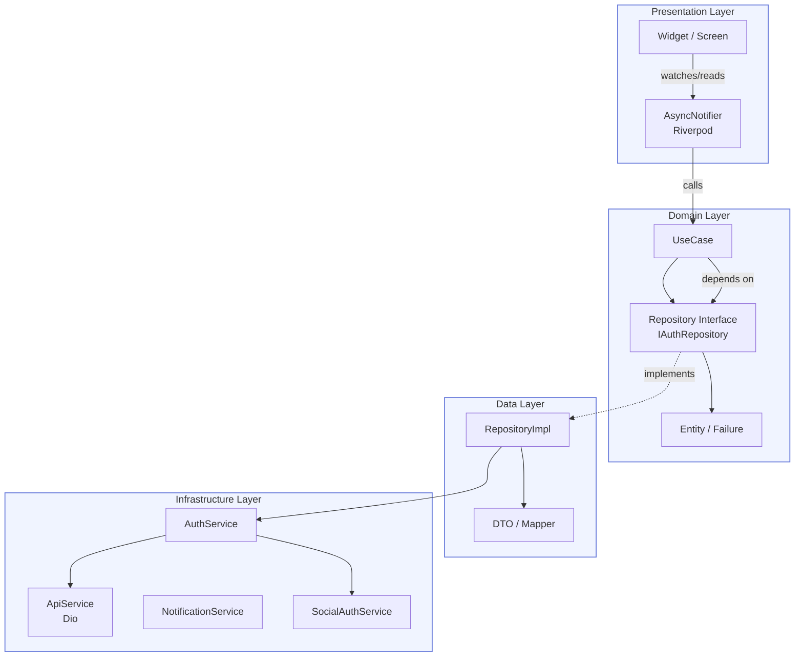
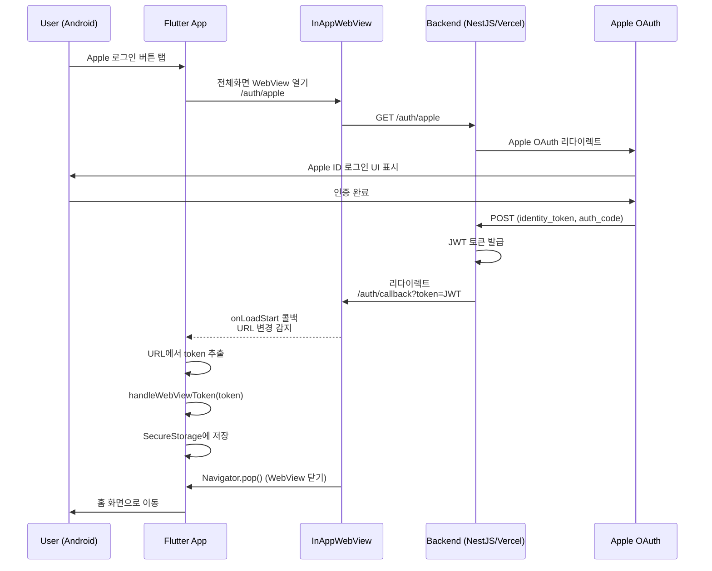

냉장고 재료 관리 앱 **쿡팅(Cookting)**을 만들면서 꽤 오랜 시간 고민했던 주제가 있다. 바로 "어디까지 네이티브로 만들고, 어디서부터 웹을 가져올 것인가"라는 경계 문제다.

소셜 로그인 하나만 놓고 봐도 복잡하다. iOS는 Apple Sign-In SDK를 네이티브로 쓸 수 있지만, Android는 Apple이 공식 SDK를 제공하지 않는다. 그렇다고 Android에서 Apple 로그인을 포기할 수는 없다. 결국 WebView로 OAuth 흐름을 태우고, 토큰을 다시 네이티브로 끌어와야 한다. 이게 WebView 브릿지 패턴의 시작이었다.

이 글은 그 경험을 정리한 것이다. Clean Architecture 레이어 설계부터, WebView를 통한 양방향 통신, 로컬 알림 처리, 플랫폼별 차이 대응, 테스트 전략까지 실제 코드를 기반으로 설명한다.

---

## 1. 왜 Clean Architecture를 선택했는가

처음에는 단순하게 시작했다. 냉장고에 재료를 등록하고, 유통기한이 다가오면 알림을 주고, AI가 레시피를 추천하는 앱이었다. 하지만 기능이 붙을수록 Provider 안에 HTTP 호출과 UI 로직이 뒤엉키기 시작했다.

전형적인 증상이 나타났다. 같은 재료 목록을 여러 화면에서 다르게 fetch하고 있었다. 에러 처리가 일관되지 않아서, 어떤 화면은 SnackBar, 어떤 화면은 Dialog로 에러를 보여줬다. API 응답 모델이 바뀌면 UI 코드를 직접 고쳐야 했다.

그때 Clean Architecture를 도입하기로 했다. 이유는 두 가지였다.

첫째, **테스트 가능성**. 비즈니스 로직이 UI와 분리되어 있어야 mock 없이, 또는 최소한의 mock으로 단위 테스트를 쓸 수 있다.

둘째, **변경 격리**. API 스펙이 바뀌어도 Domain 레이어는 건드리지 않고, Data 레이어의 매퍼(mapper)만 수정하면 된다. 실제로 Supabase로 인증 백엔드를 바꾸면서 이 격리가 얼마나 중요한지 체감했다.

---

## 2. 레이어 구조: Presentation → Domain → Data

```
lib/
├── presentation/     # UI, Provider(Notifier), Widget
│   ├── pages/
│   ├── providers/
│   └── widgets/
├── domain/           # UseCase, Repository 인터페이스, Entity
│   ├── entities/
│   ├── failures/
│   ├── repositories/
│   └── use_cases/
├── data/             # Repository 구현체, DTO, Mapper
│   ├── dto/
│   ├── mappers/
│   └── repositories/
├── infrastructure/   # 외부 서비스 (API, 알림, 인증, OCR)
│   ├── api/
│   ├── auth/
│   ├── notification/
│   └── platform/
├── di/               # 의존성 주입 (Riverpod Provider)
│   └── providers.dart
└── navigation/       # GoRouter 라우팅
    └── app_router.dart
```



의존성의 방향이 항상 안쪽(Domain)을 향한다. Presentation은 Domain을 알지만, Domain은 Presentation을 모른다. Data는 Domain의 인터페이스를 구현하지만, Domain은 Data의 존재를 모른다.

### Domain 레이어: Repository 인터페이스

```dart
// lib/domain/repositories/auth_repository.dart

abstract class IAuthRepository {
  Future<Either<Failure, User>> login(String email, String password);
  Future<Either<Failure, User>> register(String email, String password, String name);
  Future<Either<Failure, User>> loginWithGoogle();
  Future<Either<Failure, User>> loginWithApple();
  Future<Either<Failure, void>> logout();
  Future<Either<Failure, bool>> isLoggedIn();
  Future<Either<Failure, User>> getCurrentUser();

  // WebView OAuth 토큰 처리 — Android Apple Sign-In용
  Future<Either<Failure, User>> handleWebViewToken(String token);

  Future<Either<Failure, void>> deleteAccount();
}
```

`Either<Failure, T>`는 dartz 패키지의 타입이다. 성공이면 `Right(value)`, 실패면 `Left(Failure)`를 반환한다. 예외 대신 타입 시스템으로 에러를 표현하기 때문에, UseCase를 호출하는 쪽에서 반드시 실패 케이스를 처리해야 컴파일이 된다.

### Domain 레이어: Failure 타입

```dart
// lib/domain/failures/failure.dart

@freezed
abstract class Failure with _$Failure {
  const Failure._();

  String get displayMessage => when(
        server: (message, statusCode) => message,
        network: (message) => message ?? '네트워크 오류가 발생했습니다',
        cache: (message) => message ?? '캐시 오류가 발생했습니다',
        validation: (message, field) => message,
        auth: (message) => message,
        notFound: (entity, id) => '$entity을(를) 찾을 수 없습니다',
      );

  const factory Failure.server({required String message, int? statusCode}) = ServerFailure;
  const factory Failure.network({String? message}) = NetworkFailure;
  const factory Failure.cache({String? message}) = CacheFailure;
  const factory Failure.validation({required String message, String? field}) = ValidationFailure;
  const factory Failure.auth({required String message}) = AuthFailure;
  const factory Failure.notFound({required String entity, String? id}) = NotFoundFailure;
}
```

freezed로 sealed union 타입을 만들었다. `Failure.server`, `Failure.network` 같은 팩토리 생성자가 각각 다른 서브타입을 생성하고, `when()`으로 패턴 매칭이 가능하다.

### Domain 레이어: UseCase

```dart
// lib/domain/use_cases/auth/login.dart

class LoginUseCase {
  final IAuthRepository _repository;

  LoginUseCase(this._repository);

  Future<Either<Failure, User>> call(String email, String password) {
    return _repository.login(email, password);
  }
}
```

UseCase는 얇다. 비즈니스 로직이 단순한 경우엔 Repository를 그대로 위임한다. 복잡한 유효성 검사나 여러 Repository를 조합하는 경우에만 UseCase 안에서 로직을 갖는다.

---

## 3. Data 레이어: Repository 구현체와 에러 매핑

```dart
// lib/data/repositories/auth_repository_impl.dart

class AuthRepositoryImpl implements IAuthRepository {
  final AuthService _authService;

  AuthRepositoryImpl(this._authService);

  @override
  Future<Either<Failure, User>> login(String email, String password) async {
    try {
      await _authService.signIn(email: email, password: password);

      final userId = await _authService.currentUserId;
      final userEmail = await _authService.currentUserEmail;
      final userName = await _authService.currentUserName;

      if (userId == null || userEmail == null) {
        return const Left(Failure.auth(message: 'Failed to retrieve user data'));
      }

      return Right(User(id: userId, email: userEmail, name: userName));
    } catch (e) {
      return mapException(e);
    }
  }

  @override
  Future<Either<Failure, User>> handleWebViewToken(String token) async {
    try {
      await _authService.handleWebViewToken(token);

      final userId = await _authService.currentUserId;
      final userEmail = await _authService.currentUserEmail;
      final userName = await _authService.currentUserName;

      if (userId == null || userEmail == null) {
        return const Left(Failure.auth(message: 'Failed to retrieve user data'));
      }

      return Right(User(id: userId, email: userEmail, name: userName));
    } catch (e) {
      return mapException(e);
    }
  }
}
```

`mapException`은 별도 유틸 함수로 분리했다.

```dart
// lib/data/mappers/error_mapper.dart

Either<Failure, T> mapException<T>(Object error) {
  if (error is DioException) {
    if (error.response == null) {
      return Left(Failure.network(message: error.message));
    }
    switch (error.response?.statusCode) {
      case 401:
        return const Left(Failure.auth(message: 'Unauthorized'));
      case 404:
        return const Left(Failure.notFound(entity: 'Resource', id: null));
      default:
        return Left(Failure.server(
          message: error.message ?? 'Server error',
          statusCode: error.response?.statusCode,
        ));
    }
  }
  return Left(Failure.server(message: error.toString()));
}
```

DioException의 HTTP 상태 코드를 도메인 Failure로 변환한다. 이 매퍼 덕분에 Repository 구현체마다 `catch (e)` 블록을 중복해서 쓰지 않아도 된다.

---

## 4. Presentation 레이어: AsyncNotifier

```dart
// lib/presentation/providers/auth/auth_notifier.dart

class AuthNotifier extends AsyncNotifier<User?> {
  @override
  FutureOr<User?> build() async {
    // ref.read()는 await 전에 호출해야 한다
    // provider가 rebuild될 때 "ref used after disposed" 에러를 피하기 위해
    final checkAuth = ref.read(checkAuthStatusUseCaseProvider);
    final repo = ref.read(authRepositoryProvider);

    final result = await checkAuth();
    return result.fold(
      (failure) => null,
      (isLoggedIn) async {
        if (!isLoggedIn) return null;
        final userResult = await repo.getCurrentUser();
        return userResult.fold((_) => null, (user) => user);
      },
    );
  }

  Future<void> login(String email, String password) async {
    state = const AsyncLoading();
    final loginUseCase = ref.read(loginUseCaseProvider);
    final result = await loginUseCase(email, password);
    state = result.fold(
      (failure) => AsyncError(failure, StackTrace.current),
      (user) => AsyncData(user),
    );
  }

  Future<void> handleWebViewToken(String token) async {
    state = const AsyncLoading();
    final repo = ref.read(authRepositoryProvider);
    final result = await repo.handleWebViewToken(token);
    state = result.fold(
      (failure) => AsyncError(failure, StackTrace.current),
      (user) => AsyncData(user),
    );
  }
}

final authNotifierProvider = AsyncNotifierProvider<AuthNotifier, User?>(
  () => AuthNotifier(),
);
```

`AsyncNotifier<T>`는 Riverpod 3.x에서 권장하는 비동기 상태 관리 방식이다. `build()`가 초기 상태를 결정하고, 각 메서드가 상태 전이를 담당한다. `Either.fold()`로 성공/실패를 분기해서 `AsyncData` 또는 `AsyncError`로 바꾼다.

### 의존성 주입: providers.dart

```dart
// lib/di/providers.dart

final authRepositoryProvider = Provider<IAuthRepository>((ref) {
  return AuthRepositoryImpl(ref.read(authServiceProvider));
});

final loginUseCaseProvider = Provider<LoginUseCase>((ref) {
  return LoginUseCase(ref.read(authRepositoryProvider));
});

final checkAuthStatusUseCaseProvider = Provider<CheckAuthStatusUseCase>((ref) {
  return CheckAuthStatusUseCase(ref.read(authRepositoryProvider));
});
```

Riverpod의 `Provider`가 의존성 주입 컨테이너 역할을 한다. 인터페이스(`IAuthRepository`)를 구현체(`AuthRepositoryImpl`)에 바인딩하는 지점이 여기 하나뿐이다. 테스트에서는 `ProviderScope`의 `overrides`로 mock을 주입한다.

---

## 5. WebView 브릿지 패턴: Android Apple Sign-In

이게 가장 흥미로운 부분이다.

Apple은 iOS, macOS에는 네이티브 SDK를 제공하지만 Android에는 공식 SDK가 없다. `sign_in_with_apple` 패키지는 이 문제를 `webAuthenticationOptions`를 통해 해결한다. Android에서는 WebView로 Apple OAuth 흐름을 보여주고, 인증이 끝나면 백엔드가 토큰을 담은 콜백 URL로 리다이렉트한다.



실제 코드를 보면 URL 변경 감지가 핵심이다.

```dart
// lib/presentation/pages/auth/login_screen.dart (Android Apple 로그인 부분)

// Android에서는 전체 화면 WebView 방식 사용
const apiUrl = kDebugMode
    ? 'http://192.168.0.174:5001'
    : 'https://naengbu-server.vercel.app';

await Navigator.of(context).push(
  MaterialPageRoute(
    fullscreenDialog: true,
    builder: (BuildContext pageContext) {
      return Scaffold(
        appBar: AppBar(
          title: const Text('Apple 로그인'),
          leading: IconButton(
            icon: const Icon(Icons.close),
            onPressed: () => Navigator.of(pageContext).pop(),
          ),
        ),
        body: InAppWebView(
          initialUrlRequest: URLRequest(
            url: WebUri('$apiUrl/auth/apple'),
          ),
          initialSettings: InAppWebViewSettings(
            javaScriptEnabled: true,
            domStorageEnabled: true,
            useHybridComposition: true,  // Android WebView 성능 최적화
            supportZoom: false,
          ),
          onLoadStart: (controller, url) {
            // 콜백 URL을 감지해서 토큰을 추출
            if (url != null && url.toString().contains('/auth/callback')) {
              final uri = Uri.parse(url.toString());
              final token = uri.queryParameters['token'];

              if (token != null && token.isNotEmpty) {
                Future.microtask(() async {
                  try {
                    await notifier.handleWebViewToken(token);

                    if (pageContext.mounted) {
                      Navigator.of(pageContext).pop();
                    }

                    final authState = ref.read(authNotifierProvider);
                    if (context.mounted &&
                        authState.hasValue &&
                        authState.value != null) {
                      context.go('/home');
                    }
                  } catch (e) {
                    if (pageContext.mounted) {
                      Navigator.of(pageContext).pop();
                    }
                  }
                });
              }
            }
          },
        ),
      );
    },
  ),
);
```

`onLoadStart` 콜백에서 URL이 `/auth/callback`을 포함하면 바로 토큰을 꺼낸다. `Future.microtask()`를 쓰는 이유는, WebView가 새 URL을 로드하는 도중에 동기적으로 Navigator를 조작하면 충돌이 발생하기 때문이다. microtask를 통해 현재 이벤트 루프가 끝난 직후에 처리한다.

### iOS와 Android: 플랫폼 분기

```dart
// iOS에서는 기존 SDK 방식 사용
if (Platform.isIOS) {
  try {
    await notifier.loginWithApple();
    // ...
  } catch (e) { /* ... */ }
  return;
}

// Android에서는 전체 화면 WebView 방식 사용
// (Apple이 Android 네이티브 SDK를 미제공)
```

iOS에서는 `sign_in_with_apple`의 네이티브 SDK가 시스템 수준의 Sign-In with Apple UI를 띄운다. 사용자 경험이 매끄럽다. Android에서는 어쩔 수 없이 WebView를 쓴다. 이 분기가 없으면 Android에서 Apple 로그인 자체가 불가능하다.

### 딥링크 기반 OAuth 콜백 (Google)

Google 로그인은 네이티브 SDK로 처리하지만, 일부 OAuth 플로우는 딥링크로 콜백을 받는다. 이를 위해 GoRouter에 `/auth/callback` 라우트를 등록했다.

```dart
// lib/navigation/app_router.dart

GoRoute(
  path: '/auth/callback',
  name: 'auth_callback',
  builder: (context, state) {
    // 쿼리 파라미터에서 토큰 추출
    final token = state.uri.queryParameters['token'];

    return OAuthCallbackHandler(
      token: token,
      authService: authService,
    );
  },
),
```

```dart
class _OAuthCallbackHandlerState extends ConsumerState<OAuthCallbackHandler> {
  @override
  void initState() {
    super.initState();
    _handleCallback();
  }

  Future<void> _handleCallback() async {
    if (widget.token == null || widget.token!.isEmpty) {
      if (mounted) context.go('/login');
      return;
    }

    try {
      await widget.authService.saveTokenFromDeepLink(widget.token!);

      // Provider 무효화로 사용자 변경 감지 트리거
      ref.invalidate(currentUserIdProvider);

      await Future.delayed(const Duration(milliseconds: 100));

      if (mounted) context.go('/home');
    } catch (e) {
      if (mounted) context.go('/login');
    }
  }
}
```

GoRouter의 `redirect` 함수에서 `/auth/callback`은 인증 체크를 우회하도록 처리했다. 딥링크로 콜백이 들어오면 인증이 안 된 상태이기 때문이다.

```dart
redirect: (context, state) async {
  // OAuth 콜백은 redirect 체크를 우회
  if (state.matchedLocation.startsWith('/auth/callback')) {
    return null;
  }
  // ... 나머지 인증 체크
}
```

---

## 6. Infrastructure 레이어: AuthService의 역할

`AuthService`는 Infrastructure 레이어에서 인증 관련 외부 서비스들을 조율한다. Domain은 이 클래스의 존재를 모른다. Domain은 `IAuthRepository`만 알고, Repository 구현체가 `AuthService`를 사용하는 구조다.

```dart
// lib/infrastructure/auth/auth_service.dart

class AuthService {
  final ApiService _apiService;
  final SecureStorageService _secureStorage;
  final SocialAuthService _socialAuthService;
  final TokenRefreshService _tokenRefreshService;

  // WebView에서 받은 토큰 처리 (Android Apple Sign-In)
  Future<void> handleWebViewToken(String token) async {
    final tokenSnippet =
        token.length > 20 ? '${token.substring(0, 20)}...' : token;
    debugPrint('WebView 토큰 수신: $tokenSnippet');

    await _apiService.saveToken(token);

    // 토큰으로 사용자 정보 가져오기
    final userResponse = await _apiService.get('/users/profile');
    if (userResponse != null) {
      await _secureStorage.saveUserData(
        userId: userResponse['id']?.toString() ?? '',
        email: userResponse['email']?.toString() ?? '',
        name: userResponse['name']?.toString() ?? '',
      );
    }
  }

  // 딥링크를 통한 OAuth 콜백 처리
  Future<void> handleAuthCallback(String callbackUrl) async {
    final uri = Uri.parse(callbackUrl);
    final token = uri.queryParameters['token'];

    if (token == null || token.isEmpty) {
      throw Exception('OAuth 콜백에서 토큰을 찾을 수 없습니다');
    }

    await handleOAuthCallback(token);
  }

  Future<void> saveTokenFromDeepLink(String token) async {
    await handleOAuthCallback(token);
  }
}
```

WebView에서 받아온 JWT를 `SecureStorage`에 암호화 저장하고, 즉시 `/users/profile`을 호출해 사용자 정보를 채운다. 이후 모든 API 요청은 저장된 토큰을 Dio 인터셉터가 자동으로 헤더에 붙인다.

---

## 7. 로컬 알림과 딥링크: 재료 유통기한 알림

알림을 탭하면 관련 화면으로 이동해야 한다. 이를 위해 `NotificationService`에 `GlobalKey<NavigatorState>`를 주입했다.

```dart
// lib/infrastructure/notification/notification_service.dart

class NotificationService {
  GlobalKey<NavigatorState>? _navigatorKey;

  void setNavigatorKey(GlobalKey<NavigatorState> key) {
    _navigatorKey = key;
  }

  // 알림 탭 처리
  void _handleNotificationTap(NotificationResponse response) {
    final rawPayload = response.payload;
    if (rawPayload == null || rawPayload.isEmpty) return;

    try {
      final Map<String, dynamic> json =
          Map<String, dynamic>.from(jsonDecode(rawPayload) as Map);
      final route = json['route'] as String?;
      if (route != null && route.isNotEmpty) {
        _navigateToRoute(route, json);
      }
    } catch (_) {
      // 페이로드 파싱 실패 시 무시
    }
  }

  void _navigateToRoute(String route, Map<String, dynamic> data) {
    final context = _navigatorKey?.currentContext;
    if (context != null) {
      GoRouter.of(context).go(route);
    }
  }
}
```

앱 시작 시 `NotificationService`에 `rootNavigatorKey`를 주입한다.

```dart
// lib/main.dart

WidgetsBinding.instance.addPostFrameCallback((_) {
  NotificationService().setNavigatorKey(rootNavigatorKey);
  _scheduleExpiryNotificationsOnLaunch();
});
```

유통기한 알림은 앱 시작 시마다 재스케줄링한다. 재료가 추가되거나 삭제될 때마다 기존 알림을 취소하고 새로 등록하는 방식보다, 앱 시작 시 전체를 재계산하는 게 상태 관리가 단순하다.

```dart
Future<void> _scheduleExpiryNotificationsOnLaunch() async {
  try {
    final ingredientsAsync = await ref.read(ingredientListProvider.future);
    final scheduler = ExpiryNotificationScheduler(NotificationService());
    await scheduler.scheduleForExpiringIngredients(ingredientsAsync);
  } catch (_) {
    // 인증 전 또는 네트워크 실패 시 무시
  }
}
```

알림 채널은 Android용으로 세 개를 만들었다. 유통기한 경고, 레시피 추천, 일반 알림. 채널별로 `Importance`와 사운드 설정이 다르다.

```dart
// Android 알림 채널 생성
const expirationChannel = AndroidNotificationChannel(
  'expiration_alerts',
  '유통기한 알림',
  description: '재료 유통기한 경고 알림',
  importance: Importance.high,  // 헤드업 알림
);

const recipeChannel = AndroidNotificationChannel(
  'recipe_recommendations',
  '레시피 추천',
  description: '맞춤 레시피 추천 알림',
  importance: Importance.defaultImportance,
);
```

iOS는 `InterruptionLevel`로 같은 개념을 표현한다.

```dart
iOS: DarwinNotificationDetails(
  presentAlert: true,
  presentBadge: true,
  presentSound: true,
  interruptionLevel: _getIOSInterruptionLevel(payload.priority),
),
```

---

## 8. 테스트 전략

### 단위 테스트: Infrastructure 레이어

```dart
// test/core/services/social_auth_service_test.dart

@GenerateMocks([
  GoogleSignIn,
  GoogleSignInAccount,
  GoogleSignInAuthentication,
  FlutterSecureStorage,
])

void main() {
  late SocialAuthService socialAuthService;
  late MockGoogleSignIn mockGoogleSignIn;

  setUp(() {
    SocialAuthService.resetForTesting();  // 싱글톤 리셋

    mockGoogleSignIn = MockGoogleSignIn();
    socialAuthService = SocialAuthService(
      googleSignIn: mockGoogleSignIn,
      storage: mockSecureStorage,
    );
  });

  group('SocialAuthService - Google Sign-In', () {
    test('signInWithGoogle should return SocialAuthResult on success', () async {
      // Arrange
      when(mockGoogleSignIn.currentUser).thenReturn(null);
      when(mockGoogleSignIn.signIn()).thenAnswer((_) async => mockGoogleAccount);
      when(mockGoogleAuth.idToken).thenReturn('test-id-token');
      when(mockGoogleAuth.accessToken).thenReturn('test-access-token');

      // Act
      final result = await socialAuthService.signInWithGoogle();

      // Assert
      expect(result, isNotNull);
      expect(result!.idToken, 'test-id-token');
      expect(result.provider, SocialProvider.google);
      verify(mockGoogleSignIn.signIn()).called(1);
    });

    test('signInWithGoogle should return null when cancelled', () async {
      when(mockGoogleSignIn.currentUser).thenReturn(null);
      when(mockGoogleSignIn.signIn()).thenAnswer((_) async => null);

      final result = await socialAuthService.signInWithGoogle();

      expect(result, isNull);
    });

    test('signOutGoogle should fallback to signOut if disconnect fails', () async {
      when(mockGoogleSignIn.disconnect())
          .thenThrow(Exception('Disconnect failed'));
      when(mockGoogleSignIn.signOut())
          .thenAnswer((_) async => mockGoogleAccount);

      final result = await socialAuthService.signOutGoogle();

      expect(result, isTrue);
      verify(mockGoogleSignIn.disconnect()).called(1);
      verify(mockGoogleSignIn.signOut()).called(1);
    });
  });
}
```

`SocialAuthService.resetForTesting()`은 싱글톤 패턴과 테스트가 충돌하는 문제를 해결한다. 싱글톤이 테스트 간에 상태를 공유하면 테스트가 순서에 의존하게 된다.

```dart
@visibleForTesting
static void resetForTesting() {
  _instance = null;
}
```

### E2E 테스트: 세 계층 전략

GitHub Actions에서 세 가지 E2E 전략을 운영한다.

```yaml
# .github/workflows/flutter-e2e.yml

# Purpose: Three-tier integration testing strategy
#   Job 1: Android 에뮬레이터 (ubuntu-latest, PR 빠른 피드백)
#   Job 2: iOS 시뮬레이터 (macos-latest, PR 빠른 피드백)
#   Job 3: Firebase Test Lab (실제 기기, 야간 + 수동)

on:
  push:
    branches: [main, develop]
  pull_request:
    branches: [main, develop]
  schedule:
    - cron: '0 2 * * 1' # 매주 월요일 새벽 2시 (UTC)

jobs:
  android-emulator:
    name: Android Emulator (API 34)
    if: github.event_name == 'push' || github.event_name == 'pull_request'
    runs-on: ubuntu-latest

    steps:
      - uses: actions/checkout@v4
      - uses: actions/setup-java@v4
        with:
          distribution: temurin
          java-version: '17'
      - uses: subosito/flutter-action@v2
        with:
          flutter-version: '3.27.3'
          channel: stable
          cache: true
```

PR에서는 에뮬레이터/시뮬레이터로 빠른 피드백을 주고, 실제 기기 테스트는 야간에 Firebase Test Lab으로 돌린다. 에뮬레이터와 실제 기기의 동작 차이가 WebView 관련 코드에서 종종 나타나기 때문에 두 층을 모두 운영한다.

---

## 9. 실제 만난 문제와 해결

### 문제 1: Android WebView에서 `useHybridComposition` 필수

Android에서 `InAppWebView`를 일반 위젯 안에 임베드하면 렌더링 아티팩트가 생긴다. 스크롤이 끊기거나, 키보드가 올라올 때 WebView가 겹친다.

```dart
initialSettings: InAppWebViewSettings(
  javaScriptEnabled: true,
  domStorageEnabled: true,
  useHybridComposition: true,  // 이게 없으면 Android에서 렌더링 문제
),
```

`useHybridComposition`은 Android WebView를 Flutter의 하이브리드 컴포지션 모드로 렌더링한다. 약간의 성능 비용이 있지만, 렌더링 안정성이 훨씬 좋아진다.

### 문제 2: 로그아웃 중 401 에러 토스트

로그아웃 API를 호출하면 토큰이 삭제되고, 그 직후 다른 요청이 401을 받아 에러 토스트가 뜨는 문제가 있었다.

해결책은 `ApiService`에 로그아웃 플래그를 두고, 401 인터셉터에서 이 플래그를 확인하는 것이었다.

```dart
class ApiService {
  static bool _isLoggingOut = false;

  static void setLoggingOut(bool value) {
    _isLoggingOut = value;
  }
}

// AuthService.signOut()
Future<void> signOut() async {
  // 로그아웃 플래그 설정 (401 토스트 방지)
  ApiService.setLoggingOut(true);

  try {
    await _socialAuthService.signOutGoogle();
    await _socialAuthService.unlinkSocialAccount();
    await DatabaseHelper.instance.clearAllData();
    await _secureStorage.clearAll();
  } finally {
    // 500ms 후 플래그 초기화
    Future.delayed(const Duration(milliseconds: 500), () {
      ApiService.setLoggingOut(false);
    });
  }
}
```

### 문제 3: Riverpod `ref used after disposed`

`AsyncNotifier.build()`에서 `await` 이후에 `ref.read()`를 호출하면 provider가 rebuild되면서 ref가 무효화될 수 있다.

```dart
@override
FutureOr<User?> build() async {
  // ref.read()는 반드시 await 전에 모두 수행한다
  final checkAuth = ref.read(checkAuthStatusUseCaseProvider);
  final repo = ref.read(authRepositoryProvider);

  final result = await checkAuth();  // 이 이후엔 ref.read() 금지
  // ...
}
```

`await` 전에 필요한 모든 provider를 `ref.read()`로 가져와 로컬 변수에 담는 패턴으로 해결했다.

### 문제 4: iOS 메모리 압박

이미지가 많은 레시피 목록에서 iOS가 메모리 경고를 발생시켰다. `PaintingBinding`의 이미지 캐시를 명시적으로 제한했다.

```dart
// lib/main.dart
if (Platform.isIOS) {
  PaintingBinding.instance.imageCache.maximumSize = 100;        // 기본 1000개 → 100개
  PaintingBinding.instance.imageCache.maximumSizeBytes = 20 * 1024 * 1024;  // 50MB → 20MB
}
```

---

## 10. 다시 한다면 다르게 할 것

**UseCase를 너무 얇게 만들었다.** 지금은 UseCase가 Repository를 그대로 위임하는 경우가 많다. 단순히 "레이어를 맞추기 위해" 존재하는 클래스들이 생겼다. 비즈니스 로직이 없다면 UseCase를 만들지 않고 Notifier에서 Repository를 직접 쓰는 게 더 실용적이다.

**WebView 통신을 더 일반화했을 것이다.** 지금은 콜백 URL 파싱이 `login_screen.dart` 안에 인라인으로 들어가 있다. `WebViewBridgeService` 같은 클래스로 분리해서 URL 패턴 매칭, 토큰 추출, 에러 처리를 한 곳에서 관리했으면 더 깔끔했을 것이다.

**플랫폼별 분기를 더 일찍 추상화했을 것이다.** `Platform.isIOS`가 UI 코드에 직접 등장한다. `AppleSignInStrategy` 같은 추상화를 도입해서 플랫폼별 구현을 숨겼으면 테스트도 쉽고 코드도 명확했을 것이다.

**알림 권한 요청 타이밍.** 지금은 앱 시작 시 알림을 스케줄링하려다가 권한이 없으면 조용히 실패한다. 사용자에게 권한을 요청하는 적절한 타이밍과 이유 설명 UI가 부족하다.

---

## 마무리

Clean Architecture는 처음에 오버엔지니어링처럼 느껴진다. UseCase가 Repository를 그대로 통과하고, Mapper가 거의 같은 필드를 다른 클래스로 옮기는 것처럼 보인다.

하지만 Supabase로 인증 백엔드를 바꿀 때, Firebase를 제거하고 로컬 알림만 남길 때, Android Apple Sign-In을 WebView로 구현할 때 — 이 레이어 경계가 실제로 변경 비용을 낮춰줬다. Domain은 건드리지 않고 Infrastructure만 교체했다.

WebView 브릿지 패턴도 마찬가지다. 네이티브가 안 되는 것을 웹으로 보완하되, 통신 지점을 명확하게 정의해두면 나중에 네이티브 SDK가 나왔을 때 교체하기 쉽다. Apple이 언젠가 Android SDK를 공식 지원한다면, `Platform.isIOS` 분기를 제거하고 네이티브 구현으로 바꾸면 된다. 나머지 레이어는 그대로 둬도 된다.

아키텍처의 가치는 처음이 아니라, 두 번째 수정 때 드러난다.

---

**참고 라이브러리**

| 패키지                        | 용도                                      | 버전    |
| ----------------------------- | ----------------------------------------- | ------- |
| `flutter_riverpod`            | 상태 관리                                 | ^3.0.1  |
| `go_router`                   | 선언적 라우팅                             | ^17.1.0 |
| `dartz`                       | Either 타입 (함수형 에러 처리)            | ^0.10.1 |
| `freezed`                     | 불변 데이터 클래스 / sealed union         | ^3.0.0  |
| `flutter_inappwebview`        | Android WebView (Apple OAuth)             | ^6.0.0  |
| `sign_in_with_apple`          | Apple Sign-In (iOS 네이티브 + Android 웹) | ^6.1.2  |
| `google_sign_in`              | Google Sign-In SDK                        | ^6.3.0  |
| `flutter_local_notifications` | 로컬 푸시 알림                            | ^19.4.2 |
| `dio`                         | HTTP 클라이언트 + 인터셉터                | ^5.9.1  |
| `flutter_secure_storage`      | 토큰 암호화 저장                          | ^8.0.0  |
| `mockito`                     | 단위 테스트 Mock 생성                     | ^5.4.4  |
