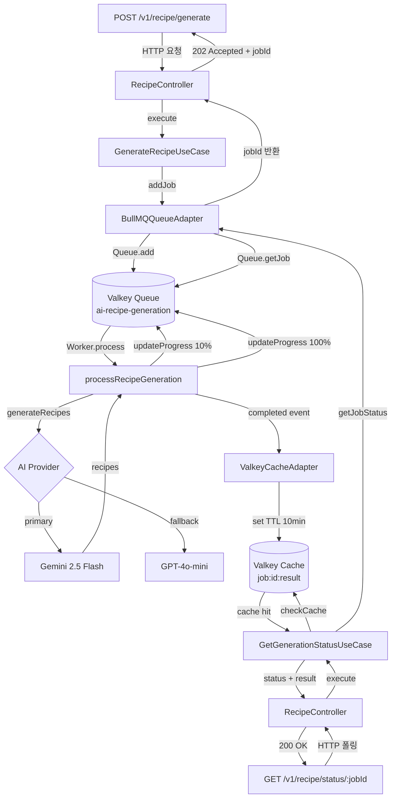

냉장고에 있는 재료를 입력하면 AI가 레시피를 추천해주는 기능을 구현하면서, 예상보다 훨씬 복잡한 문제를 마주쳤다. AI 응답이 평균 15~30초가 걸리는데, Next.js를 배포한 Vercel의 Serverless Function에는 60초 타임아웃 제한이 있다. 이론상으로는 통과하지만, 실제로는 AI API 호출 + 네트워크 지연 + 응답 파싱을 합치면 언제든 타임아웃이 날 수 있는 아슬아슬한 상황이다.

그래서 AI 처리를 완전히 별도 서비스로 분리하기로 했다. 이 글은 NestJS + BullMQ + Valkey 조합으로 AI 레시피 생성 마이크로서비스(`server-ai`)를 설계하고 실제 운영 서버에 배포하기까지의 과정을 기록한 것이다.

---

## 왜 AI 처리를 별도 마이크로서비스로 분리했는가

### Vercel 60초 타임아웃의 현실

냉장고 앱(나중에 냉장고를 부탁해, 줄여서 `naengbu`라고 부르겠다)의 주요 기능 중 하나는 냉장고에 있는 재료 목록을 기반으로 AI가 만들 수 있는 레시피를 추천하는 것이다. 처음에는 간단하게 메인 서버(NestJS)에서 직접 Gemini API를 호출하는 방식으로 구현했다.

```
[Next.js Client] → [Vercel Serverless] → [NestJS Main Server] → [Gemini API]
```

문제는 Gemini가 3개 기존 레시피 + 2개 추가 레시피를 생성하는 데 평균 20~25초가 걸린다는 것이다. 거기에 네트워크 왕복 2번(클라이언트→Vercel, Vercel→메인서버)이 더해지면 30초를 훌쩍 넘긴다. Vercel의 Pro 플랜 기준 함수 타임아웃은 60초지만, 간헐적으로 AI가 느릴 때는 실제로 타임아웃이 발생했다.

### 비동기 잡 큐가 정답인 이유

해결 방법은 몇 가지가 있었다:

1. **AI 응답 시간 단축**: 프롬프트를 줄이거나 더 빠른 모델 사용 → 품질 저하
2. **Vercel 타임아웃 늘리기**: Fluid Compute로 올리면 되지만 비용 문제
3. **비동기 처리**: 잡을 큐에 넣고 클라이언트가 폴링으로 결과 확인

세 번째 방법이 가장 깔끔하다. 클라이언트 요청은 즉시 `202 Accepted`와 `jobId`를 받고, 이후 폴링으로 상태를 확인한다. AI 처리가 아무리 오래 걸려도 타임아웃은 없다.

여기에 더해 AI 처리 서비스를 아예 별도 마이크로서비스로 분리한 이유가 하나 더 있다. 나중에 레시피 생성 외에 다른 AI 기능(식재료 인식, 영양 분석 등)이 추가될 때 메인 서버와 독립적으로 확장하거나 배포할 수 있기 때문이다.

최종 아키텍처는 이렇다:

```
[Next.js Client]
    ↓ POST /recipe/generate
[Vercel Serverless → NestJS Main Server]
    ↓ POST /v1/recipe/generate (HTTP)
[server-ai: NestJS + BullMQ]
    ↓ addJob()
[Valkey Queue]
    ↓ Worker 처리
[Gemini / OpenAI API]
    ↓ 결과 캐시
[Valkey Cache]
    ↑ GET /v1/recipe/status/:jobId (폴링)
[NestJS Main Server → Vercel → Client]
```

---

## BullMQ 잡 큐 아키텍처

### 전체 잡 플로우



### Clean Architecture 적용

이 프로젝트에서 가장 신경 쓴 부분은 Clean Architecture 원칙을 지키는 것이다. 레이어 구조를 명확히 나눴다:

```
src/
├── domain/                    # 핵심 비즈니스 규칙
│   ├── entities/              # RecipeRequest, RecipeResult
│   ├── value-objects/         # GenerationStatus
│   └── interfaces/            # 도메인 인터페이스
├── application/               # 유스케이스
│   ├── use-cases/             # GenerateRecipeUseCase, GetGenerationStatusUseCase
│   └── ports/                 # IAIModelPort, IQueuePort, ICachePort
├── infrastructure/            # 외부 의존성 구현체
│   └── adapters/              # BullMQ, Gemini, OpenAI, Valkey 어댑터
└── modules/                   # NestJS 모듈 설정
    ├── recipe/                # HTTP 인터페이스 레이어
    └── valkey/                # Valkey 연결 관리
```

핵심은 `application/ports/`의 인터페이스들이다. 유스케이스는 구체적인 BullMQ나 Gemini에 의존하지 않고 포트 인터페이스에만 의존한다:

```typescript
// application/ports/ai-model.port.ts
export interface IAIModelPort {
  generateRecipes(
    ingredients: string[],
    preferences?: RecipePreferences
  ): Promise<MultipleRecipesResponse>

  isAvailable(): Promise<boolean>
  getProviderName(): string
}

export const AI_MODEL_PORT = Symbol('AI_MODEL_PORT')
```

```typescript
// application/ports/queue.port.ts
export interface IQueuePort {
  addJob(data: QueueJobData): Promise<string>
  getJobStatus(jobId: string): Promise<QueueJobResult | null>
  cancelJob(jobId: string): Promise<boolean>
}

export const QUEUE_PORT = Symbol('QUEUE_PORT')
```

NestJS의 DI 컨테이너를 통해 구체 구현체를 주입한다:

```typescript
// modules/recipe/recipe.module.ts
@Module({
  imports: [ValkeyModule],
  controllers: [RecipeController],
  providers: [
    GenerateRecipeUseCase,
    GetGenerationStatusUseCase,
    {
      provide: AI_MODEL_PORT,
      useClass: GeminiAIModelAdapter,
    },
    {
      provide: CONNECTION_PORT,
      useClass: ValkeyConnectionAdapter,
    },
    {
      provide: QUEUE_PORT,
      useClass: BullMQQueueAdapter,
    },
    {
      provide: CACHE_PORT,
      useClass: ValkeyCacheAdapter,
    },
  ],
})
export class RecipeModule {}
```

이 구조 덕분에 AI 프로바이더를 교체하거나 큐 구현체를 바꿔도 유스케이스 코드는 전혀 건드리지 않아도 된다. 실제로 Gemini에서 OpenAI로 전환할 때 `recipe.module.ts`의 한 줄만 바꾸면 됐다.

---

## BullMQQueueAdapter 구현 상세

BullMQ의 Queue(프로듀서)와 Worker(컨슈머)를 하나의 어댑터에서 모두 관리한다. `OnModuleInit`에서 초기화하고 `OnModuleDestroy`에서 정리한다:

```typescript
// infrastructure/adapters/bullmq-queue.adapter.ts
@Injectable()
export class BullMQQueueAdapter
  implements IQueuePort, OnModuleInit, OnModuleDestroy
{
  private queue: Queue | null = null
  private worker: Worker | null = null
  private readonly queueName = 'ai-recipe-generation'
  private readonly RESULT_CACHE_TTL = 600 // 10분

  async onModuleInit() {
    const connection = this.connectionPort.getClient()

    this.queue = new Queue(this.queueName, { connection })

    this.worker = new Worker(
      this.queueName,
      async (job: Job) => {
        return await this.processRecipeGeneration(job)
      },
      { connection }
    )

    // 완료된 잡 결과를 Valkey에 캐시
    this.worker.on('completed', async job => {
      const cacheKey = `job:${job.id}:result`
      const jobResult: CachedJobResult = {
        jobId: job.id as string,
        status: 'completed',
        progress: 100,
        result: job.returnvalue as RecipeJobResult | undefined,
      }
      await this.cachePort.set(
        cacheKey,
        JSON.stringify(jobResult),
        this.RESULT_CACHE_TTL
      )
    })
  }

  async addJob(data: QueueJobData): Promise<string> {
    const defaultOptions: JobsOptions = {
      attempts: 3,
      backoff: { type: 'exponential', delay: 2000 },
      removeOnComplete: true,
      removeOnFail: false,
    }

    const job = await this.queue!.add('generate-recipe', data, defaultOptions)
    return job.id as string
  }

  private async processRecipeGeneration(job: Job): Promise<RecipeJobResult> {
    const { userId, ingredients, preferences } = job.data as QueueJobData

    await job.updateProgress(10)
    await job.updateProgress(30)

    const recipes = await this.aiModelPort.generateRecipes(
      ingredients ?? [],
      preferences ?? {}
    )

    await job.updateProgress(80)
    await job.updateProgress(100)

    return {
      ...recipes,
      userId,
      generatedAt: new Date().toISOString(),
    }
  }
}
```

잡 옵션에서 `attempts: 3`, `backoff: exponential`로 재시도를 설정했다. AI API 호출은 간헐적으로 실패할 수 있어서 지수 백오프 재시도는 필수다. `removeOnComplete: true`로 완료된 잡은 Valkey에서 자동 삭제하고(결과는 별도 캐시 키에 저장), `removeOnFail: false`로 실패한 잡은 디버깅을 위해 보존한다.

---

## 멀티 AI 프로바이더 전략 (Gemini + GPT Fallback)

### 왜 두 개의 AI 프로바이더인가

처음에는 Gemini만 사용했다. 그런데 Gemini Free Tier는 RPM(분당 요청 수) 제한이 있어서, 여러 사용자가 동시에 요청하면 `429 Too Many Requests`가 발생했다. OpenAI를 폴백으로 두면 한쪽이 막혀도 서비스가 이어진다.

`IAIModelPort` 인터페이스를 공통으로 두고 각각 어댑터를 구현했다.

### GeminiAIModelAdapter

Gemini는 `@google/generative-ai` SDK를 사용하고, 순수 JSON 응답을 강제하는 프롬프트 엔지니어링이 핵심이다:

````typescript
// infrastructure/adapters/gemini-ai-model.adapter.ts
@Injectable()
export class GeminiAIModelAdapter implements IAIModelPort {
  private gemini: GoogleGenerativeAI | null = null
  private readonly modelName: string

  constructor(private readonly configService: ConfigService) {
    const apiKey = this.configService.get<string>('GEMINI_API_KEY')
    this.modelName = this.configService.get<string>(
      'GEMINI_MODEL',
      'gemini-2.5-flash'
    )

    if (apiKey) {
      this.gemini = new GoogleGenerativeAI(apiKey)
    }
  }

  private buildPrompt(
    ingredients: string[],
    preferences?: RecipePreferences
  ): string {
    let prompt = `당신은 한국 요리 전문가입니다.

**중요: 반드시 순수 JSON 형식으로만 응답하세요. 다른 텍스트는 포함하지 마세요.**

재료 목록:
${ingredients.join('\n')}
`
    // ... 선호도 조건 추가 ...

    prompt += `
**중요 규칙:**
1. 순수 JSON만 반환하세요 (마크다운 코드 블록 없이)
2. existingIngredientsRecipes: 현재 재료로만 만들 수 있는 레시피 3개
3. additionalIngredientsRecipes: 추가 재료 필요한 레시피 2개`

    return prompt
  }

  private parseResponse(text: string): MultipleRecipesResponse {
    let cleanedText = text.trim()

    // Gemini가 가끔 마크다운 코드 블록으로 감싸서 반환하므로 제거
    if (cleanedText.includes('```')) {
      const matches = cleanedText.match(/```(?:json)?\s*([\s\S]*?)\s*```/)
      if (matches && matches[1]) {
        cleanedText = matches[1].trim()
      }
    }

    // JSON 경계 추출
    const jsonStart = cleanedText.indexOf('{')
    const jsonEnd = cleanedText.lastIndexOf('}')
    if (jsonStart !== -1 && jsonEnd !== -1 && jsonStart < jsonEnd) {
      cleanedText = cleanedText.substring(jsonStart, jsonEnd + 1)
    }

    const parsed = JSON.parse(cleanedText)
    // ...
  }
}
````

### OpenAIAIModelAdapter

OpenAI는 `response_format: { type: 'json_object' }` 옵션 덕분에 파싱이 훨씬 단순하다:

```typescript
// infrastructure/adapters/openai-ai-model.adapter.ts
async generateRecipes(
  ingredients: string[],
  preferences?: RecipePreferences,
): Promise<MultipleRecipesResponse> {
  const completion = await this.openai!.chat.completions.create({
    model: this.modelName, // gpt-4o-mini
    messages: [
      {
        role: 'system',
        content:
          'You are a professional Korean chef. Always respond with valid JSON only.',
      },
      { role: 'user', content: prompt },
    ],
    temperature: 0.7,
    response_format: { type: 'json_object' },
  });

  const text = completion.choices[0].message.content;
  return this.parseResponse(text!);
}
```

`json_object` 모드를 사용하면 OpenAI가 항상 유효한 JSON을 반환하므로 Gemini처럼 복잡한 정제 로직이 필요 없다.

### 프롬프트 구조

두 프로바이더 모두 동일한 응답 구조를 요구한다:

```json
{
  "existingIngredientsRecipes": [
    {
      "name": "레시피 이름",
      "description": "레시피 설명",
      "difficulty": "easy|medium|hard",
      "cookingTime": 30,
      "servings": 2,
      "ingredients": ["재료1", "재료2"],
      "instructions": "조리 방법"
    }
  ],
  "additionalIngredientsRecipes": [
    {
      "name": "레시피 이름",
      "additionalIngredients": ["추가 재료1"],
      "..."
    }
  ]
}
```

`existingIngredientsRecipes`는 입력한 재료만으로 만들 수 있는 레시피, `additionalIngredientsRecipes`는 집에 흔히 있을 재료를 몇 가지 더 사면 만들 수 있는 레시피다. 이 두 카테고리 분리가 사용자 경험에서 가장 중요한 부분이다.

---

## Valkey(Redis-compatible) 캐시 + 잡 큐 이중 활용

### Valkey를 선택한 이유

Redis 대신 Valkey를 선택한 이유는 단순하다. 2024년 Redis가 라이선스를 SSPL(Server Side Public License)로 변경했고, Valkey는 이에 반발한 커뮤니티가 Redis 7.2.4를 포크해 만든 BSD 라이선스 프로젝트다. API가 완전히 호환되어 ioredis 클라이언트를 그대로 쓸 수 있다.

Docker Compose에서 `valkey/valkey:8-alpine`를 사용한다:

```yaml
# docker-compose.dev.yml
services:
  valkey:
    image: valkey/valkey:8-alpine
    ports:
      - '6379:6379'
    volumes:
      - valkey-data:/data
    healthcheck:
      test: ['CMD', 'valkey-cli', 'ping']
      interval: 10s
      timeout: 5s
      retries: 3
```

### ValkeyService: ioredis 래퍼

BullMQ는 ioredis 클라이언트를 직접 받아야 한다. `ValkeyService`를 NestJS 서비스로 만들어 연결 생명주기를 관리하고, 이 클라이언트를 BullMQ와 캐시 어댑터 양쪽에 공유한다:

```typescript
// modules/valkey/valkey.service.ts
@Injectable()
export class ValkeyService implements OnModuleInit, OnModuleDestroy {
  private client!: Redis

  async onModuleInit() {
    this.client = new Redis({
      host: this.configService.get('VALKEY_HOST', 'localhost'),
      port: parseInt(this.configService.get('VALKEY_PORT', '6379'), 10),
      db: parseInt(this.configService.get('VALKEY_DB', '0'), 10),
      retryStrategy: times => Math.min(times * 50, 2000),
      maxRetriesPerRequest: null, // BullMQ 블로킹 명령에 필수
    })

    // 연결이 ready 상태가 될 때까지 대기
    await new Promise(resolve => {
      if (this.client.status === 'ready') {
        resolve(true)
      } else {
        this.client.once('ready', resolve)
      }
    })
  }
}
```

`maxRetriesPerRequest: null` 설정이 중요하다. BullMQ는 내부적으로 `BRPOPLPUSH` 같은 블로킹 Redis 명령을 사용하는데, ioredis의 기본 재시도 제한이 있으면 에러가 발생한다.

### Valkey의 이중 역할

하나의 Valkey 인스턴스가 두 가지 역할을 동시에 수행한다:

**역할 1: BullMQ 잡 큐 스토리지**
BullMQ는 Valkey를 내부 상태 저장소로 사용한다. 잡 데이터, 진행 상태, 완료/실패 상태가 모두 `bull:ai-recipe-generation:*` 키에 저장된다.

```bash
# 실제 Valkey 키 확인
redis-cli -h 127.0.0.1 -p 6379 -n 1 KEYS "bull:ai-recipe-generation:*"
# bull:ai-recipe-generation:1
# bull:ai-recipe-generation:completed
# bull:ai-recipe-generation:failed
# ...
```

**역할 2: 결과 캐시**
잡이 완료되면 `job:{jobId}:result` 키로 결과를 10분간 캐시한다. BullMQ는 기본적으로 `removeOnComplete: true`로 완료된 잡을 큐에서 삭제하므로, 삭제 전에 별도 캐시 키에 결과를 저장해두는 것이다.

```
Valkey DB 1 키 네임스페이스:
├── bull:ai-recipe-generation:*     (BullMQ 잡 큐)
├── job:{jobId}:result              (완료된 잡 결과, TTL 10분)
└── job-status:{jobId}             (상태 캐시, TTL 1시간)
```

상태 조회 유스케이스에서 캐시 우선 전략을 사용한다:

```typescript
// application/use-cases/get-generation-status.use-case.ts
async execute(request: GetGenerationStatusRequest) {
  // 1. 캐시 먼저 확인 (완료된 잡)
  const cachedResult = await this.checkCache(jobId);
  if (cachedResult) return cachedResult;

  // 2. 캐시 미스 시 BullMQ 큐에서 상태 조회
  const jobResult = await this.queuePort.getJobStatus(jobId);

  // 3. 완료된 경우 캐시에 저장
  if (jobResult.status.isCompleted()) {
    await this.cacheResult(jobId, jobResult);
  }

  return { success: true, data: responseData };
}
```

---

## 실시간 잡 진행 상태 추적

### 진행률 업데이트

BullMQ의 `job.updateProgress()`를 활용해 처리 단계별 진행률을 업데이트한다:

```typescript
private async processRecipeGeneration(job: Job): Promise<RecipeJobResult> {
  await job.updateProgress(10);  // 시작
  await job.updateProgress(30);  // AI 호출 시작

  const recipes = await this.aiModelPort.generateRecipes(ingredients, preferences);

  await job.updateProgress(80);  // AI 응답 받음
  await job.updateProgress(100); // 완료

  return { ...recipes, userId, generatedAt: new Date().toISOString() };
}
```

### GenerationStatus 값 객체

도메인 레이어의 `GenerationStatus` 값 객체(Value Object)가 상태를 타입 안전하게 표현한다:

```typescript
// domain/value-objects/generation-status.value-object.ts
export class GenerationStatus {
  private constructor(private readonly props: GenerationStatusProps) {}

  static pending(): GenerationStatus {
    return new GenerationStatus({
      value: 'pending',
      progress: 0,
      message: '대기 중',
    })
  }

  static processing(progress: number, message?: string): GenerationStatus {
    return new GenerationStatus({
      value: 'processing',
      progress: Math.min(Math.max(progress, 0), 99), // 0-99 사이로 클램핑
      message: message || '처리 중...',
    })
  }

  static completed(): GenerationStatus {
    return new GenerationStatus({
      value: 'completed',
      progress: 100,
      message: '생성 완료',
    })
  }

  static failed(errorMessage: string): GenerationStatus {
    return new GenerationStatus({
      value: 'failed',
      progress: 0,
      message: '생성 실패',
      errorMessage,
    })
  }

  isCompleted(): boolean {
    return this._value === 'completed'
  }
  isFailed(): boolean {
    return this._value === 'failed'
  }
  isTerminal(): boolean {
    return this.isCompleted() || this.isFailed()
  }
}
```

클라이언트 측에서는 2초마다 폴링해서 `status`가 `completed` 또는 `failed`가 될 때까지 기다린다. 메인 서버의 통합 코드는 이렇게 된다:

```typescript
// 메인 서버의 recipes.service.ts에서 server-ai 호출
const { jobId, statusUrl } = await response.json()

let result
let attempts = 0
while (attempts < 30) {
  // 최대 60초 (30 * 2초)
  await new Promise(resolve => setTimeout(resolve, 2000))

  const status = await fetch(`${SERVER_AI_URL}${statusUrl}`).then(r => r.json())

  if (status.status === 'completed') {
    result = status.result
    break
  } else if (status.status === 'failed') {
    throw new Error(status.error)
  }
  attempts++
}
```

---

## Docker 컨테이너 배포 및 Nginx 리버스 프록시

### 멀티 스테이지 Dockerfile

pnpm monorepo 구조에서 `server-ai`만 빌드하는 멀티 스테이지 Dockerfile이다. 특히 `--filter=@naengbu/server-ai...` 플래그로 해당 패키지와 그 의존성만 설치한다:

```dockerfile
FROM node:20-alpine AS base
RUN corepack enable && corepack prepare pnpm@9.15.0 --activate

FROM base AS deps
WORKDIR /app
COPY pnpm-lock.yaml pnpm-workspace.yaml package.json ./
COPY apps/server-ai/package.json ./apps/server-ai/
COPY packages/typescript-config/package.json ./packages/typescript-config/
COPY packages/eslint-config/package.json ./packages/eslint-config/
COPY packages/shared-types/package.json ./packages/shared-types/
# monorepo에서 server-ai와 그 워크스페이스 의존성만 설치
RUN pnpm install --filter=@naengbu/server-ai... --frozen-lockfile --ignore-scripts

FROM base AS builder
WORKDIR /app
COPY --from=deps /app/node_modules ./node_modules
COPY --from=deps /app/apps/server-ai/node_modules ./apps/server-ai/node_modules
COPY --from=deps /app/packages/ ./packages/
COPY apps/server-ai/ ./apps/server-ai/
RUN pnpm -F @naengbu/shared-types run build
RUN pnpm -F @naengbu/server-ai run build

FROM node:20-alpine AS runner
WORKDIR /app
RUN addgroup -g 1001 -S nodejs && adduser -S nestjs -u 1001
COPY --from=builder --chown=nestjs:nodejs /app/apps/server-ai/dist ./dist
COPY --from=builder --chown=nestjs:nodejs /app/apps/server-ai/node_modules ./node_modules
COPY --from=builder --chown=nestjs:nodejs /app/apps/server-ai/package.json ./
ENV NODE_ENV=production
EXPOSE 5002
USER nestjs
HEALTHCHECK --interval=30s --timeout=10s --start-period=40s --retries=3 \
  CMD node -e "require('http').get('http://localhost:5002/recipe/health', (r) => process.exit(r.statusCode === 200 ? 0 : 1))"
CMD ["node", "dist/main.js"]
```

최종 이미지는 `node:20-alpine` 기반에 빌드된 `dist/`와 프로덕션 `node_modules`만 포함한다. `nestjs` 유저로 실행해 최소 권한 원칙을 지킨다.

### Nginx 리버스 프록시

Nginx가 SSL 종료와 레이트 리미팅을 담당한다. 특히 `/recipe/status/` 경로는 폴링 엔드포인트라 레이트 리미팅 버스트를 더 크게 잡았다:

```nginx
# nginx/nginx.conf
limit_req_zone $binary_remote_addr zone=api_limit:10m rate=10r/s;

upstream server-ai {
    server localhost:5002 max_fails=3 fail_timeout=30s;
    keepalive 32;
}

server {
    listen 80;
    server_name naengbu-server-ai.jell.kr localhost;

    location / {
        limit_req zone=api_limit burst=20 nodelay;

        proxy_pass http://server-ai;
        proxy_http_version 1.1;
        proxy_set_header Host $host;
        proxy_set_header X-Real-IP $remote_addr;
        proxy_set_header X-Forwarded-For $proxy_add_x_forwarded_for;
        proxy_set_header Connection "";

        # AI 처리 시간을 고려한 타임아웃
        proxy_connect_timeout 60s;
        proxy_send_timeout 300s;
        proxy_read_timeout 300s;
    }

    # 잡 상태 폴링은 버스트를 더 크게
    location ~ ^/recipe/status/ {
        limit_req zone=api_limit burst=30 nodelay;
        proxy_pass http://server-ai;
        proxy_http_version 1.1;
        proxy_read_timeout 60s;
    }
}
```

`proxy_read_timeout 300s`로 AI 처리 시간을 넉넉하게 잡았다. 비동기 큐 방식이어서 사실 타임아웃이 날 일은 없지만, 혹시 모를 동기 경로를 위한 안전장치다.

서비스 전체 구성은 개발 환경에서 Docker Compose로 한 번에 올라온다:

```yaml
# docker-compose.dev.yml
services:
  valkey:
    image: valkey/valkey:8-alpine
    healthcheck:
      test: ['CMD', 'valkey-cli', 'ping']

  server:
    build: { dockerfile: apps/server/Dockerfile.dev }
    environment:
      - VALKEY_URL=redis://valkey:6379
    depends_on:
      valkey: { condition: service_healthy }

  server-ai:
    build: { dockerfile: apps/server-ai/Dockerfile.dev }
    environment:
      - VALKEY_URL=redis://valkey:6379
    depends_on:
      valkey: { condition: service_healthy }
```

`depends_on`에 `condition: service_healthy`를 명시해 Valkey가 준비된 후에만 서버가 시작되게 했다.

---

## 다국어 지원 구현

### 프롬프트 기반 언어 처리

레시피 생성 프롬프트 자체가 한국어로 작성되어 있어 기본 출력이 한국어다. `preferences?.cuisine` 파라미터로 요리 종류(한식, 중식, 일식, 양식 등)를 지정하면 해당 스타일로 생성된다.

`GeminiAIModelAdapter`의 프롬프트 빌더에서 선호도를 자연어로 추가하는 방식이다:

```typescript
if (preferences?.dietary) {
  prompt += `\n식단 선호: ${preferences.dietary}`
}
if (preferences?.cuisine) {
  prompt += `\n요리 종류: ${preferences.cuisine}`
}
if (preferences?.allergies?.length) {
  prompt += `\n알레르기 주의: ${preferences.allergies.join(', ')}`
}
if (preferences?.maxCookingTime) {
  prompt += `\n최대 조리 시간: ${preferences.maxCookingTime}분`
}
if (preferences?.servings) {
  prompt += `\n인분: ${preferences.servings}인분`
}
```

### DTO 유효성 검사

`GenerateRecipeDto`에서 `class-validator`로 입력값을 검증한다. NestJS의 `ValidationPipe`가 전역으로 적용되어 잘못된 요청은 큐에 들어가기 전에 400으로 차단된다. 이렇게 하면 잘못된 입력 때문에 AI 호출 비용이 낭비되는 일을 막는다.

---

## OpenTelemetry 분산 추적

마이크로서비스가 늘어나면 요청이 어느 서비스에서 얼마나 걸렸는지 추적하기 어려워진다. OpenTelemetry로 기본 추적을 설정해뒀다:

```typescript
// common/tracing.ts
const sdk = new NodeSDK({
  resource: resourceFromAttributes({
    [ATTR_SERVICE_NAME]: 'naengbu-server-ai',
    [ATTR_SERVICE_VERSION]: process.env.npm_package_version || '1.0.0',
  }),
  traceExporter: new ConsoleSpanExporter(),
  instrumentations: [
    getNodeAutoInstrumentations({
      '@opentelemetry/instrumentation-http': {
        ignoreIncomingRequestHook: req => {
          const url = req.url || ''
          return url.includes('/health') || url.includes('/favicon.ico')
        },
      },
      '@opentelemetry/instrumentation-fs': { enabled: false },
    }),
  ],
})

export function initTracing(): void {
  if (process.env.OTEL_ENABLED === 'true') {
    sdk.start()
  }
}
```

`OTEL_ENABLED=true` 환경 변수로 활성화한다. 지금은 `ConsoleSpanExporter`로 로그에 출력하지만, 나중에 Jaeger나 Grafana Tempo 같은 분산 추적 백엔드로 교체할 수 있게 구조를 잡아뒀다.

---

## 실제 만난 문제와 해결

### 문제 1: Gemini가 JSON 대신 마크다운 코드 블록을 반환

처음 프롬프트에 "JSON으로만 응답하세요"라고 했는데도 Gemini가 종종 이런 응답을 반환했다:

````
여기 레시피를 JSON 형식으로 만들어드리겠습니다.

```json
{
  "existingIngredientsRecipes": [...]
}
````

물론이죠, 위 레시피를 즐겨보세요!

````

이 경우 직접 `JSON.parse()`하면 파싱 에러가 발생한다. `parseResponse()` 메서드에 정규식으로 코드 블록을 제거하고 `{`와 `}` 경계를 찾아 JSON 부분만 추출하는 방어 로직을 추가했다:

```typescript
if (cleanedText.includes('```')) {
  const matches = cleanedText.match(/```(?:json)?\s*([\s\S]*?)\s*```/);
  if (matches && matches[1]) {
    cleanedText = matches[1].trim();
  }
}

const jsonStart = cleanedText.indexOf('{');
const jsonEnd = cleanedText.lastIndexOf('}');
if (jsonStart !== -1 && jsonEnd !== -1) {
  cleanedText = cleanedText.substring(jsonStart, jsonEnd + 1);
}
````

Gemini 2.5 Flash로 올리면서 이 문제가 많이 줄었지만, 방어 코드는 유지한다.

### 문제 2: BullMQ Worker maxRetriesPerRequest 에러

처음 BullMQ를 붙였을 때 Worker 초기화에서 이런 에러가 났다:

```
Error: BLMOVE command failed: Cannot send request after connection is destroyed
```

원인은 ioredis의 기본 `maxRetriesPerRequest` 설정이 BullMQ의 블로킹 Redis 명령(`BRPOPLPUSH`, `BLMOVE`)과 충돌하는 것이었다. `ValkeyService`에서 `maxRetriesPerRequest: null`로 명시적으로 비활성화해서 해결했다.

```typescript
this.client = new Redis({
  // ...
  maxRetriesPerRequest: null, // BullMQ 블로킹 명령에 필수
})
```

BullMQ 공식 문서에 나와있는 내용이지만 처음에는 에러 메시지만 보고 엉뚱한 곳을 찾아 한참 헤맸다.

### 문제 3: Docker 컨테이너에서 Valkey 연결 순서 문제

`docker-compose up`으로 올리면 Valkey가 완전히 준비되기 전에 `server-ai`가 연결을 시도해서 실패하는 경우가 있었다. `healthcheck` + `depends_on condition: service_healthy` 조합으로 해결했다:

```yaml
valkey:
  healthcheck:
    test: ['CMD', 'valkey-cli', 'ping']
    interval: 10s
    timeout: 5s
    retries: 3

server-ai:
  depends_on:
    valkey:
      condition: service_healthy
```

Valkey가 `ping`에 응답할 때까지 `server-ai` 컨테이너 시작을 지연시킨다. `ValkeyService`에서도 `ready` 이벤트를 기다리는 코드를 추가해 이중으로 방어했다.

### 문제 4: 완료된 잡 조회 불가

`removeOnComplete: true` 옵션을 켜면 잡이 완료되자마자 BullMQ가 Valkey에서 삭제한다. 클라이언트가 완료 직후 상태를 조회하면 `Job not found`가 반환되는 문제가 있었다.

해결책은 Worker의 `completed` 이벤트에서 결과를 별도 캐시 키(`job:{id}:result`)에 TTL 10분으로 저장하는 것이다:

```typescript
this.worker.on('completed', async job => {
  const cacheKey = `job:${job.id}:result`
  await this.cachePort.set(
    cacheKey,
    JSON.stringify({
      jobId: job.id,
      status: 'completed',
      result: job.returnvalue,
    }),
    600 // 10분
  )
})
```

상태 조회 시 먼저 캐시를 확인하고, 캐시 미스면 BullMQ 큐를 조회하는 방식으로 처리했다.

---

## 성능 최적화와 모니터링

### Pino 구조적 로깅

`nestjs-pino`를 사용해 구조적 로그(JSON 형식)를 출력한다. 개발 환경에서는 `pino-pretty`로 컬러 출력, 프로덕션에서는 순수 JSON:

```typescript
LoggerModule.forRoot({
  pinoHttp: {
    transport:
      process.env.NODE_ENV !== 'production'
        ? {
            target: 'pino-pretty',
            options: { colorize: true, singleLine: true },
          }
        : undefined,
    level: process.env.NODE_ENV === 'production' ? 'info' : 'debug',
    autoLogging: {
      ignore: req => ['/health', '/favicon.ico'].includes(req.url as string),
    },
    genReqId: (req, res) => {
      const existingId = req.headers['x-request-id']
      if (existingId) return existingId
      const id = randomUUID()
      res.setHeader('x-request-id', id)
      return id
    },
  },
})
```

`genReqId`로 `x-request-id` 헤더를 통한 요청 추적을 지원한다. 메인 서버가 AI 서버로 요청할 때 이 헤더를 전달하면 로그에서 요청 흐름을 추적할 수 있다.

### 레이트 리미팅

`@nestjs/throttler`로 서비스 레벨에서 레이트 리미팅을 적용했다:

```typescript
ThrottlerModule.forRoot([
  {
    ttl: 60000,  // 1분
    limit: 60,   // 분당 60요청
  },
]),
```

Nginx에서도 IP 기반 레이트 리미팅(`10r/s`)을 하므로 이중 방어다.

### Docker 헬스체크

컨테이너 헬스체크로 실제 HTTP 응답을 확인한다:

```dockerfile
HEALTHCHECK --interval=30s --timeout=10s --start-period=40s --retries=3 \
  CMD node -e "require('http').get('http://localhost:5002/recipe/health', (r) => process.exit(r.statusCode === 200 ? 0 : 1))"
```

`start-period: 40s`를 줘서 NestJS 앱이 완전히 뜰 때까지 헬스체크를 유예한다. `server-ai` 의존 서비스들이 이 헬스체크를 기반으로 준비 상태를 판단한다.

### Swagger 문서 자동 생성

컨트롤러에 `@ApiOperation`, `@ApiResponse` 데코레이터를 붙여 Swagger 문서가 자동 생성된다. `http://localhost:5002/docs`에서 바로 API를 테스트할 수 있어서 개발 중에 매우 편리하다.

---

## 다시 한다면 다르게 할 것

### 1. WebSocket 또는 SSE로 실시간 업데이트

지금은 클라이언트가 2초마다 폴링하는 방식이다. 이건 단순하지만 효율적이지 않다. 30초짜리 작업이면 클라이언트가 최대 15번 요청을 보낸다. 다음에는 Server-Sent Events(SSE)나 WebSocket을 사용해서 서버가 완료 시점에 클라이언트에게 푸시하는 방식으로 바꾸겠다.

NestJS에서 SSE는 `@Sse()` 데코레이터로 간단하게 구현할 수 있다. BullMQ의 `QueueEvents`를 구독해서 잡 완료 이벤트를 SSE로 전달하면 된다.

### 2. Bull Board로 잡 모니터링 UI

BullMQ와 연동되는 `@bull-board/nestjs` 패키지를 사용하면 웹 UI로 잡 상태를 실시간 모니터링할 수 있다. 지금은 Redis CLI로 직접 확인해야 하는데, 이게 불편하다. 내부망에서만 접근 가능하게 인증을 걸고 Bull Board를 붙이겠다.

### 3. AI 프로바이더 폴백 자동화

지금은 `recipe.module.ts`에서 수동으로 `GeminiAIModelAdapter`를 바인딩한다. 환경 변수 `AI_MODEL_PROVIDER`로 동적으로 선택하고, Gemini가 실패하면 자동으로 OpenAI로 폴백하는 로직을 `AIModelProviderService`로 만들면 더 좋을 것이다:

```typescript
// 이런 방식으로:
if (await geminiAdapter.isAvailable()) {
  try {
    return await geminiAdapter.generateRecipes(ingredients, preferences)
  } catch (e) {
    this.logger.warn('Gemini failed, falling back to OpenAI')
    return await openaiAdapter.generateRecipes(ingredients, preferences)
  }
}
```

현재는 Gemini API 키가 있으면 항상 Gemini를 사용하고, 실패하면 에러를 그대로 올린다.

### 4. 레시피 결과 영구 저장

지금은 완료된 레시피가 Valkey에 10분만 캐시되고 사라진다. 사용자가 나중에 다시 보고 싶어도 볼 수 없다. PostgreSQL에 레시피를 저장하고 사용자별 히스토리를 제공하면 더 좋은 경험을 줄 수 있다. `drizzle-orm`과 `postgres` 패키지가 이미 `package.json`에 있는 걸 보면 처음부터 DB 연동을 고려했던 것 같은데, 아직 구현하지 못했다.

### 5. 잡 취소 API 노출

`BullMQQueueAdapter.cancelJob()`은 구현되어 있지만 HTTP 엔드포인트가 없다. 사용자가 생성 중인 잡을 취소할 수 있도록 `DELETE /recipe/status/:jobId` 엔드포인트를 추가하면 좋겠다.

---

## 마치며

Vercel 타임아웃이라는 구체적인 문제에서 시작했지만, 결과적으로 꽤 탄탄한 비동기 마이크로서비스 아키텍처가 만들어졌다. 핵심 교훈 세 가지:

**1. 비동기 큐는 AI 통합의 기본**이다. AI API는 느리고 불안정하다. 동기 HTTP 호출로 연결하면 언제나 타임아웃과 신뢰성 문제가 생긴다. BullMQ 같은 잡 큐를 중간에 두면 AI의 느린 속도가 사용자 경험에 직접 영향을 주지 않는다.

**2. Clean Architecture는 AI 교체 비용을 0에 가깝게 만든다.** `IAIModelPort` 인터페이스를 통해 Gemini와 OpenAI를 완전히 교환 가능하게 만들었다. 나중에 Claude API나 로컬 LLM으로 교체할 때도 어댑터 하나만 추가하면 된다.

**3. 캐시 전략은 단순할수록 좋다.** 완료된 잡 결과를 10분간 캐시하는 단순한 전략만으로도 반복 조회 비용을 크게 줄일 수 있다. 과도한 캐시 무효화 로직보다 TTL 기반의 단순한 전략이 운영하기 훨씬 편하다.

전체 코드는 `naengbu` 프로젝트의 `apps/server-ai/` 경로에 있다.
