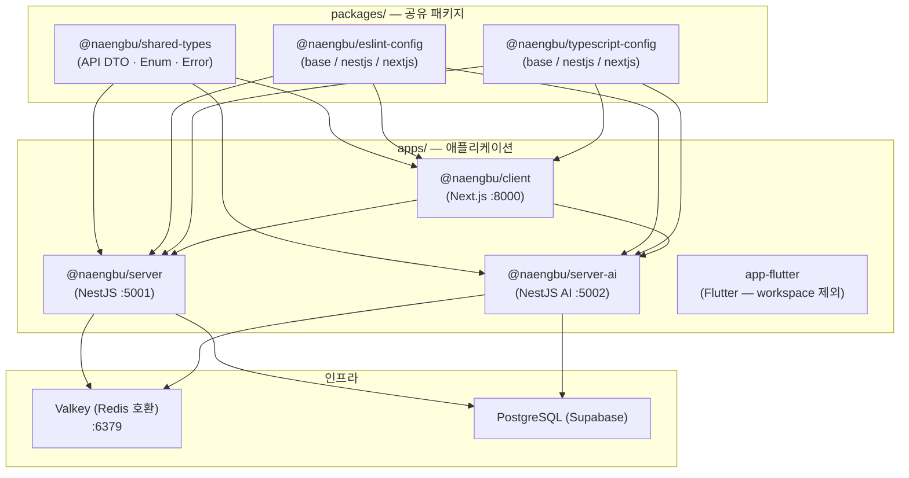

모노레포(monorepo)는 요즘 프론트엔드 생태계에서 자주 들리는 단어지만, 실제로 "NestJS 백엔드 + Next.js 클라이언트 + Flutter 앱 + AI 마이크로서비스"를 한 레포지토리에 넣어본 경험담은 생각보다 드물다. 이 글은 냉장고 부탁해(naengbu) 프로젝트를 폴리레포(polyrepo)에서 Turborepo 모노레포로 전환한 과정을 정리한 실전 기록이다. 아름다운 성공담보다는 "이런 문제가 있었고, 이렇게 해결했다"에 집중한다.

---

## 왜 모노레포를 선택했는가 — 폴리레포의 고통

### 공유 타입의 지옥

프로젝트 초기에는 레포지토리가 세 개였다: `naengbu-server`, `naengbu-client`, `naengbu-app-flutter`. 처음 몇 달은 괜찮았다. 그런데 API가 늘어나면서 문제가 시작됐다.

서버에서 레시피 응답 DTO를 바꿨다. `cookingTime: string`을 `cookingTime: number`로 수정했다. 그런데 클라이언트 레포는 여전히 `string`으로 선언된 타입을 쓰고 있었다. 빌드는 통과했다. 런타임에서야 `NaN`이 렌더링되는 걸 발견했다. 프로덕션에서.

```typescript
// server repo — recipes.dto.ts (변경 후)
export interface RecipeDto {
  cookingTime: number // string에서 number로 변경
}

// client repo — types/recipe.ts (아직 구버전)
export interface RecipeDto {
  cookingTime: string // 동기화 실패 — 빌드는 통과, 런타임에서 NaN
}
```

이 문제의 근본 원인은 타입 정의가 두 군데 있다는 것이었다. 해결책으로 공유 npm 패키지를 만들어 배포하는 방법도 고려했지만, 패키지를 수정할 때마다 버전을 올리고 `npm publish`하고 각 레포에서 `npm update`하는 과정이 너무 번거로웠다. API를 하나 수정할 때마다 최소 세 번의 커밋이 필요했다.

### ESLint/TypeScript 설정의 드리프트 (configuration drift)

세 레포가 각자 `tsconfig.json`을 관리하다 보니 시간이 지날수록 설정이 달라졌다. 서버는 `strict: true`였는데 클라이언트는 `strict: false`로 슬그머니 바뀌어 있었다. ESLint 규칙도 마찬가지였다. 서버는 `@typescript-eslint/no-explicit-any: error`였는데 클라이언트는 `warn`이었다. 코드 리뷰할 때 기준이 달라서 혼란스러웠다.

### 버전 관리의 불일치

Flutter를 제외한 세 레포가 모두 TypeScript를 쓰는데, TypeScript 버전이 레포마다 달랐다. 한쪽에서는 5.4, 다른 쪽에서는 5.2를 쓰고 있었다. Renovate 같은 의존성 자동화 도구를 붙이려면 레포 개수만큼 설정해야 했다.

### 결정: Turborepo + pnpm workspace

모노레포 도구로는 Nx, Turborepo, Rush를 검토했다. 선택 기준은 세 가지였다.

1. **학습 비용**: 기존 `package.json` 스크립트 구조를 최대한 유지할 수 있어야 한다.
2. **캐싱**: CI 시간이 현재 15분인데, 변경된 앱만 빌드/테스트하고 싶다.
3. **pnpm 호환**: 이미 pnpm을 쓰고 있었다.

Turborepo는 설정 파일이 `turbo.json` 하나로 단순하고, pnpm workspace와 자연스럽게 통합된다. Nx는 강력하지만 설정이 복잡하고, Rush는 Microsoft 스택에 최적화돼 있어서 패스했다.

---

## 구조 설계 — 무엇을 어디에 둘 것인가

### 디렉토리 구조

```
naengbu/                      ← 모노레포 루트
├── apps/
│   ├── server/               ← @naengbu/server (NestJS :5001)
│   ├── server-ai/            ← @naengbu/server-ai (NestJS AI 마이크로서비스 :5002)
│   ├── client/               ← @naengbu/client (Next.js :8000)
│   └── app-flutter/          ← Flutter (pnpm workspace 제외)
├── packages/
│   ├── shared-types/         ← @naengbu/shared-types
│   ├── eslint-config/        ← @naengbu/eslint-config
│   └── typescript-config/    ← @naengbu/typescript-config
├── turbo.json
├── pnpm-workspace.yaml
└── package.json
```

`apps/`에는 배포 가능한 애플리케이션을, `packages/`에는 앱 간에 공유되는 내부 패키지를 뒀다. Flutter 앱은 Dart 생태계라 pnpm workspace의 의미가 없어서 workspace에서 제외했다. 이 부분이 나중에 CI 설계에서 중요한 포인트가 된다.

### pnpm-workspace.yaml

```yaml
packages:
  - 'apps/*'
  - 'packages/*'
  - '!apps/app-flutter'
```

딱 세 줄이다. `!apps/app-flutter`로 Flutter를 명시적으로 제외했다. Flutter는 CI에서 별도 job으로 처리한다.

### 아키텍처 다이어그램



---

## packages/ — 공유 패키지 전략

### shared-types: 타입의 단일 진실 공급원 (Single Source of Truth)

이것이 모노레포 전환의 핵심 동기였다. `@naengbu/shared-types`는 세 가지 카테고리의 타입을 export한다.

```typescript
// packages/shared-types/src/index.ts
export * from './api'
export * from './enums'
export * from './errors'
```

**API DTO** — 서버와 클라이언트가 같은 타입을 바라본다.

```typescript
// packages/shared-types/src/api/recipe.ts
export interface RecipeDto {
  id: string
  title: string
  description: string
  instructions: string
  cookingTime: number
  servings: number
  difficulty: RecipeDifficulty
  imageUrl?: string
  ingredients: RecipeIngredientDto[]
}

export interface RecipeIngredientDto {
  ingredientId: string
  ingredientName: string
  quantity: number
  unitName: string
  isOptional: boolean
}

export type RecipeDifficulty = 'easy' | 'medium' | 'hard'

export interface RecipeRecommendationRequest {
  ingredientIds: string[]
  maxCookingTime?: number
  difficulty?: RecipeDifficulty
  servings?: number
}
```

**Enum** — 에러 코드와 도메인 분류를 공유한다.

```typescript
// packages/shared-types/src/enums/index.ts
export enum ErrorCode {
  VALIDATION_ERROR = 'VALIDATION_ERROR',
  AUTHENTICATION_ERROR = 'AUTHENTICATION_ERROR',
  AUTHORIZATION_ERROR = 'AUTHORIZATION_ERROR',
  NOT_FOUND = 'NOT_FOUND',
  DUPLICATE = 'DUPLICATE',
  AI_PROVIDER_ERROR = 'AI_PROVIDER_ERROR',
  AI_QUOTA_EXCEEDED = 'AI_QUOTA_EXCEEDED',
  AI_RATE_LIMITED = 'AI_RATE_LIMITED',
  INTERNAL_ERROR = 'INTERNAL_ERROR',
}

export enum IngredientCategory {
  VEGETABLE = 'vegetable',
  FRUIT = 'fruit',
  MEAT = 'meat',
  SEAFOOD = 'seafood',
  DAIRY = 'dairy',
  GRAIN = 'grain',
  SEASONING = 'seasoning',
  OTHER = 'other',
}
```

**에러 타입** — 서버가 던지는 에러 구조를 클라이언트도 정확히 안다.

```typescript
// packages/shared-types/src/errors/index.ts
import { ErrorCode } from '../enums'

export interface AppError {
  code: ErrorCode
  message: string
  statusCode: number
  details?: Record<string, unknown>
}

export const ErrorMessages: Record<ErrorCode, string> = {
  [ErrorCode.VALIDATION_ERROR]: '입력값이 올바르지 않습니다.',
  [ErrorCode.AUTHENTICATION_ERROR]: '인증에 실패했습니다.',
  [ErrorCode.AUTHORIZATION_ERROR]: '권한이 없습니다.',
  [ErrorCode.NOT_FOUND]: '요청한 리소스를 찾을 수 없습니다.',
  [ErrorCode.DUPLICATE]: '이미 존재하는 데이터입니다.',
  [ErrorCode.AI_PROVIDER_ERROR]: 'AI 서비스에 오류가 발생했습니다.',
  [ErrorCode.AI_QUOTA_EXCEEDED]: 'AI 사용 한도를 초과했습니다.',
  [ErrorCode.AI_RATE_LIMITED]: 'AI 요청이 너무 빈번합니다.',
  [ErrorCode.INTERNAL_ERROR]: '서버 내부 오류가 발생했습니다.',
}
```

이 패키지 덕분에 서버에서 `RecipeDto`를 수정하면, 클라이언트는 빌드 타임에 즉시 타입 에러를 만난다. 프로덕션 런타임 버그가 컴파일 에러로 당겨진다.

`shared-types`의 `package.json`은 의도적으로 단순하게 유지했다.

```json
{
  "name": "@naengbu/shared-types",
  "version": "1.0.0",
  "private": true,
  "main": "./dist/index.js",
  "types": "./dist/index.d.ts",
  "scripts": {
    "build": "tsc --project tsconfig.json",
    "clean": "rm -rf dist",
    "type-check": "tsc --noEmit"
  },
  "devDependencies": {
    "@naengbu/typescript-config": "workspace:*",
    "typescript": "^5.9.3"
  }
}
```

`private: true`로 실수로 npm에 배포되는 것을 막았다. `workspace:*`는 pnpm의 로컬 워크스페이스 참조 문법이다. 버전을 맞출 필요 없이 항상 현재 로컬 코드를 참조한다.

앱에서 의존성 선언은 이렇게 한다.

```json
// apps/server/package.json (발췌)
{
  "name": "@naengbu/server",
  "dependencies": {
    "@naengbu/shared-types": "workspace:*"
  },
  "devDependencies": {
    "@naengbu/eslint-config": "workspace:*",
    "@naengbu/typescript-config": "workspace:*"
  }
}
```

### typescript-config: tsconfig 드리프트 방지

앱마다 다른 tsconfig를 쓰면서 발생하던 드리프트를 `@naengbu/typescript-config`로 해결했다. 베이스 설정을 한 곳에서 관리하고, 앱별로 상속한다.

```json
// packages/typescript-config/base.json
{
  "$schema": "https://json.schemastore.org/tsconfig",
  "compilerOptions": {
    "strict": true,
    "esModuleInterop": true,
    "skipLibCheck": true,
    "forceConsistentCasingInFileNames": true,
    "resolveJsonModule": true,
    "isolatedModules": true,
    "moduleDetection": "force",
    "declaration": true,
    "declarationMap": true,
    "sourceMap": true,
    "noUnusedLocals": true,
    "noUnusedParameters": true,
    "noFallthroughCasesInSwitch": true
  },
  "exclude": ["node_modules", "dist", "build", ".next", "coverage"]
}
```

NestJS용 preset은 decorator 지원을 위한 추가 설정을 포함한다.

```json
// packages/typescript-config/nestjs.json
{
  "$schema": "https://json.schemastore.org/tsconfig",
  "extends": "./base.json",
  "compilerOptions": {
    "module": "commonjs",
    "target": "ES2021",
    "lib": ["ES2021"],
    "emitDecoratorMetadata": true,
    "experimentalDecorators": true,
    "allowSyntheticDefaultImports": true,
    "incremental": true,
    "noEmit": false,
    "noUnusedLocals": false,
    "noUnusedParameters": false
  }
}
```

NestJS는 decorator를 광범위하게 사용하기 때문에 `noUnusedLocals`와 `noUnusedParameters`를 false로 오버라이드했다. 베이스에서 엄격하게 켜뒀다가 앱별로 완화하는 방향이 반대보다 낫다.

### eslint-config: 규칙 한 곳에서

ESLint 9의 flat config를 기반으로 앱별 preset을 제공한다. exports 맵으로 앱 종류에 맞는 설정을 골라 쓴다.

```json
// packages/eslint-config/package.json (발췌)
{
  "name": "@naengbu/eslint-config",
  "type": "module",
  "exports": {
    "./base": "./base.mjs",
    "./nestjs": "./nestjs.mjs",
    "./nextjs": "./nextjs.mjs",
    "./react-native": "./react-native.mjs"
  }
}
```

```javascript
// packages/eslint-config/nestjs.mjs
import { baseConfig } from './base.mjs'

export default [
  ...baseConfig,
  {
    rules: {
      '@typescript-eslint/interface-name-prefix': 'off',
      '@typescript-eslint/explicit-module-boundary-types': 'off',
      // NestJS 특성상 any를 완전히 금지하기 어려워 warn으로 완화
      '@typescript-eslint/no-explicit-any': 'warn',
      '@typescript-eslint/no-require-imports': 'warn',
      '@typescript-eslint/no-empty-object-type': 'warn',
    },
  },
  {
    files: ['**/*.spec.ts', '**/*.test.ts'],
    rules: {
      '@typescript-eslint/no-explicit-any': 'warn',
      '@typescript-eslint/no-unused-vars': 'warn',
    },
  },
]
```

각 앱의 `eslint.config.mjs`는 이 preset을 import해서 사용한다. 프로젝트 전체 ESLint 규칙 변경이 파일 하나 수정으로 끝난다.

---

## Turborepo 설정 — 태스크 그래프와 캐싱

### turbo.json 전체

```json
{
  "$schema": "https://turbo.build/schema.json",
  "tasks": {
    "build": {
      "dependsOn": ["^build"],
      "outputs": ["dist/**", ".next/**"],
      "env": [
        "DATABASE_URL",
        "JWT_SECRET",
        "SUPABASE_URL",
        "SUPABASE_ANON_KEY",
        "NEXT_PUBLIC_API_URL",
        "OPENAI_API_KEY"
      ]
    },
    "dev": {
      "cache": false,
      "persistent": true
    },
    "lint": {
      "dependsOn": ["^build"]
    },
    "test": {
      "dependsOn": ["^build"],
      "env": ["DATABASE_URL", "JWT_SECRET"]
    },
    "type-check": {
      "dependsOn": ["^build"]
    },
    "clean": {
      "cache": false
    },
    "db:generate": {
      "cache": false
    },
    "db:migrate": {
      "cache": false
    },
    "analyze": {
      "dependsOn": ["^build"],
      "outputs": [".next/**"],
      "cache": false,
      "env": ["ANALYZE"]
    },
    "storybook": {
      "cache": false,
      "persistent": true
    },
    "build-storybook": {
      "dependsOn": ["^build"],
      "outputs": ["storybook-static/**"]
    }
  }
}
```

`"dependsOn": ["^build"]`의 `^` 기호가 핵심이다. `^build`는 "이 패키지가 의존하는 패키지들의 build 태스크가 먼저 완료돼야 한다"는 의미다. 즉 `@naengbu/server`의 build를 실행하면 Turborepo가 자동으로 `@naengbu/shared-types`의 build를 먼저 실행한다. 의존성 그래프를 Turborepo가 추적하므로 직접 실행 순서를 관리할 필요가 없다.

`env` 배열은 캐시 키에 환경 변수를 포함시킨다. `DATABASE_URL`이 바뀌면 캐시가 무효화된다. 이걸 빠뜨리면 환경 변수가 바뀌었는데 캐시된 빌드 결과물이 재사용되는 문제가 생긴다. 이 실수를 실제로 저질렀고, 뒤에서 자세히 다룬다.

`dev` 태스크는 `cache: false`와 `persistent: true`를 설정했다. 개발 서버는 캐시가 의미 없고, watch 모드로 계속 실행되어야 하기 때문이다.

### 루트 package.json 스크립트

```json
{
  "name": "naengbu",
  "packageManager": "pnpm@9.15.0",
  "engines": { "node": ">=20.0.0" },
  "scripts": {
    "dev": "turbo dev",
    "build": "turbo build",
    "lint": "turbo lint",
    "test": "turbo test",
    "type-check": "turbo type-check",
    "dev:server": "turbo dev --filter=@naengbu/server",
    "dev:client": "turbo dev --filter=@naengbu/client",
    "dev:server-ai": "turbo dev --filter=@naengbu/server-ai",
    "build:server": "turbo build --filter=@naengbu/server",
    "build:client": "turbo build --filter=@naengbu/client",
    "test:server": "turbo test --filter=@naengbu/server",
    "test:client": "turbo test --filter=@naengbu/client",
    "test:flutter:e2e": "cd apps/app-flutter && flutter test integration_test/ -d macos"
  }
}
```

`--filter` 플래그로 특정 앱만 실행할 수 있다. 클라이언트만 개발할 때 `pnpm dev:client`를 쓰면 서버는 실행되지 않는다. 단, `@naengbu/shared-types`의 build는 의존성 그래프에 따라 자동으로 먼저 실행된다.

---

## CI/CD 파이프라인 — 변경된 것만 검사한다

### 핵심 전략: 변경 감지 + 필터 빌드

CI의 가장 중요한 설계 결정은 "전체를 항상 빌드하지 않는다"는 것이다. `ci.yml`에서 이를 두 가지 방법으로 구현했다.

**방법 1: `paths-filter`로 job 자체를 건너뜀**

```yaml
jobs:
  detect-changes:
    runs-on: ubuntu-latest
    outputs:
      flutter: ${{ steps.changes.outputs.flutter }}
      client: ${{ steps.changes.outputs.client }}
    steps:
      - uses: actions/checkout@v4
      - uses: dorny/paths-filter@v3
        id: changes
        with:
          filters: |
            flutter:
              - 'apps/app-flutter/**'
            client:
              - 'apps/client/**'

  flutter:
    needs: detect-changes
    if: needs.detect-changes.outputs.flutter == 'true'
    runs-on: macos-latest
    # Flutter 관련 변경이 없으면 이 job 전체를 실행하지 않음
    defaults:
      run:
        working-directory: apps/app-flutter
    steps:
      - uses: actions/checkout@v4
      - uses: subosito/flutter-action@v2
        with:
          flutter-version: '3.27.3'
          channel: 'stable'
          cache: true
      - run: flutter pub get
      - run: dart run build_runner build --delete-conflicting-outputs
      - run: flutter analyze
      - run: flutter test --coverage
```

Flutter는 `macos-latest` runner를 쓰기 때문에 비용이 비싸다. Flutter 파일에 변경이 없으면 job 자체를 건너뛴다. 마찬가지로 Next.js 클라이언트 변경이 없으면 번들 사이즈 체크, Playwright E2E, Lighthouse CI도 실행되지 않는다.

**방법 2: Turborepo 필터로 변경된 패키지만 빌드**

```yaml
- run: pnpm turbo lint test build --filter=...[origin/main]
```

`--filter=...[origin/main]`은 Turborepo의 강력한 기능이다. `origin/main`과 비교해 변경된 패키지와 그 패키지에 의존하는 패키지만 태스크를 실행한다. `@naengbu/shared-types`가 바뀌면 이를 의존하는 server, client, server-ai 모두 다시 빌드된다. `@naengbu/server`만 바뀌면 server만 빌드된다.

**방법 3: Turbo 캐시**

```yaml
- name: Cache Turbo
  uses: actions/cache@v4
  with:
    path: .turbo
    key: turbo-${{ runner.os }}-${{ github.sha }}
    restore-keys: |
      turbo-${{ runner.os }}-
```

`.turbo` 디렉토리를 GitHub Actions 캐시에 저장한다. 이전 실행에서 빌드된 결과물이 있으면 재사용한다. 덕분에 CI 시간이 평균 15분에서 4-6분으로 줄었다.

### PR 커버리지 자동 코멘트

테스트 커버리지를 PR에 자동으로 코멘트하는 기능도 CI에 포함했다. 기존 봇 코멘트가 있으면 새로 달지 않고 업데이트한다.

```yaml
- name: Comment PR with coverage
  if: github.event_name == 'pull_request'
  uses: actions/github-script@v7
  with:
    script: |
      const fs = require('fs');
      let serverCoverage = 'N/A';

      try {
        const serverReport = JSON.parse(
          fs.readFileSync('apps/server/coverage/coverage-summary.json', 'utf8')
        );
        const total = serverReport.total;
        serverCoverage = `${total.lines.pct}% lines, ${total.branches.pct}% branches, ${total.functions.pct}% functions`;
      } catch (e) {
        console.log('Server coverage report not found');
      }

      const body = `## Test Coverage Report\n\n| Project | Coverage |\n| --- | --- |\n| Server | ${serverCoverage} |`;

      const { data: comments } = await github.rest.issues.listComments({
        owner: context.repo.owner,
        repo: context.repo.repo,
        issue_number: context.issue.number,
      });

      const botComment = comments.find(c => c.body.includes('Test Coverage Report'));

      if (botComment) {
        await github.rest.issues.updateComment({
          owner: context.repo.owner,
          repo: context.repo.repo,
          comment_id: botComment.id,
          body,
        });
      } else {
        await github.rest.issues.createComment({
          owner: context.repo.owner,
          repo: context.repo.repo,
          issue_number: context.issue.number,
          body,
        });
      }
```

### Flutter E2E — 3단계 테스트 전략

Flutter E2E 테스트는 `flutter-e2e.yml`에서 세 계층으로 구성했다.

```
PR/push       → Job 1: Android 에뮬레이터 (ubuntu-latest + KVM 가속)
              → Job 2: iOS 시뮬레이터 (macos-latest)
매주 월요일   → Job 3: Firebase Test Lab (실제 기기: Pixel 6, Pixel 7)
```

PR에서는 에뮬레이터/시뮬레이터로 빠른 피드백을 받고, 실제 기기 테스트는 주간 스케줄로 돌린다. Firebase Test Lab은 비용이 나가기 때문에 모든 PR에 붙이지 않았다.

```yaml
# KVM 가속 활성화 — Linux 환경에서 Android 에뮬레이터 속도를 높임
- name: Enable KVM acceleration
  run: |
    echo 'KERNEL=="kvm", GROUP="kvm", MODE="0666", OPTIONS+="static_node=kvm"' | sudo tee /etc/udev/rules.d/99-kvm4all.rules
    sudo udevadm control --reload-rules
    sudo udevadm trigger --name-match=kvm

- name: Run integration tests on Android emulator
  uses: reactivecircus/android-emulator-runner@v2
  with:
    api-level: 34
    arch: x86_64
    profile: pixel_6
    target: google_apis
    emulator-options: >-
      -no-snapshot-save -no-window -gpu swiftshader_indirect -noaudio -no-boot-anim
    disable-animations: true
    script: cd apps/app-flutter && flutter test integration_test/ --flavor staging --timeout 300s
```

Firebase Test Lab job은 나이틀리(nightly) 또는 수동 dispatch에서만 실행된다.

```yaml
- name: Run tests on Firebase Test Lab
  run: |
    gcloud firebase test android run \
      --type instrumentation \
      --app build/app/outputs/flutter-apk/app-staging-debug.apk \
      --test build/app/outputs/apk/androidTest/staging/debug/app-staging-debug-androidTest.apk \
      --device model=Pixel6,version=34,locale=ko_KR \
      --device model=Pixel7,version=34,locale=ko_KR \
      --timeout 300s \
      --results-dir=firebase-test-results \
      --no-record-video
```

`locale=ko_KR`을 명시한 이유가 있다. 한국어 입력이 관련된 기능에서 영문 로케일로 테스트하면 통과하고 한국어 로케일에서 실패하는 케이스가 있었다.

### Flutter 배포 — Fastlane + workflow_dispatch

```yaml
on:
  workflow_dispatch:
    inputs:
      platform:
        description: 'Deploy platform'
        required: true
        type: choice
        options: [ios, android, both]
      track:
        description: 'Release track'
        required: true
        type: choice
        options: [beta, production]
```

Flutter 배포는 자동 트리거가 아닌 수동 dispatch로 구성했다. iOS TestFlight/App Store, Android Google Play beta/production을 선택해서 배포할 수 있다.

```yaml
- name: Decode keystore
  env:
    ANDROID_KEYSTORE_BASE64: ${{ secrets.ANDROID_KEYSTORE_BASE64 }}
  run: echo "$ANDROID_KEYSTORE_BASE64" | base64 --decode > android/app/upload-keystore.jks

- name: Create key.properties
  env:
    KEYSTORE_PASSWORD: ${{ secrets.ANDROID_KEYSTORE_PASSWORD }}
    KEY_PASSWORD: ${{ secrets.ANDROID_KEY_PASSWORD }}
    KEY_ALIAS: ${{ secrets.ANDROID_KEY_ALIAS }}
  run: |
    printf 'storePassword=%s\nkeyPassword=%s\nkeyAlias=%s\nstoreFile=upload-keystore.jks\n' \
      "$KEYSTORE_PASSWORD" "$KEY_PASSWORD" "$KEY_ALIAS" > android/key.properties

- name: Cleanup secrets
  if: always()
  run: |
    rm -f android/app/upload-keystore.jks
    rm -f android/key.properties
    rm -f google-play-key.json
```

`if: always()`로 빌드 실패 여부와 관계없이 키스토어 파일을 반드시 삭제한다. 이 부분을 빠뜨리면 워크플로우 실패 시 키스토어가 runner에 남는다.

### 부가 CI — 품질 게이트

CI는 단순 빌드/테스트 외에도 여러 품질 게이트를 포함한다.

| Job                 | 조건             | 내용                                             |
| ------------------- | ---------------- | ------------------------------------------------ |
| `bundle-size`       | client 변경 시   | Next.js 페이지별 최대 번들 사이즈 초과 여부 체크 |
| `security-audit`    | 항상             | `pnpm audit --audit-level=high`                  |
| `license-check`     | 항상             | 허용되지 않는 라이선스 탐지                      |
| `contract-check`    | 항상             | 서버-클라이언트 API 계약 검증                    |
| `lighthouse`        | client 변경 + PR | 성능/접근성/SEO 점수를 PR에 코멘트               |
| `codeql`            | main push + 주간 | 정적 보안 분석                                   |
| `visual-regression` | client 변경 시   | Playwright 스크린샷 비교                         |

### commitlint — 커밋 스코프 강제

```javascript
// commitlint.config.js
module.exports = {
  extends: ['@commitlint/config-conventional'],
  rules: {
    'scope-enum': [
      2,
      'always',
      ['server', 'client', 'server-ai', 'flutter', 'shared', 'infra', 'deps'],
    ],
    'scope-empty': [1, 'never'],
    'subject-case': [2, 'always', 'lower-case'],
  },
}
```

모노레포에서 커밋 메시지에 스코프를 강제하는 것은 작은 것처럼 보이지만 실용적이다. `feat(server): add recipe recommendation endpoint`처럼 스코프가 있으면 `git log --grep="(client)"` 같은 검색이 유효하고, Changelog 생성 시 앱별로 분류할 수 있다.

---

## Docker 배포 전략 — 모노레포 컨텍스트의 문제

### 핵심 문제: Dockerfile의 빌드 컨텍스트

일반적인 폴리레포에서는 `apps/server/` 디렉토리 자체가 Docker 빌드 컨텍스트다. 모노레포에서는 `packages/shared-types`가 `apps/server/`와 다른 디렉토리에 있기 때문에, 빌드 컨텍스트를 모노레포 루트로 지정해야 한다.

```dockerfile
# apps/server/Dockerfile
FROM node:20-alpine AS base
RUN corepack enable && corepack prepare pnpm@9.15.0 --activate

# 의존성 설치 — 루트 컨텍스트에서 필요한 package.json만 선택적으로 복사
FROM base AS deps
WORKDIR /app
COPY pnpm-lock.yaml pnpm-workspace.yaml package.json ./
COPY apps/server/package.json ./apps/server/
COPY packages/typescript-config/package.json ./packages/typescript-config/
COPY packages/eslint-config/package.json ./packages/eslint-config/
COPY packages/shared-types/package.json ./packages/shared-types/
RUN pnpm install --filter=@naengbu/server... --frozen-lockfile --ignore-scripts

# 빌드 — shared-types 먼저, 그 다음 server
FROM base AS builder
WORKDIR /app
COPY --from=deps /app/node_modules ./node_modules
COPY --from=deps /app/apps/server/node_modules ./apps/server/node_modules
COPY --from=deps /app/packages/ ./packages/
COPY apps/server/ ./apps/server/
RUN pnpm -F @naengbu/shared-types run build
RUN pnpm -F @naengbu/server run build

# 런타임 이미지 — 빌드 결과물만 포함
FROM node:20-alpine AS runner
WORKDIR /app
RUN addgroup -g 1001 -S nodejs && adduser -S nestjs -u 1001
COPY --from=builder --chown=nestjs:nodejs /app/apps/server/dist ./dist
COPY --from=builder --chown=nestjs:nodejs /app/apps/server/node_modules ./node_modules
COPY --from=builder --chown=nestjs:nodejs /app/apps/server/package.json ./
ENV NODE_ENV=production
ENV PORT=5001
EXPOSE 5001
USER nestjs
HEALTHCHECK --interval=30s --timeout=3s --start-period=5s --retries=3 \
  CMD node -e "require('http').get('http://localhost:5001/health', (r) => process.exit(r.statusCode === 200 ? 0 : 1))"
CMD ["node", "dist/main.js"]
```

`pnpm install --filter=@naengbu/server...`의 `...`(3개 점)이 중요하다. 이 문법은 "server 패키지와 server가 의존하는 모든 패키지를 설치하라"는 의미다. `@naengbu/shared-types`도 자동으로 포함된다. 필터 없이 전체 설치하면 client, server-ai의 의존성까지 모두 설치해 이미지 크기가 불필요하게 커진다.

### server vs server-ai — 헬스체크 타이밍 차이

AI 마이크로서비스(`server-ai`)는 메인 서버와 분리 배포한다. Dockerfile 구조는 동일하지만 한 가지 차이가 있다.

```dockerfile
# apps/server/Dockerfile
HEALTHCHECK --interval=30s --timeout=3s --start-period=5s --retries=3 \
  CMD node -e "require('http').get('http://localhost:5001/health', ...)"

# apps/server-ai/Dockerfile
HEALTHCHECK --interval=30s --timeout=10s --start-period=40s --retries=3 \
  CMD node -e "require('http').get('http://localhost:5002/recipe/health', ...)"
```

`--start-period=40s`가 server의 5s와 다르다. AI 서비스는 시작 시 LLM 클라이언트 초기화, 커넥션 풀 설정 등으로 준비에 시간이 더 걸리기 때문이다. 이 값을 낮게 잡으면 컨테이너가 항상 unhealthy로 표시된다. 실제로 처음에 이 문제를 겪었고, 컨테이너가 반복적으로 재시작되는 것을 보고 나서야 `start-period`를 조정했다.

### 개발 환경: Docker Compose + 볼륨 마운트

로컬 개발에서는 `docker-compose.dev.yml`로 인프라(Valkey)와 백엔드 서비스를 함께 띄운다.

```yaml
name: naengbu-dev

services:
  valkey:
    image: valkey/valkey:8-alpine
    ports:
      - '6379:6379'
    volumes:
      - valkey-data:/data
    healthcheck:
      test: ['CMD', 'valkey-cli', 'ping']
      interval: 10s
      timeout: 5s
      retries: 3

  server:
    build:
      context: . # 모노레포 루트를 컨텍스트로
      dockerfile: apps/server/Dockerfile.dev
    ports:
      - '5001:5001'
    volumes:
      - ./apps/server/src:/app/apps/server/src
      - ./packages:/app/packages # ← 핵심: shared-types 변경 감지
    env_file:
      - ./apps/server/.env
    environment:
      - VALKEY_URL=redis://valkey:6379
    depends_on:
      valkey:
        condition: service_healthy
    command: pnpm -F @naengbu/server run start:dev

  server-ai:
    build:
      context: .
      dockerfile: apps/server-ai/Dockerfile.dev
    ports:
      - '5002:5002'
    volumes:
      - ./apps/server-ai/src:/app/apps/server-ai/src
      - ./packages:/app/packages
    env_file:
      - ./apps/server-ai/.env
    environment:
      - VALKEY_URL=redis://valkey:6379
    depends_on:
      valkey:
        condition: service_healthy
    command: pnpm -F @naengbu/server-ai run start:dev

volumes:
  valkey-data:
```

`./packages:/app/packages` 볼륨 마운트가 핵심이다. 개발 중에 `shared-types`를 수정하면, 컨테이너 안의 서버 watch 프로세스가 변경을 감지한다. 이 마운트가 없으면 `shared-types` 수정 후 컨테이너를 다시 빌드해야 한다.

Redis 대신 Valkey를 쓴 이유도 짚고 넘어가자. Redis 7.4부터 라이선스가 SSPL로 변경됐다. Valkey는 Redis 7.2 기반 BSD 라이선스 포크로, API 호환성이 있어서 교체 비용이 거의 없었다.

---

## 실제 만난 문제들과 해결 과정

### 문제 1: shared-types가 빌드되지 않은 채로 앱이 빌드됨

전환 초기에 가장 자주 만난 오류였다.

```
error TS2307: Cannot find module '@naengbu/shared-types' or its corresponding type declarations.
```

`@naengbu/server`의 `tsconfig.json`이 `@naengbu/shared-types`를 참조하는데, `shared-types`의 `dist/`가 없으면 타입을 못 찾는다. 원인은 단순했다: `turbo.json`에 `"dependsOn": ["^build"]`를 설정했음에도 첫 클론 후에는 `dist/`가 없다.

CI에서는 이 문제가 없는 이유가 `pnpm turbo lint test build --filter=...[origin/main]`이 의존성 순서를 자동으로 처리하기 때문이다. 하지만 로컬에서 Turborepo를 거치지 않고 직접 `tsc`를 실행하면 터진다.

해결책은 두 가지다. 첫 번째는 개발자 온보딩 가이드에 `pnpm install && pnpm build` 순서를 명시하는 것, 두 번째는 TypeScript project references를 도입하는 것이다. 현재는 첫 번째 방법으로 운영 중이다.

### 문제 2: Docker 빌드 컨텍스트가 너무 큰 문제

처음에 `docker build -f apps/server/Dockerfile .`을 모노레포 루트에서 실행했을 때, Docker에 전송되는 컨텍스트 크기가 1GB를 넘었다. `node_modules`가 포함됐기 때문이다.

루트에 `.dockerignore`를 추가했다.

```
node_modules
**/node_modules
.git
.turbo
apps/app-flutter
apps/client
*.log
coverage
.next
dist
```

앱별로 필요한 소스만 컨텍스트에 포함되도록 했다. 컨텍스트 크기가 50MB 미만으로 줄었고 빌드 초기 전송 시간이 크게 단축됐다.

### 문제 3: pnpm-lock.yaml 충돌

팀 여러 명이 각자 의존성을 추가하면서 `pnpm-lock.yaml` 충돌이 빈번해졌다. `yarn.lock`과 달리 `pnpm-lock.yaml`은 충돌 마커(`<<<<<<<`)가 들어가면 `pnpm install`이 실패한다.

해결책으로 두 가지를 적용했다.

첫째, lock 파일 충돌 발생 시 양쪽 변경을 버리고 `pnpm install`을 다시 실행해서 재생성하는 팀 가이드를 수립했다.

둘째, Renovate를 모노레포 루트에 단 한 번 설정해서 모든 앱의 의존성을 한꺼번에 업데이트했다. 의존성 업데이트 PR은 Renovate가 lock 파일까지 갱신하므로 의존성 관련 충돌이 최소화됐다.

### 문제 4: Flutter job의 working-directory 설정

`pnpm-workspace.yaml`에서 `!apps/app-flutter`로 제외했지만, Flutter job의 경로 처리가 처음에 혼란스러웠다. `defaults.run.working-directory`를 job 레벨에서 설정하는 것이 정답이었다.

```yaml
flutter:
  runs-on: macos-latest
  defaults:
    run:
      working-directory: apps/app-flutter # job 전체의 기본 디렉토리
  steps:
    - uses: actions/checkout@v4
    - run: flutter pub get # apps/app-flutter에서 실행
    - run: flutter test # apps/app-flutter에서 실행
```

단, `uses:` 형태의 action은 `defaults.run.working-directory`의 영향을 받지 않는다. `run:` step만 적용된다. 이 차이를 모르면 action 내부에서 경로를 찾지 못하는 문제가 생긴다.

### 문제 5: 환경 변수 캐시 무효화 누락

`turbo.json`의 `env` 배열을 처음에 빠뜨렸다. 결과는 예상치 못한 문제였다: `NEXT_PUBLIC_API_URL`을 스테이징 URL에서 프로덕션 URL로 바꿨는데, Turborepo가 "소스 파일이 변경되지 않았다"고 판단해 캐시된 빌드 결과물을 그대로 재사용했다. 프로덕션 빌드에 스테이징 API URL이 하드코딩된 채로 배포됐다.

```json
// turbo.json — 잘못된 설정
"build": {
  "dependsOn": ["^build"],
  "outputs": ["dist/**", ".next/**"]
  // env 배열 없음 → 환경 변수 변경이 캐시를 무효화하지 않음
}

// turbo.json — 올바른 설정
"build": {
  "dependsOn": ["^build"],
  "outputs": ["dist/**", ".next/**"],
  "env": [
    "DATABASE_URL",
    "NEXT_PUBLIC_API_URL",   // 빌드 결과물에 인라인되는 변수는 반드시 포함
    "OPENAI_API_KEY"
  ]
}
```

`env` 배열에 빌드 결과물에 영향을 주는 모든 환경 변수를 넣어야 한다. 특히 `NEXT_PUBLIC_*` 변수들은 빌드 타임에 번들에 인라인되기 때문에 반드시 포함해야 한다. 이 실수는 한 번 겪고 나면 절대 잊지 않는다.

---

## 다시 한다면 다르게 할 것

### TypeScript Project References 도입

현재 구조에서 `@naengbu/shared-types`는 `dist/`에 빌드된 결과물을 통해 참조된다. TypeScript project references를 사용하면 `dist/` 없이 소스 파일을 직접 참조할 수 있다. IDE 지원도 더 좋아진다. `go-to-definition`이 `dist/index.d.ts`가 아닌 실제 소스 파일로 이동한다.

마이그레이션 비용이 있어서 미루고 있지만, 새 프로젝트를 시작한다면 처음부터 project references로 구성할 것이다.

### 원격 캐시 (Remote Cache) 도입

현재는 GitHub Actions의 로컬 캐시(`actions/cache`)만 쓴다. Turborepo의 원격 캐시를 붙이면 로컬 개발 환경과 CI가 캐시를 공유할 수 있다. 팀 전원이 동일한 커밋의 빌드 결과물을 캐시에서 받아올 수 있어서 CI 시간이 더 줄어든다. Vercel의 Turborepo Remote Cache는 무료 플랜이 있고, 자체 호스팅도 가능하다.

### Flutter를 workspace에서 완전히 분리하거나 완전히 통합하거나

현재는 Flutter가 모노레포 안에 있지만 pnpm workspace에서는 제외된 어중간한 상태다. TypeScript 앱들과 공유하는 것이 없기 때문에 사실 별도 레포로 분리해도 무방하다. 반대로 통합을 유지한다면, Flutter에서도 OpenAPI 스펙을 공유하는 방향을 고려해볼 수 있다. `@naengbu/shared-types`에서 OpenAPI JSON을 생성하고, Flutter의 `build_runner`가 이를 이용해 Dart 클라이언트 코드를 자동 생성하는 파이프라인이다.

### 앱별 Dockerfile을 루트 Dockerfile로 통합

현재는 `apps/server/Dockerfile`, `apps/server-ai/Dockerfile`이 거의 동일한 구조를 반복한다. 루트에 `Dockerfile` 하나를 두고 `--build-arg APP=server` 방식으로 앱을 선택하는 구조가 더 유지보수하기 좋다. 단, Docker layer cache 효율이 달라질 수 있어서 실제 빌드 시간을 측정하고 결정해야 한다.

---

## 교훈과 트레이드오프

모노레포로 전환한 지 약 6개월이 지난 시점에서 솔직하게 평가하면, **공유 타입 문제는 완전히 해결됐고 CI 시간도 줄었다. 하지만 온보딩 복잡도가 늘었다.**

좋은 점:

- **타입 안전성**: 서버-클라이언트 타입 불일치가 빌드 에러로 잡힌다
- **일관성**: ESLint, TypeScript, 커밋 컨벤션이 전체 프로젝트에 통일됨
- **의존성 관리**: Renovate 설정이 레포 하나로 끝난다
- **CI 효율**: 변경된 앱만 빌드/테스트한다. 15분에서 4-6분으로 단축

나쁜 점:

- **초기 설정 비용**: Turborepo, pnpm workspace, Docker 멀티스테이지 빌드를 전부 이해해야 함
- **lock 파일 충돌**: 폴리레포보다 빈번하게 발생
- **`dist/` 관리**: 공유 패키지를 먼저 빌드해야 하는 선행 조건이 있음
- **IDE 성능**: 대형 모노레포에서 TypeScript language server가 느려질 수 있음 (현재 규모에서는 문제 없음)

결론적으로 "4개 앱이 타입을 공유해야 하는 프로젝트"라면 모노레포는 확실히 옳은 선택이었다. 다만 모노레포는 도구가 아니라 팀 계약이다. 공유 패키지 변경 시 의존하는 앱이 깨질 수 있다는 것을 모두가 인지하고, 변경 시 영향 범위를 확인하는 습관이 필요하다. 그 문화 없이는 도구가 아무리 좋아도 효과가 반감된다.

---

_이 글에 등장하는 코드는 모두 실제 프로젝트에서 발췌했다. 비슷한 구조를 고민 중이라면 참고가 됐으면 한다._
