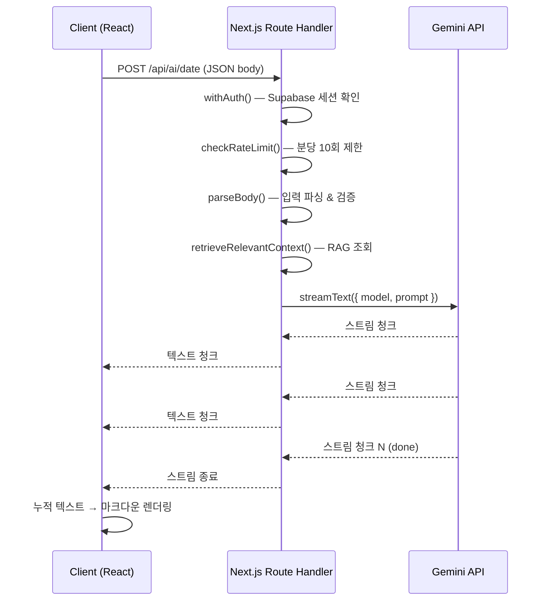

Couple Planner를 만들면서 AI 기능을 추가해야 할 시점이 왔다. 데이트 코스 추천, 선물 추천, 커플 싸움 심판(!)까지. 세 가지를 붙여야 하는데, 각각 따로 만들면 코드가 세 배로 늘어난다. 나쁜 예감이 들었다.

해답은 패턴 추출이었다. AI 요청 흐름을 뜯어보니 거의 똑같았다 — 인증 확인, Rate Limit 체크, 입력 파싱, LLM 호출, 스트리밍 응답. 이걸 한 번 잘 만들면 나머지는 그냥 복붙 + 프롬프트 교체 수준이다.

이 글은 그 과정을 정리한 것이다. Vercel AI SDK(`ai` v6, `@ai-sdk/google` v3)의 `streamText` + `toTextStreamResponse` 패턴부터, 프론트엔드 커스텀 훅, Rate Limiting 전략, 마크다운 렌더링까지. 실제 코드 기반으로 쓴다.

---

## 왜 이 기술을 선택했는가

### Vercel AI SDK를 선택한 이유

처음에는 Google Generative AI SDK(`@google/generative-ai`)를 직접 쓰려고 했다. 그런데 스트리밍 응답을 Next.js Route Handler에서 제대로 내려보내는 게 생각보다 번거롭다. `ReadableStream`을 직접 조립하고, Content-Type 헤더 맞추고, 청크 인코딩 처리까지. 보일러플레이트가 너무 많았다.

Vercel AI SDK는 이걸 `streamText()` 한 줄 + `result.toTextStreamResponse()` 한 줄로 해결한다. 내부적으로 스트리밍 응답 직렬화를 전부 처리해준다. Provider 추상화도 잘 돼 있어서 나중에 Gemini에서 다른 모델로 바꿀 때 `geminiModel` 변수 하나만 교체하면 된다.

```typescript
// src/lib/gemini.ts
import { google } from '@ai-sdk/google'

export const geminiModel = google('gemini-3.0-flash')
```

`@ai-sdk/google`은 Google AI Studio API를 추상화한 공식 어댑터다. 환경변수 `GOOGLE_GENERATIVE_AI_API_KEY`만 설정하면 된다. 모델 ID를 바꾸면 Flash/Pro/Ultra 중 선택 가능하고, 나머지 코드는 전혀 바꿀 필요가 없다.

### Gemini를 선택한 이유

한국어 품질이 중요했다. 데이트 코스를 서울 강남 기준으로 추천할 때, 실제 존재하는 장소명과 자연스러운 한국어가 나와야 한다. Gemini 3.0 Flash는 이 점에서 충분한 퍼포먼스를 보여줬고, API 비용도 합리적이다. 무엇보다 `@ai-sdk/google`이 Vercel AI SDK와 공식 통합을 제공해서 별도 어댑터 작성 없이 바로 쓸 수 있었다.

---

## streamText + toTextStreamResponse 패턴 해부

핵심 패턴은 단 두 줄이다.

```typescript
const result = await streamText({ model: geminiModel, prompt })
return result.toTextStreamResponse()
```

`streamText()`는 LLM에 요청을 보내고 스트리밍 결과 객체를 반환한다. `toTextStreamResponse()`는 그 결과를 Web API 표준 `Response` 객체로 변환한다. Content-Type은 `text/plain; charset=utf-8`로 설정되고, 청크가 생성될 때마다 클라이언트로 전송된다.

Next.js App Router Route Handler는 Web API `Response`를 그대로 반환할 수 있으므로 별도 처리가 필요없다. 아래가 실제 date 추천 route의 전체 코드다.

```typescript
// src/app/api/ai/date/route.ts
import { streamText } from 'ai'
import {
  geminiModel,
  getDateRecommendationPromptWithContext,
  DateContext,
} from '@/lib/gemini'
import { withAuth } from '@/lib/api-handler'
import { parseBody } from '@/lib/api-error'
import { NextRequest, NextResponse } from 'next/server'
import { checkRateLimit } from '@/lib/rate-limit'
import { retrieveRelevantContext } from '@/app/actions/embeddings'

export const POST = withAuth(async (req: NextRequest, { user, supabase }) => {
  const rl = await checkRateLimit(`ai-date:${user.id}`, 10, 60_000)
  if (!rl.allowed) {
    return NextResponse.json(
      { error: '너무 많은 요청입니다. 잠시 후 다시 시도해주세요.' },
      { status: 429 }
    )
  }

  const body = await parseBody<DateContext>(req)
  if (!body) {
    return NextResponse.json(
      { error: '요청 본문을 파싱할 수 없습니다.' },
      { status: 400 }
    )
  }

  if (!body.location?.trim()) {
    return NextResponse.json({ error: '위치를 입력해주세요.' }, { status: 400 })
  }

  // RAG 컨텍스트 조회 — 실패해도 폴백
  let ragContext = ''
  try {
    const { data: membership } = await supabase
      .from('couple_members')
      .select('couple_id')
      .eq('user_id', user.id)
      .single()
    if (membership?.couple_id) {
      ragContext = await retrieveRelevantContext(
        membership.couple_id,
        `${body.location} ${body.weather} ${body.preferences?.join(' ')}`
      )
    }
  } catch {
    // RAG 실패 시 빈 컨텍스트로 폴백
  }

  const prompt = getDateRecommendationPromptWithContext(body, ragContext)
  const result = await streamText({ model: geminiModel, prompt })
  return result.toTextStreamResponse()
})
```

이 패턴을 gift, judge, meal route에도 동일하게 적용했다. 달라지는 것은 Rate Limit 키 prefix(`ai-gift:`, `ai-judge:`, `ai-meal:`)와 프롬프트 생성 함수뿐이다.

### 스트리밍 데이터 흐름



Route Handler가 미들웨어 파이프라인 역할을 한다. `withAuth` → `checkRateLimit` → `parseBody` → `streamText` 순서로 처리하고, 각 단계에서 실패하면 즉시 JSON 에러 응답을 반환한다. LLM 호출은 마지막에만 일어난다. 유효하지 않은 요청에 LLM API 비용이 발생하는 걸 원천 차단하는 구조다.

---

## withAuth 미들웨어 — API Route 템플릿의 뼈대

모든 AI Route는 `withAuth()`로 감싼다. Supabase 세션 확인 + 에러 처리를 담당하는 Higher-Order Function이다.

```typescript
// src/lib/api-handler.ts
import { NextRequest, NextResponse } from 'next/server'
import { createServerSupabaseClient } from './supabase-server'
import { User } from '@supabase/supabase-js'
import { apiError } from './api-error'

type SupabaseServerClient = Awaited<
  ReturnType<typeof createServerSupabaseClient>
>

export interface AuthContext {
  user: User
  supabase: SupabaseServerClient
  params?: Record<string, string>
}

type AuthHandler = (
  req: NextRequest,
  ctx: AuthContext
) => Promise<NextResponse | Response>

type WrappedHandler = {
  (req: NextRequest): Promise<NextResponse | Response>
  (
    req: NextRequest,
    ctx: { params: Promise<Record<string, string>> }
  ): Promise<NextResponse | Response>
}

export function withAuth(handler: AuthHandler): WrappedHandler {
  const wrapped = async (
    req: NextRequest,
    routeContext?: { params: Promise<Record<string, string>> }
  ): Promise<NextResponse | Response> => {
    try {
      const supabase = await createServerSupabaseClient()
      const {
        data: { user },
        error,
      } = await supabase.auth.getUser()

      if (error || !user) {
        return NextResponse.json(
          { error: '인증이 필요합니다.' },
          { status: 401 }
        )
      }

      const params = routeContext?.params
        ? await routeContext.params
        : undefined
      return await handler(req, { user, supabase, params })
    } catch (error) {
      return apiError(error, '서버 오류가 발생했습니다.')
    }
  }
  return wrapped as WrappedHandler
}
```

반환 타입이 `NextResponse | Response`다. `toTextStreamResponse()`는 Web API `Response`를 반환하고, 에러 응답은 `NextResponse`를 반환한다. Next.js App Router는 둘 다 처리할 수 있어서 타입만 잘 맞춰주면 문제없다.

`parseBody`와 `apiError`도 단순하게 유지했다.

```typescript
// src/lib/api-error.ts
export function apiError(
  error: unknown,
  publicMessage: string,
  status = 500
): NextResponse {
  if (process.env.NODE_ENV === 'development') {
    console.error('[API Error]', error)
  }
  return NextResponse.json({ error: publicMessage }, { status })
}

export async function parseBody<T>(req: NextRequest): Promise<T | null> {
  try {
    return (await req.json()) as T
  } catch {
    return null
  }
}
```

`parseBody`가 실패하면 `null`을 반환하고 Route Handler에서 400 응답으로 처리한다. 예외를 Route Handler 밖으로 던지지 않는다.

judge route는 RAG가 없는 단순 케이스라 비교하면 구조 차이가 잘 보인다.

```typescript
// src/app/api/ai/judge/route.ts
export const POST = withAuth(async (req: NextRequest, { user }) => {
  const rl = await checkRateLimit(`ai-judge:${user.id}`, 10, 60_000)
  if (!rl.allowed) {
    return NextResponse.json(
      { error: '너무 많은 요청입니다. 잠시 후 다시 시도해주세요.' },
      { status: 429 }
    )
  }

  const body = await parseBody<JudgeContext>(req)
  if (!body) {
    return NextResponse.json(
      { error: '요청 본문을 파싱할 수 없습니다.' },
      { status: 400 }
    )
  }

  // 필드 검증 ...

  const prompt = getJudgePrompt(body)
  const result = await streamText({ model: geminiModel, prompt })
  return result.toTextStreamResponse()
})
```

`supabase` 파라미터를 destructure조차 하지 않는다. 쓰지 않으니까. RAG 조회 블록이 빠지니 route 전체가 훨씬 짧아진다. 공통 구조는 그대로이되 기능별 필요에 따라 자연스럽게 줄어드는 형태다.

---

## 재사용 가능한 useAIStream 커스텀 훅 설계

프론트엔드 쪽도 같은 원리로 접근했다. 스트리밍 fetch 로직을 훅으로 추출하면 각 AI 기능 컴포넌트는 UI만 담당하면 된다.

```typescript
// src/hooks/useAIStream.ts
'use client'

import { useState, useCallback, useRef, useEffect } from 'react'

interface UseAIStreamOptions {
  endpoint: string
}

interface UseAIStreamReturn<T> {
  text: string
  isLoading: boolean
  error: string | null
  generate: (context: T) => Promise<void>
  reset: () => void
}

export function useAIStream<T>({
  endpoint,
}: UseAIStreamOptions): UseAIStreamReturn<T> {
  const [text, setText] = useState('')
  const [isLoading, setIsLoading] = useState(false)
  const [error, setError] = useState<string | null>(null)
  const abortControllerRef = useRef<AbortController | null>(null)

  useEffect(() => {
    return () => {
      abortControllerRef.current?.abort()
    }
  }, [])

  const generate = useCallback(
    async (context: T) => {
      // 진행 중인 요청 취소
      abortControllerRef.current?.abort()
      const controller = new AbortController()
      abortControllerRef.current = controller

      setIsLoading(true)
      setError(null)
      setText('')

      try {
        const response = await fetch(endpoint, {
          method: 'POST',
          headers: { 'Content-Type': 'application/json' },
          body: JSON.stringify(context),
          signal: controller.signal,
        })

        if (!response.ok) {
          const errorData = await response.json().catch(() => ({}))
          throw new Error(errorData.error || '요청에 실패했습니다.')
        }

        if (!response.body) {
          throw new Error('스트림을 받을 수 없습니다.')
        }

        const reader = response.body.getReader()
        const decoder = new TextDecoder()
        let accumulatedText = ''

        while (true) {
          const { done, value } = await reader.read()
          if (done) break
          const chunk = decoder.decode(value, { stream: true })
          accumulatedText += chunk
          setText(accumulatedText)
        }
      } catch (err) {
        if (err instanceof DOMException && err.name === 'AbortError') {
          return // 정상 취소 — 에러 표시 안 함
        }
        console.error('AI Stream error:', err)
        setError(
          err instanceof Error ? err.message : '알 수 없는 오류가 발생했습니다.'
        )
      } finally {
        setIsLoading(false)
      }
    },
    [endpoint]
  )

  const reset = useCallback(() => {
    abortControllerRef.current?.abort()
    setText('')
    setError(null)
  }, [])

  return { text, isLoading, error, generate, reset }
}
```

### 설계 포인트

**AbortController 관리.** `useRef`로 AbortController를 들고 있다가 `generate()`가 다시 호출되면 이전 요청을 먼저 취소한다. 사용자가 빠르게 두 번 누르거나 다른 조건으로 재생성을 요청해도 중복 요청이 누적되지 않는다. 컴포넌트 언마운트 시에도 `useEffect` cleanup에서 `abort()`를 호출해 메모리 누수를 막는다.

**AbortError 분기.** `catch` 블록에서 `AbortError`를 명시적으로 처리한다. 취소는 에러가 아니므로 `setError()`를 호출하지 않는다. 사용자가 "다시 받기"를 누를 때 에러 메시지가 깜빡이는 현상을 방지하기 위한 처리다.

**누적 텍스트 방식.** 청크를 받을 때마다 기존 `accumulatedText`에 더한다. `setText(chunk)` 대신 `setText(accumulatedText)`로 항상 전체 텍스트를 상태에 저장한다. 리렌더가 약간 더 일어나지만, 부분 텍스트가 화면에 점진적으로 나타나는 스트리밍 UX를 얻을 수 있다.

**`TextDecoder`의 `{ stream: true }` 옵션.** 멀티바이트 문자(한글)가 청크 경계에서 잘리지 않도록 한다. 이 옵션 없이 `decode()`를 쓰면 청크 경계에 한글이 걸칠 때 깨진 문자가 나타날 수 있다.

**제네릭 타입.** `useAIStream<T>`로 제네릭을 쓴다. `generate(context: T)`의 타입이 호출 시점에 결정된다. `DateContext`, `GiftContext`, `JudgeContext` 각각에 동일한 훅을 타입 안전하게 쓸 수 있다.

### 컴포넌트에서 사용하기

```typescript
// src/components/ai/DateRecommendation.tsx (핵심 부분)
const { text, isLoading, error, generate, reset } = useAIStream<DateContext>({
  endpoint: '/api/ai/date',
})

const handleSubmit = async () => {
  if (!context.location.trim()) {
    setValidationError('위치를 입력해주세요.')
    return
  }
  setValidationError(null)
  await generate(context)
}
```

`GiftRecommendation`은 `endpoint: "/api/ai/gift"`, `MealRecommendation`은 `endpoint: "/api/ai/meal"`. 훅 사용법이 완전히 동일하고, 컴포넌트별로 달라지는 건 endpoint 문자열과 UI 폼 구조뿐이다.

---

## 시스템 프롬프트 엔지니어링 — 한국어 AI 응답 품질

프롬프트 품질이 결과물 품질을 결정한다. 특히 한국어로 실용적인 정보를 뽑아내야 할 때는 구조화가 핵심이다.

```typescript
// src/lib/gemini.ts — 데이트 코스 추천 프롬프트
export function getDateRecommendationPrompt(context: DateContext): string {
  const timeText = context.time
    ? `- 시간대: ${context.time === 'morning' ? '오전' : context.time === 'afternoon' ? '오후' : '저녁'}`
    : ''

  return `당신은 커플들을 위한 데이트 플래너입니다. 아래 조건에 맞는 완벽한 데이트 코스를 추천해주세요.

## 조건
- 날씨: ${context.weather}
- 위치: ${context.location}
- 예산: ${context.budget.toLocaleString()}원
- 선호: ${context.preferences.length > 0 ? context.preferences.join(', ') : '특별한 선호 없음'}
${timeText}

## 요청사항
1. 구체적인 장소명과 주소를 포함해주세요
2. 시간 순서대로 코스를 구성해주세요
3. 각 장소에서의 예상 비용과 추천 활동을 알려주세요
4. 이동 방법과 예상 소요 시간도 포함해주세요
5. 총 예상 비용이 예산을 넘지 않도록 해주세요

한국어로 친근하고 따뜻한 톤으로 작성해주세요. 마크다운 형식으로 정리해주세요.`
}
```

### 프롬프트 설계 원칙

**역할 부여.** "당신은 커플들을 위한 데이트 플래너입니다"처럼 구체적인 역할을 먼저 설정한다. 일반적인 "AI 어시스턴트"보다 훨씬 더 적절한 톤과 내용이 나온다. 역할이 명확할수록 응답이 해당 도메인에 집중된다.

**출력 형식 명시.** "마크다운 형식으로 정리해주세요"를 명시했다. 없으면 응답 구조가 일관되지 않아 프론트엔드에서 렌더링이 들쑥날쑥해진다.

**톤 지정.** "친근하고 따뜻한 톤으로"는 한국어 AI 응답에서 중요하다. 없으면 딱딱한 리스트나 사무적인 설명이 나오기 쉽다.

**숫자 포맷.** `context.budget.toLocaleString()`으로 `100000` 대신 `100,000`을 프롬프트에 넣는다. LLM이 숫자를 더 자연스럽게 처리하고, 응답에서도 포맷이 일관된다.

### Judge 프롬프트 — 유머 엔지니어링

커플 싸움 심판 기능은 조금 다르다. 법원 판결문 형식을 흉내 내면서 유머를 섞는 독특한 프롬프트가 필요했다.

```typescript
// src/lib/gemini.ts
export function getJudgePrompt(context: JudgeContext): string {
  const caseNumber = Math.floor(1000 + Math.random() * 9000)
  const bgText = context.context ? `\n## 사건 배경\n${context.context}` : ''

  return `당신은 대한민국 커플 법원의 판사입니다.
형식은 실제 법원 판결문처럼 격식있게 작성하되, 내용은 유머러스하게 작성합니다.

## 사건 정보
- 사건번호: 커플법원 2026러${caseNumber}
- 원고: ${context.plaintiff.name}
- 피고: ${context.defendant.name}
${bgText}

## 원고 주장
${context.plaintiff.argument}

## 피고 주장
${context.defendant.argument}

## 판결문 작성 지침

아래 구조를 반드시 따라 작성해주세요:

1. **사건번호** 표시
2. **원고/피고** 표시
3. **주문** (판결 결과 — 누가 잘못인지, 쌍방과실인지, 비율도 표시)
4. **이유** (각자의 주장을 진지하게 분석하되, 법률 용어를 커플 상황에 억지로 끼워맞추는 유머)
5. **부대조건** (화해를 위한 구체적 권고사항 — 예: "피고는 원고에게 아이스크림 1개를 배상할 것")
6. **판사 서명** (AI 판사 커플법원)

톤: 진지한 척 하지만 웃긴. 격식체를 사용하되 드립을 섞을 것.
절대 한쪽만 비난하지 말 것. 양쪽의 입장을 공정하게 분석한 뒤 판결.
마크다운 형식으로 출력할 것.
한국어로 작성할 것.`
}
```

랜덤 사건번호(`커플법원 2026러4237` 같은 형식)는 프롬프트 레벨에서 주입한다. 매 요청마다 다른 번호가 나오는데, LLM이 생성하게 두면 판결문 다른 부분에서 번호가 바뀌는 경우가 있어서 프롬프트에 미리 못 박았다.

### RAG 컨텍스트 주입

date, gift, meal 기능에는 RAG(Retrieval-Augmented Generation)를 붙였다. 커플의 과거 데이트 기록에서 관련 데이터를 벡터 검색으로 뽑아와 프롬프트에 추가한다.

```typescript
// src/lib/gemini.ts
export function getDateRecommendationPromptWithContext(
  context: DateContext,
  ragContext: string
): string {
  const base = getDateRecommendationPrompt(context)
  if (!ragContext.trim()) return base
  return `${base}

## 커플 과거 데이트 데이터
아래는 이 커플의 과거 활동 기록입니다. 참고하여 더 개인화된 추천을 해주세요:
${ragContext}`
}
```

RAG 실패 시 빈 문자열을 넘기면 `if (!ragContext.trim()) return base`로 기본 프롬프트만 사용한다. Route Handler에서도 RAG 조회 실패를 try-catch로 잡고 빈 컨텍스트로 폴백한다. AI 기능이 RAG 실패 때문에 통째로 죽으면 안 된다.

---

## Rate Limiting 전략 — Upstash Redis + In-Memory 폴백

AI API 호출에는 비용이 발생한다. 사용자가 짧은 시간에 수십 번 요청하면 비용 폭탄을 맞을 수 있다. Rate Limiting은 선택이 아니라 필수다.

```typescript
// src/lib/rate-limit.ts
import { Ratelimit } from '@upstash/ratelimit'
import { Redis } from '@upstash/redis'

let redisRatelimit: Ratelimit | null = null

if (
  process.env.UPSTASH_REDIS_REST_URL &&
  process.env.UPSTASH_REDIS_REST_TOKEN
) {
  const redis = new Redis({
    url: process.env.UPSTASH_REDIS_REST_URL,
    token: process.env.UPSTASH_REDIS_REST_TOKEN,
  })
  redisRatelimit = new Ratelimit({
    redis,
    limiter: Ratelimit.fixedWindow(10, '1 m'),
    analytics: false,
  })
}
```

환경변수가 설정되어 있으면 Upstash Redis를 쓰고, 없으면 in-memory 폴백을 사용한다. 로컬 개발 환경에서 Upstash 설정 없이도 Rate Limiting이 동작한다.

```typescript
// in-memory 폴백 구현
const rateMap = new Map<string, { count: number; resetAt: number }>()
const CLEANUP_INTERVAL = 60_000
let lastCleanup = Date.now()

function cleanup() {
  const now = Date.now()
  if (now - lastCleanup < CLEANUP_INTERVAL) return
  lastCleanup = now
  for (const [key, val] of rateMap) {
    if (val.resetAt < now) rateMap.delete(key)
  }
}

function checkMemoryRateLimit(
  key: string,
  maxRequests: number,
  windowMs: number
): { allowed: boolean; remaining: number; resetAt: Date } {
  cleanup()
  const now = Date.now()
  const entry = rateMap.get(key)

  if (!entry || entry.resetAt < now) {
    rateMap.set(key, { count: 1, resetAt: now + windowMs })
    return {
      allowed: true,
      remaining: maxRequests - 1,
      resetAt: new Date(now + windowMs),
    }
  }

  entry.count++
  if (entry.count > maxRequests) {
    return { allowed: false, remaining: 0, resetAt: new Date(entry.resetAt) }
  }

  return {
    allowed: true,
    remaining: maxRequests - entry.count,
    resetAt: new Date(entry.resetAt),
  }
}

export async function checkRateLimit(
  key: string,
  maxRequests: number,
  windowMs: number
): Promise<{ allowed: boolean; remaining: number; resetAt: Date }> {
  if (redisRatelimit) {
    const result = await redisRatelimit.limit(key)
    return {
      allowed: result.success,
      remaining: result.remaining,
      resetAt: new Date(result.reset),
    }
  }
  return checkMemoryRateLimit(key, maxRequests, windowMs)
}
```

Rate Limit 키는 기능별로 다르다 — `ai-date:${user.id}`, `ai-gift:${user.id}`, `ai-judge:${user.id}`, `ai-meal:${user.id}`. 각 기능이 독립적으로 분당 10회 제한을 갖는다. 데이트 추천을 10번 써도 선물 추천은 10번 더 쓸 수 있다.

In-memory 폴백은 싱글 인스턴스 환경에서만 정확하다. Vercel 서버리스 함수는 요청마다 다른 인스턴스일 수 있으니, 프로덕션에서는 반드시 Upstash Redis를 써야 한다. 이 구조의 장점은 환경변수 하나로 전환이 된다는 점이다.

**cleanup 전략.** in-memory 폴백은 주기적으로 만료된 키를 정리한다. `cleanup()`은 60초에 한 번만 실행되고, 만료 시간이 지난 엔트리를 Map에서 지운다. 메모리 누수를 방지하는 간단하고 효과적인 방어 코드다.

---

## 마크다운 렌더링 + 스트리밍 UX 최적화

AI 응답은 마크다운으로 온다. `react-markdown` 같은 라이브러리를 쓸 수도 있었지만, 번들 크기와 Tailwind CSS 스타일 통합을 위해 커스텀 `MarkdownRenderer`를 만들었다.

```typescript
// src/components/ai/MarkdownRenderer.tsx
"use client";

interface MarkdownRendererProps {
  content: string;
}

export function MarkdownRenderer({ content }: MarkdownRendererProps) {
  const renderMarkdown = (text: string): string => {
    let html = text;

    // XSS 방지: HTML 엔티티 이스케이프 먼저
    html = html
      .replace(/&/g, "&amp;")
      .replace(/</g, "&lt;")
      .replace(/>/g, "&gt;");

    // 헤딩
    html = html.replace(
      /^### (.*$)/gim,
      '<h3 class="text-lg font-bold mt-4 mb-2 text-[var(--foreground)]">$1</h3>',
    );
    html = html.replace(
      /^## (.*$)/gim,
      '<h2 class="text-xl font-bold mt-6 mb-3 text-[var(--foreground)]">$1</h2>',
    );
    html = html.replace(
      /^# (.*$)/gim,
      '<h1 class="text-2xl font-bold mt-6 mb-4 text-[var(--foreground)]">$1</h1>',
    );

    // 볼드, 이탤릭
    html = html.replace(
      /\*\*(.*?)\*\*/gim,
      '<strong class="font-semibold">$1</strong>',
    );
    html = html.replace(/\*(.*?)\*/gim, "<em>$1</em>");

    // 리스트
    html = html.replace(
      /^\- (.*$)/gim,
      '<li class="ml-4 list-disc">$1</li>',
    );
    html = html.replace(
      /^\* (.*$)/gim,
      '<li class="ml-4 list-disc">$1</li>',
    );
    html = html.replace(
      /^\d+\. (.*$)/gim,
      '<li class="ml-4 list-decimal">$1</li>',
    );

    // 블록쿼트 (이스케이프된 > 처리)
    html = html.replace(
      /^&gt; (.*$)/gim,
      '<blockquote class="border-l-4 border-[var(--primary)] pl-4 my-3 italic text-[var(--muted-foreground)]">$1</blockquote>',
    );

    // 수평선
    html = html.replace(
      /^---$/gim,
      '<hr class="my-6 border-[var(--border)]" />',
    );

    // 단락 구분
    html = html.replace(/\n\n/g, '</p><p class="my-3">');
    html = html.replace(/\n/g, "<br />");

    if (!html.startsWith("<")) {
      html = `<p class="my-3">${html}</p>`;
    }

    return html;
  };

  return (
    <div
      className="prose prose-sm max-w-none text-[var(--foreground)] leading-relaxed"
      dangerouslySetInnerHTML={{ __html: renderMarkdown(content) }}
    />
  );
}
```

XSS 방지가 중요하다. `dangerouslySetInnerHTML`을 쓰기 때문에, HTML 엔티티 이스케이프를 **먼저** 하고 나서 마크다운 패턴을 적용한다. 순서가 바뀌면 `>` 이스케이프가 블록쿼트 패턴(`^&gt;`)과 충돌한다. 실제로 이 순서 문제로 한 번 헤맸다.

### 스트리밍 중 렌더링 — 세 가지 상태 전환

컴포넌트에서 스트리밍 진행 중에도 `MarkdownRenderer`를 그대로 사용한다.

```tsx
// src/components/ai/DateRecommendation.tsx — 결과 표시 부분
{
  ;(text || isLoading) && (
    <div className="rounded-2xl border border-[var(--border)] bg-white p-6 dark:bg-[var(--card)]">
      <div className="mb-4 flex items-center justify-between">
        <h3 className="flex items-center gap-2 text-lg font-bold">
          <Sparkles className="h-5 w-5 text-[var(--primary)]" />
          AI 추천 데이트 코스
          {isLoading && (
            <span className="text-sm font-normal text-[var(--muted-foreground)]">
              (생성 중...)
            </span>
          )}
        </h3>
        {!isLoading && text && (
          <button
            onClick={handleReset}
            className="flex items-center gap-1 text-sm text-[var(--muted-foreground)] transition-colors hover:text-[var(--foreground)]"
          >
            <RefreshCw className="h-4 w-4" />
            다시 받기
          </button>
        )}
      </div>
      <MarkdownRenderer content={text || '응답을 기다리는 중...'} />
    </div>
  )
}
```

`(text || isLoading)`으로 결과 영역을 마운트한다. 스트리밍이 시작되면 "응답을 기다리는 중..." 텍스트 대신 실제 내용이 들어오고, 청크가 누적될수록 마크다운이 점점 완성된다. 완료 후에는 "다시 받기" 버튼이 나타난다. 로딩 → 스트리밍 → 완료 세 가지 상태를 자연스럽게 표현했다.

버튼도 상태에 따라 달라진다.

```tsx
<button
  onClick={handleSubmit}
  disabled={isLoading}
  className="flex w-full items-center justify-center gap-2 rounded-xl bg-[var(--primary)] px-4 py-3 font-medium text-white disabled:cursor-not-allowed disabled:opacity-50"
>
  {isLoading ? (
    <>
      <Loader2 className="h-5 w-5 animate-spin" />
      AI가 코스를 생성 중...
    </>
  ) : (
    <>
      <Sparkles className="h-5 w-5" />
      데이트 코스 추천받기
    </>
  )}
</button>
```

스트리밍 중에는 버튼이 비활성화되고 스피너가 나타난다. 이중 요청을 UI 레벨에서도 차단한다.

---

## 3개 AI 기능을 동일 패턴으로 빠르게 만드는 코드 재사용

패턴이 완성된 뒤 두 번째, 세 번째 기능을 추가하는 데 걸린 시간은 첫 번째의 절반도 안 됐다. 실제로 gift route를 만들 때 date route에서 복사하고 5군데만 바꿨다.

| 변경 항목      | date                                     | gift                                     | meal                                     | judge                    |
| -------------- | ---------------------------------------- | ---------------------------------------- | ---------------------------------------- | ------------------------ |
| Rate Limit 키  | `ai-date:`                               | `ai-gift:`                               | `ai-meal:`                               | `ai-judge:`              |
| 입력 타입      | `DateContext`                            | `GiftContext`                            | `MealContext`                            | `JudgeContext`           |
| 프롬프트 함수  | `getDateRecommendationPromptWithContext` | `getGiftRecommendationPromptWithContext` | `getMealRecommendationPromptWithContext` | `getJudgePrompt`         |
| 필수 필드 검증 | `location`                               | `occasion`                               | `ingredients`                            | `plaintiff`, `defendant` |
| RAG 컨텍스트   | 있음                                     | 있음                                     | 있음                                     | 없음                     |

judge는 RAG가 없다 — 싸움 맥락은 사용자가 직접 입력하는 게 맞다고 판단했다.

프론트엔드도 마찬가지다. `GiftRecommendation`, `MealRecommendation`은 `DateRecommendation`과 구조가 거의 같다. 폼 필드와 `endpoint` 값만 다르고, `useAIStream` 사용법과 결과 표시 방식은 동일하다.

### 새로운 AI 기능 추가 시 패턴의 위력

이 패턴이 있으면 새 AI 기능을 추가할 때의 체크리스트가 명확하다.

1. `src/lib/gemini.ts`에 Context 인터페이스와 프롬프트 함수 추가
2. `src/app/api/ai/{기능명}/route.ts` 생성 — 기존 route 복사 후 5군데 수정
3. `src/components/ai/{기능명}.tsx` 생성 — 기존 컴포넌트 복사 후 폼 필드 수정
4. `src/app/(protected)/ai/{기능명}/page.tsx` 생성 — 컴포넌트 마운트

Route Handler 파이프라인(`withAuth` → `checkRateLimit` → `parseBody` → `streamText` → `toTextStreamResponse`)은 손대지 않아도 된다. 프롬프트 함수만 잘 만들면 된다. AI 기능 추가 작업이 사실상 "프롬프트 엔지니어링 + 폼 UI" 문제로 환원된다.

---

## 실제 만난 문제와 해결

### 1. Route Handler 반환 타입 충돌

`withAuth` 내부에서 `toTextStreamResponse()`를 반환할 때 TypeScript가 타입 에러를 냈다. `NextResponse`만 반환 타입으로 지정했기 때문이다. `NextResponse | Response`로 넓히고, `WrappedHandler` 타입을 명시적으로 선언해서 해결했다.

```typescript
type WrappedHandler = {
  (req: NextRequest): Promise<NextResponse | Response>
  (req: NextRequest, ctx: RouteContext): Promise<NextResponse | Response>
}
```

Next.js App Router는 Route Handler에서 표준 Web API `Response`를 반환해도 처리한다. 처음엔 이 점을 몰라서 불필요하게 `NextResponse`로 래핑하려 했다.

### 2. AbortError 누락으로 인한 에러 깜빡임

처음에는 AbortController를 쓰지 않았다. 사용자가 "다시 받기"를 누르면 이전 요청과 새 요청이 경쟁 조건에 빠졌다. 이전 요청 청크가 새 요청 시작 후에도 들어오면서 `setText`가 엉켰다. AbortController를 도입하고 나서 이 문제가 완전히 사라졌다. `AbortError` 분기를 빠뜨리면 "다시 받기"를 누를 때마다 에러 메시지가 잠깐 번쩍이는 부작용이 생긴다.

### 3. 스트리밍 중 마크다운 파싱 걱정 — 기우였다

스트리밍 도중에는 마크다운이 절반만 온 상태다. `**볼드**`에서 앞 `**`만 왔으면 정규식이 매칭되지 않는다. 처음에는 이게 문제가 될까 걱정했는데, 실제로는 괜찮았다. 매칭 안 된 `**`는 그냥 `**` 텍스트로 보이다가, 나머지 청크가 오면서 `<strong>`으로 변환된다. 전환이 빠르게 일어나서 사용자가 신경 쓸 틈이 없다.

### 4. In-Memory Rate Limiter 메모리 누수

초기 구현에서 `rateMap`을 정리하는 코드가 없었다. 오래 실행되면 만료된 키가 계속 쌓였다. `cleanup()` 함수를 추가하고 `checkMemoryRateLimit()` 호출 시마다 실행하되, 60초 이내면 스킵하는 방식으로 해결했다. 단순하지만 효과적인 방어 코드다.

---

## 다시 한다면 다르게 할 것

### 1. Vercel AI SDK의 `useChat` 훅 검토

`useAIStream`을 직접 만들었는데, Vercel AI SDK에는 `useChat` 훅이 있다. 대화 히스토리, 메시지 스트리밍, 에러 처리가 기본으로 들어있다. 단방향 생성(generate once)이 아닌 멀티턴 대화가 필요하다면 `useChat`이 훨씬 강력하다. 이 프로젝트는 단방향 생성이라 직접 만드는 게 더 단순했지만, 다음 프로젝트에서는 먼저 `useChat`을 검토할 것이다.

### 2. 프롬프트를 코드 밖으로

프롬프트를 TypeScript 함수로 관리하는 게 편하긴 하지만, 버전 관리가 코드 커밋에 묶인다. A/B 테스트나 빠른 프롬프트 수정이 어렵다. 프롬프트를 외부 스토리지(DB나 파일)에 저장하고 런타임에 로드하는 방식을 고려해볼 만하다. 코드 배포 없이 프롬프트를 수정할 수 있으면 실험이 훨씬 빨라진다.

### 3. Rate Limit 응답 헤더 추가

현재 Rate Limit 초과 시 에러 JSON만 반환한다. `X-RateLimit-Remaining`, `X-RateLimit-Reset` 헤더를 추가하면 클라이언트가 남은 횟수나 리셋 시간을 표시할 수 있다. "잠시 후 다시 시도해주세요" 대신 "37초 후에 다시 시도하세요"처럼 더 정확한 안내가 가능하다.

### 4. MarkdownRenderer 교체

`react-markdown`을 처음부터 쓰는 게 맞았다. 직접 구현한 정규식 기반 파서는 중첩 목록, 코드 블록, 인라인 코드 처리가 불완전하다. 의존성을 줄이려는 의도는 좋았지만, 마크다운 파싱은 엣지 케이스가 생각보다 훨씬 많다. `react-markdown` + `remark-gfm` 조합이 훨씬 안정적이다.

---

## 마무리

Vercel AI SDK의 `streamText` + `toTextStreamResponse` 패턴은 단순하지만 강력하다. Route Handler를 미들웨어 파이프라인으로 설계하고, 프론트엔드 스트리밍 로직을 제네릭 훅으로 추출하면 AI 기능 추가 비용이 급격히 낮아진다. 세 번째 기능을 만들 때는 첫 번째 기능의 30% 시간도 안 걸렸다.

패턴의 힘은 반복에서 나온다. 두 번째 기능을 만들 때부터 패턴이 보이기 시작하고, 세 번째쯤 되면 새 기능이 "프롬프트 + 폼 UI" 문제가 된다. AI 기능의 핵심인 프롬프트 엔지니어링에만 집중할 수 있는 구조가 된다.

그리고 스트리밍은 선택이 아니다. AI 응답이 5-10초 걸린다고 스피너를 보여주는 것과, 1초도 안 돼서 텍스트가 흘러나오기 시작하는 것은 사용자 경험에서 완전히 다른 세계다. 한 번 구축해두면 모든 AI 기능에서 자동으로 쓸 수 있는 패턴이니, 처음부터 스트리밍으로 만드는 것을 추천한다.
