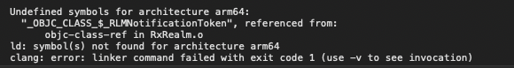

집에서 iOS를 공부하기 위해 습관적으로 cocoapods를 업데이트하고 빌드를 하려고 보니


```
Undefined symbols for architecture arm64:
  "_OBJC_CLASS_$_RLMNotificationToken", recerenced from:
      objc-class-ref in RxRealm.o
ld: symbol(s) not found for architecture arm64
```

라는 에러와 함께 빌드가 실패했습니다.  
그래서 팟을 해제시켜보고 소스를 다시 받아보고 빌드 클린을 해도 증상은 똑같더라구요.  
해결은 의외로 간단했습니다.  
단순히 설치되어있는 cocoapods 1.9.3에 버그가 있어 프로젝트 생성이 이상하게 된다는 건데요.

우선 Podfile에 설정되어 있는 RealmSwift를 5.4.3버전으로 내립니다.

```
    pod 'RealmSwift', '~> 5.4.3'
```

그리고 설치된 cocoapods를 1.8.3으로 내립니다.

```shell
sudo gem uninstall cocoapods
sudo gem install cocoapods -v 1.8.3
pod deintegrate // 설치된 pods의 링크를 해제합니다.
pod cache clean --all // 설치된 pods의 캐시를 모두 날려, 재설치시 캐시를 무시하게 만듭니다.
pod install // clean 한 상태로 다시 설치합니다.
```

해당 커맨드 입력 후 정상적으로 되더군요.  
하루빨리 버그가 고쳐진 새 cocoapods가 나오길 바랍니다.

---

(2021. 05. 14 추가)
해결방법이 나와서 추가합니다. [해결방법](/dev/ios/2021/05/14/Cocoapods%201.9.4%20이후%20RxRealm의%20에러%20해결방법/)
