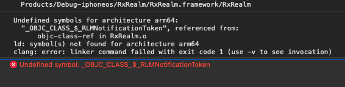
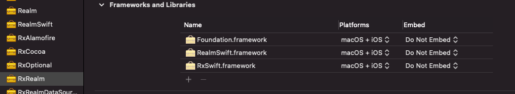
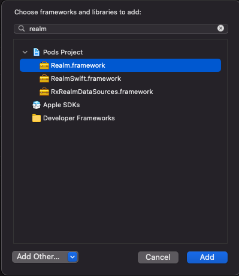
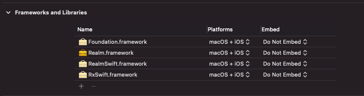

[이전 글](/dev/ios/2020/10/03/Cocoapods%201.9.4%EC%97%90%20%ED%98%84%EC%9E%AC%20%EB%B2%84%EA%B7%B8%EA%B0%80%20%EC%9E%88%EC%8A%B5%EB%8B%88%EB%8B%A4/)에서 나타났던 에러의 해결방법입니다.

기존 에러는 다음과 같습니다.  


```text
Undefined symbols for architecture arm64:
  "_OBJC_CLASS_$_RLMNotificationToken", recerenced from:
      objc-class-ref in RxRealm.o
ld: symbol(s) not found for architecture arm64
```

여기서 Pods 프로젝트의 'RxRealm.framework'의 정보를 보시면

이렇게 세 가지의 framework가 포함되어 있음을 알 수 있습니다.

문제는 여기서 제일 중요한 'Realm'의 참조가 빠져있다는 건데요.
Realm.framework를 추가해 줍니다.



이후 클린 및 빌드를 진행하시면 성공하는 걸 볼 수 있습니다.
