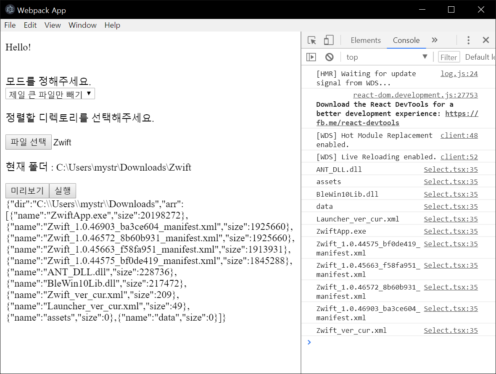

회사에서 진행하고 있는 거대한 일이 하나 끝나서, 간단한 파일 관리 앱을 만들어보고 있습니다.  
예전부터 Electron Application을 만들어보고 싶었는데, 이번에 자그맣게나마 한 단계를 끊을 수 있어서 참 좋네요.  
Redux에 대한 복습도 하고, fs-extra라는 유용한 라이브러리를 익힐 수 있어서 좋았습니다.  
계속 만들어 볼께요.  
해당 앱에 대한 소스는 [여기](https://github.com/jellive/file-sorter) 에서 확인하실 수 있습니다.  
다른 기능도 천천히 넣어보려고 합니다 :)
