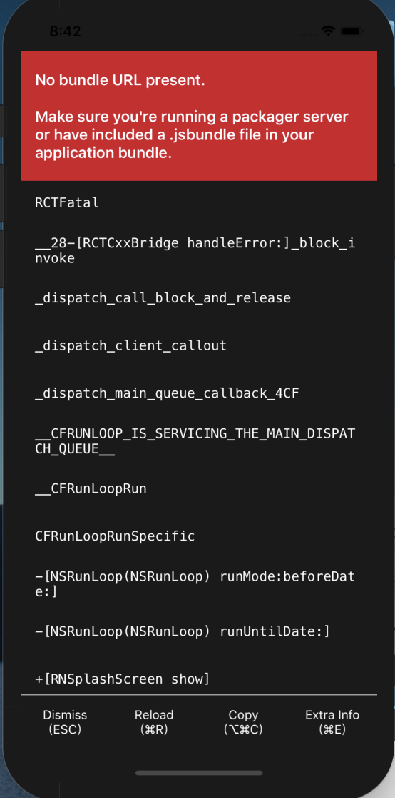
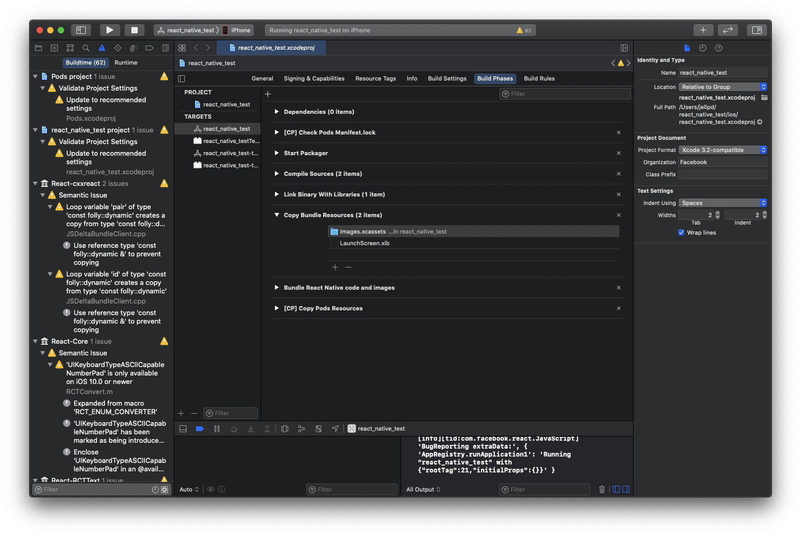
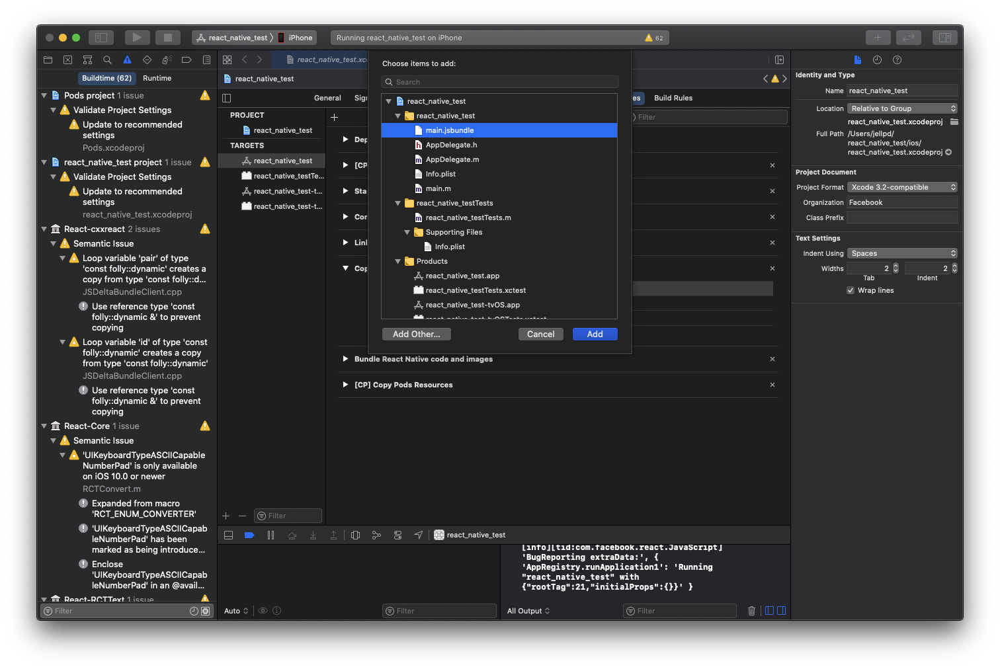

## 개요

오랜만에 React native 프로젝트를 다시 열 일이 있어서 초기화한 맥에 설치를 하고 앱을 실행해 봤습니다.  
그런데..



에러가 뜨면서 실행이 안되는 겁니다.  
그래서 인생의 동반자~~스승~~인 구글신의 도움을 빌었습니다.

## 해결법

### 1단계

먼저 main.jsbundle을 만들어주는 스크립트를 package.json에 삽입합니다.

```json
"build:ios": "react-native bundle --entry-file='index.js' --bundle-output='./ios/main.jsbundle' --dev=false --platform='ios'"
```

### 2단계

해당 스크립트를 실행합니다.

```shell
yarn build:ios
혹은
npm run build:ios
```

### 3단계

Xcode의 Build Phases 중 Copy Bundle Resources에 main.jsbundle을 추가해줍니다.



### 4단계

원래 실행하던 대로 iOS를 실행해줍니다.

```shell
npx react-native run-ios
혹은
react-native run-ios
```

이제 정상적으로 실행될 것입니다 :)

출처: [Medium 블로그](https://medium.com/@onexlab.io/no-bundle-url-present-fixed-ca2688a80f66)
