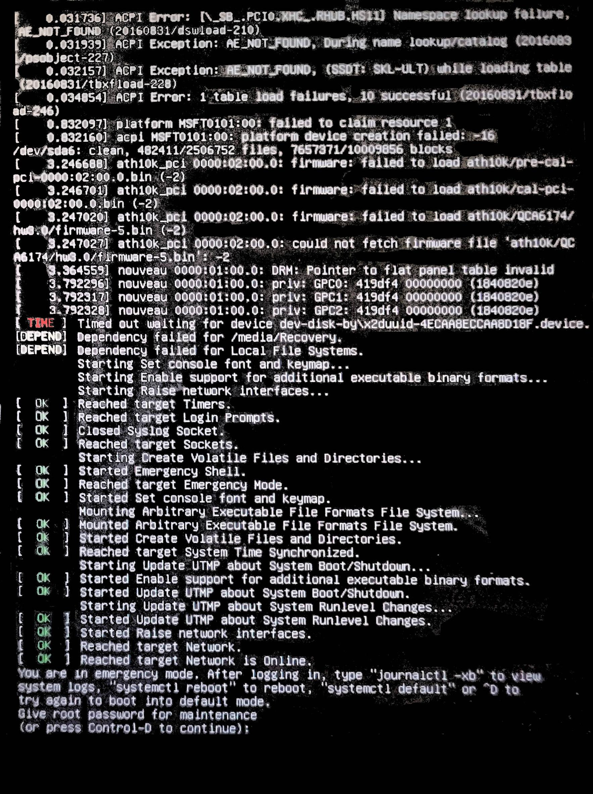

# 왜 쓰는가?

개인적으로 사용한지 약 7년 된 HGST의 8테라 하드가 슬슬 긁는 소리가 나서  
급하게 껐다가 대체품을 구매해서 옮기려고 보니 우분투 22.04 LTS로 업그레이드를 권유하길래  
진행하다 멈춰서 리셋을 하고 보니



가 나왔습니다.  

# You are in emergency mode!

정확하게는  
```
1. 22.04로 업그레이드 하기 위해 설치를 진행했던 작업과  
2. 하드 디스크를 옮기기 위해 한개를 대체하고 자동 마운트 설정을 제거하지 않았던 현상
```
이 겹쳤던 건데요.  
해결 방법은

```shell
sudo vi /etc/fstab
```
로 자동마운트를 관장하는 파일을 열어 해당 드라이브의  
자동 마운트를 #으로 주석처리를 먼저 하면 emergency mode는 해제가 됩니다. ([출처](https://bsssss.tistory.com/485))
그리고 로그인 창을 기대한 제가 마주 한 것은....


# Oh no! Something has gone wrong

...  
일요일 댓바람부터 무슨 문제가 있는지.. 
해결 방법은 다음과 같습니다.  

우선 해당 화면이 출력되고 있는 상태에서 Ctrl + Alt + F3을 누르면 CLI로 넘어가게 되는데요.  
다음 명령어를 입력해줍니다. 

```shell
sudo apt-get update && sudo apt-get dist-upgrade 
```
후

```shell
sudo apt-get clean && sudo apt-get autoremove && sudo reboot
```
([출처](https://askubuntu.com/questions/1239025/after-upgrade-to-ubuntu-20-04-oh-no-something-went-wrong))

이후 리부트를 하면 원래대로 돌아오게 됩니다.  
